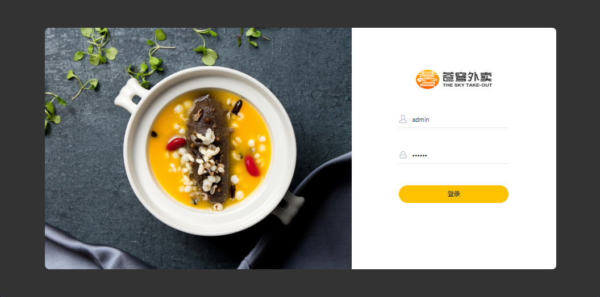
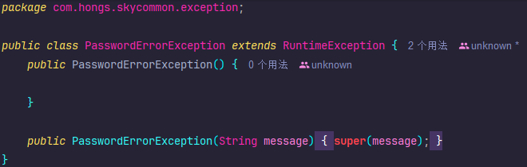
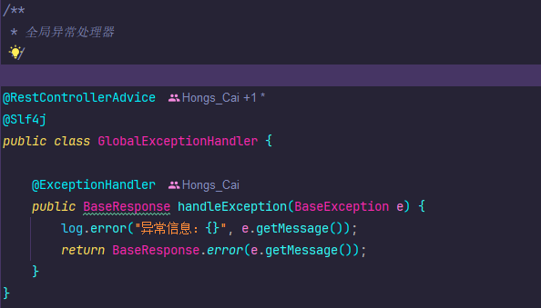
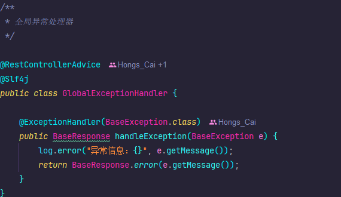
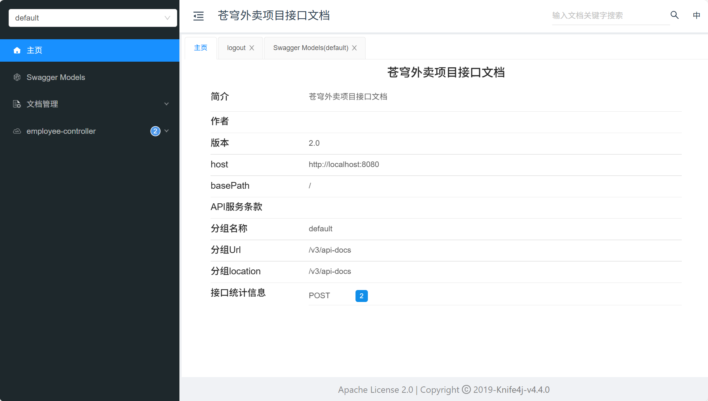

# 2025年12月2日

## 无法找到javax/xml/bind/DatatypeConverter

1. **环境**：使用的是 **JDK 17**。
2. **代码**：项目中使用的 JWT 工具包版本是 `jjwt:0.9.1`（这是一个 2018 年的老版本）。
3. **冲突点**：`jjwt:0.9.1` 的底层依赖于 `javax.xml.bind.DatatypeConverter` 这个类来做 Base64 解码。
	- 这个类在 JDK 8 中是内置的。
	- 但是，**从 JDK 11 开始，Java 官方把 `javax.xml.bind` 包彻底移除了**。
4. **结果**：当代码运行到 `JwtUtil` 解析令牌时，JVM 在 JDK 17 里找不到这个类，于是抛出 `ClassNotFoundException: javax.xml.bind.DatatypeConverter`。


添加依赖

```xml
<dependency>
    <groupId>javax.xml.bind</groupId>
    <artifactId>jaxb-api</artifactId>
    <version>2.3.1</version>
</dependency>
```


# 2025年12月4日

## 登录失败无报错提示信息

问题：



输入错误密码无错误提示，且有报错


解决：

异常未继承BaseException，但调用了BaseException的方法



全局异常处理器使用ExceptionHandler注解，默认捕获RuntimeException异常



指定捕获异常类型




# 2025年12月5日

## 使用Knife4j出现文档请求异常

springboot3.x以上就需要换knife4j依赖为4.x版本的knife4j-openapi3-jakarta-spring-boot-starter依赖

```xml
<dependency>
    <groupId>com.github.xiaoymin</groupId>
    <artifactId>knife4j-openapi3-jakarta-spring-boot-starter</artifactId>
    <version>4.5.0</version>
</dependency>
```

由于从Swagger2变更到Openapi3的标准，故注解以及配置类全部重新该

> 由于Springboot版本为3.5.8不支持Knife4j最新的4.5.0版本，故将Springboot版本降低为3.2.12（悲

```xml
    <parent>
        <groupId>org.springframework.boot</groupId>
        <artifactId>spring-boot-starter-parent</artifactId>
        <version>3.2.12</version>
    </parent>
```




# 2025年12月7日

## Knife4j的调试接口将请求参数对象识别为了请求体


```java
    /**
     * 员工分页查询
     * @param pageQueryDTO
     * @return
     */
    @Operation(summary = "员工分页查询")
    @GetMapping("/page")
    public Result<PageResult> page(@ParameterObject EmployeePageQueryDTO pageQueryDTO) {
        log.info("员工分页查询: {}", pageQueryDTO);
        PageResult pageResult = employeeService.page(pageQueryDTO);
        return Result.success(pageResult);
    }
```


添加 @ParameterObject 注解，效果达成


## 扩展 Spring MVC 框架的消息转换器后Knife4j文档请求异常

源代码如下

```java
public class WebMvcConfig extends WebMvcConfigurationSupport {
    /**
     * 扩展 Spring MVC 框架的消息转换器
     * @param converters
     */
    @Override
    protected void extendMessageConverters(List<HttpMessageConverter<?>> converters) {

        log.info("扩展消息转换器...");

        // 1. 创建一个消息转换器对象
        MappingJackson2HttpMessageConverter converter = new MappingJackson2HttpMessageConverter();

        // 2. 需要为消息转换器设置一个对象转换器，对象转换器可以将 Java 对象序列化为 JSON 数据
        converter.setObjectMapper(new JacksonObjectMapper());

        // 3. 将自己的消息转换器加入到容器中
        converters.add(0, converter);
    }
}
```


原因是扩展 Spring MVC 框架的消息转换器更改了Knife4j的json数据解析，解决方式将消息转换器的优先级调低。

```java
converters.add(1, converter);
```

或者

```jav
converters.add(converters.size() - 1, converter);
```

