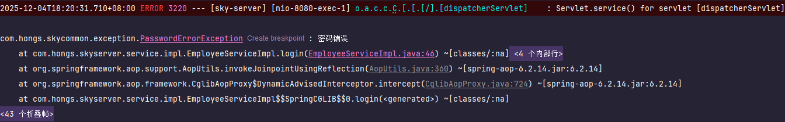
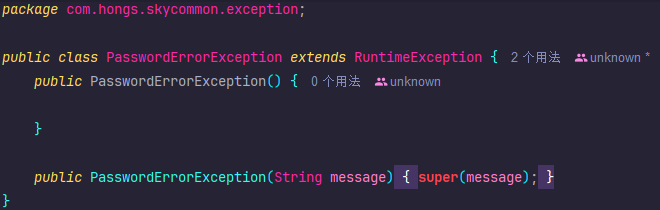
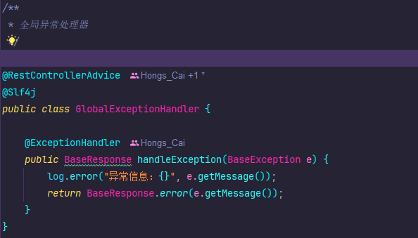
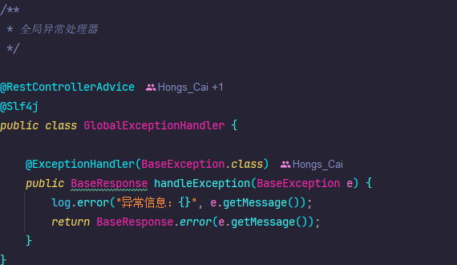
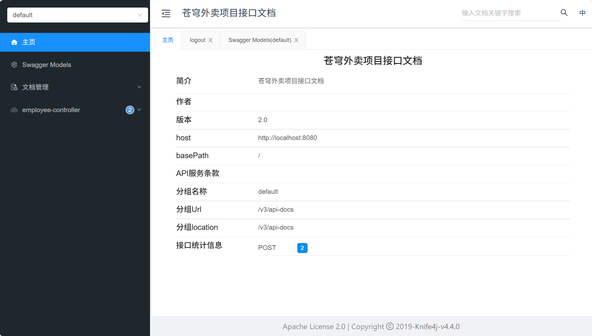

# 2025年12月2日

## 无法找到javax/xml/bind/DatatypeConverter

1. **环境**：使用的是 **JDK 17**。
2. **代码**：项目中使用的 JWT 工具包版本是 `jjwt:0.9.1`（这是一个 2018 年的老版本）。
3. **冲突点**：`jjwt:0.9.1` 的底层依赖于 `javax.xml.bind.DatatypeConverter` 这个类来做 Base64 解码。
	- 这个类在 JDK 8 中是内置的。
	- 但是，**从 JDK 11 开始，Java 官方把 `javax.xml.bind` 包彻底移除了**。
4. **结果**：当代码运行到 `JwtUtil` 解析令牌时，JVM 在 JDK 17 里找不到这个类，于是抛出 `ClassNotFoundException: javax.xml.bind.DatatypeConverter`。


添加依赖

```xml
<dependency>
    <groupId>javax.xml.bind</groupId>
    <artifactId>jaxb-api</artifactId>
    <version>2.3.1</version>
</dependency>
```


# 2025年12月4日

## 登录失败无报错提示信息

问题：


输入错误密码无错误提示，且有报错




解决：

异常未继承BaseException，但调用了BaseException的方法



全局异常处理器使用ExceptionHandler注解，默认捕获RuntimeException异常



指定捕获异常类型




# 2025年12月5日

## 使用Knife4j出现文档请求异常

springboot3.x以上就需要换knife4j依赖为4.x版本的knife4j-openapi3-jakarta-spring-boot-starter依赖

```xml
<dependency>
    <groupId>com.github.xiaoymin</groupId>
    <artifactId>knife4j-openapi3-jakarta-spring-boot-starter</artifactId>
    <version>4.5.0</version>
</dependency>
```

由于从Swagger2变更到Openapi3的标准，故注解以及配置类全部重新该

> 由于Springboot版本为3.5.8不支持Knife4j最新的4.5.0版本，故将Springboot版本降低为3.2.12（悲

```xml
    <parent>
        <groupId>org.springframework.boot</groupId>
        <artifactId>spring-boot-starter-parent</artifactId>
        <version>3.2.12</version>
    </parent>
```




# 2025年12月7日

## Knife4j的调试接口将请求参数对象识别为了请求体


```java
    /**
     * 员工分页查询
     * @param pageQueryDTO
     * @return
     */
    @Operation(summary = "员工分页查询")
    @GetMapping("/page")
    public Result<PageResult> page(@ParameterObject EmployeePageQueryDTO pageQueryDTO) {
        log.info("员工分页查询: {}", pageQueryDTO);
        PageResult pageResult = employeeService.page(pageQueryDTO);
        return Result.success(pageResult);
    }
```


添加 @ParameterObject 注解，效果达成


## 扩展 Spring MVC 框架的消息转换器后Knife4j文档请求异常

源代码如下

```java
public class WebMvcConfig extends WebMvcConfigurationSupport {
    /**
     * 扩展 Spring MVC 框架的消息转换器
     * @param converters
     */
    @Override
    protected void extendMessageConverters(List<HttpMessageConverter<?>> converters) {

        log.info("扩展消息转换器...");

        // 1. 创建一个消息转换器对象
        MappingJackson2HttpMessageConverter converter = new MappingJackson2HttpMessageConverter();

        // 2. 需要为消息转换器设置一个对象转换器，对象转换器可以将 Java 对象序列化为 JSON 数据
        converter.setObjectMapper(new JacksonObjectMapper());

        // 3. 将自己的消息转换器加入到容器中
        converters.add(0, converter);
    }
}
```


原因是扩展 Spring MVC 框架的消息转换器更改了Knife4j的json数据解析，解决方式将消息转换器的优先级调低。

```java
converters.add(1, converter);
```

或者

```jav
converters.add(converters.size() - 1, converter);
```


# 2025年12月9日

## 自动填充字段失败1 (Mybatis-Plus配置)

<font color='red'>在 `update(Wrapper<T> updateWrapper)` 时不会自动填充，需要手动赋值字段条件。</font>

```java
    /**
     * 启用禁用分类
     * @param status
     * @param id
     * @return
     */
    @Override
    public void updateStatus(Integer status, Long id) {
        LambdaUpdateWrapper<Category> wrapper = new LambdaUpdateWrapper<>();
        wrapper.eq(Category::getId, id)
                .set(status != null, Category::getStatus, status);
        this.update(wrapper);
    }
```

```java
    /**
     * 启用禁用分类
     * @param status
     * @param id
     * @return
     */
    @Override
    public void updateStatus(Integer status, Long id) {
        Category category = Category.builder()
                .id(id)
                .status(status)
                .build();
        this.updateById(category);
    }
```


## 自动填充字段出现失败2 (Mybatis-Plus配置)

手动实现中，反射需要依靠方法名

```java
package com.hongs.skycommon.constant;

/**
 * 公共字段自动填充相关常量
 */
public class AutoFillConstant {
    public static final String SET_CREATE_TIME = "setCreateTime";
    public static final String SET_UPDATE_TIME = "setUpdateTime";
    public static final String SET_CREATE_USER = "setCreateUser";
    public static final String SET_UPDATE_USER = "setUpdateUser";
}
```


Mybatis-Plus，的使用中只需要属性即可

```java
package com.hongs.skycommon.constant;

/**
 * 公共字段自动填充相关常量
 */
public class AutoFillConstant {
    public static final String CREATE_TIME = "createTime";
    public static final String UPDATE_TIME = "updateTime";
    public static final String CREATE_USER = "createUser";
    public static final String UPDATE_USER = "updateUser";
}
```


# 2025年12月11日

## xml配置文件中SQL语法错误

```sql
select d.id, d.name, d.category_id, d.price, d.image, d.description,
    d.status, d.update_time, c.name as c.category_name
...
```

`c.name as c.category_name` 中 `AS` 后面的别名（Alias）就是一个纯粹的名字，**不能包含点号（`.`）**。


## xml配置文件中未找到绑定属性

```shell
### Error querying database.  Cause: org.apache.ibatis.binding.BindingException: Parameter 'name' not found. Available parameters are [page, dishPageQueryDTO, param1, param2]
### Cause: org.apache.ibatis.binding.BindingException: Parameter 'name' not found. Available parameters are [page, dishPageQueryDTO, param1, param2]] with root cause
```


修改前：

```xml
<select id="pageQuery" resultType="com.hongs.skycommon.pojo.vo.DishPageQueryVO">
    select d.id, d.name, d.category_id, d.price, d.image, d.description,
    d.status, d.update_time, c.name as category_name
    from dish d
    left join category c on d.category_id = c.id
    <where>
        <if test="name != null and name != ''">
            and d.name like concat('%', #{name}, '%')
        </if>
        <if test="categoryId != null">
            and d.category_id = #{categoryId}
        </if>
        <if test="status != null">
            and d.status = #{status}
        </if>
    </where>
</select>
```

> 传入的是dto，而非几个单一属性


修改后：

```xml
    <select id="pageQuery" resultType="com.hongs.skycommon.pojo.vo.DishPageQueryVO">
        select d.id, d.name, d.category_id, d.price, d.image, d.description,
        d.status, d.update_time, c.name as category_name
        from dish d
        left join category c on d.category_id = c.id
        <where>
            <if test="dishPageQueryDTO.name != null and dishPageQueryDTO.name != ''">
                and d.name like concat('%', #{dishPageQueryDTO.name}, '%')
            </if>
            <if test="dishPageQueryDTO.categoryId != null">
                and d.category_id = #{dishPageQueryDTO.categoryId}
            </if>
            <if test="dishPageQueryDTO.status != null">
                and d.status = #{dishPageQueryDTO.status}
            </if>
        </where>
    </select>
```


还可以起别名，在mapper文件中设置 `@Param("别名")`

> <font color='red'>注意该注解的import应该来自ibatis</font>

```java
public interface DishMapper extends BaseMapper<Dish> {

    /**
     * 菜品分页查询
     * @param page
     * @param dishPageQueryDTO
     * @return
     */
    Page<DishPageQueryVO> pageQuery(Page<DishPageQueryVO> page, @Param("dto") DishPageQueryDTO dishPageQueryDTO);

}
```

```xml
<select id="pageQuery" resultType="com.hongs.skycommon.pojo.vo.DishPageQueryVO">
    select d.id, d.name, d.category_id, d.price, d.image, d.description,
    d.status, d.update_time, c.name as category_name
    from dish d
    left join category c on d.category_id = c.id
    <where>
        <if test="dto.name != null and dto.name != ''">
            and d.name like concat('%', #{dto.name}, '%')
        </if>
        <if test="dto.categoryId != null">
            and d.category_id = #{dto.categoryId}
        </if>
        <if test="dto.status != null">
            and d.status = #{dto.status}
        </if>
    </where>
</select>
```


# 2025年12月14日

## Spring 循环依赖

### 错误原因

```
***************************
APPLICATION FAILED TO START
***************************

Description:

The dependencies of some of the beans in the application context form a cycle:

   dishController (field private com.hongs.skyserver.service.DishService com.hongs.skyserver.controller.admin.DishController.dishService)
┌─────┐
|  dishServiceImpl (field private com.hongs.skyserver.service.SetmealService com.hongs.skyserver.service.impl.DishServiceImpl.setmealService)
↑     ↓
|  setmealServiceImpl (field private com.hongs.skyserver.service.DishService com.hongs.skyserver.service.impl.SetmealServiceImpl.dishService)
└─────┘
```

代码中出现了“我调用你，你调用我”的死锁情况：

1. **DishServiceImpl** 中注入了 `SetmealService`（为了在停售菜品时，连带停售套餐）。
2. **SetmealServiceImpl** 中注入了 `DishService`（为了在起售套餐时，检查包含的菜品是否在售）。

Spring 在启动时，创建 `DishServiceImpl` 需要 `SetmealService`，而去创建 `SetmealService` 时又发现它需要 `DishServiceImpl`，于是就卡住报错了。


### 解决方案

这里有三种解决方法，推荐使用 **方法一** 或 **方法二**。

#### 方法一：使用 `@Lazy` 注解（最简单，推荐）

告诉 Spring：在注入这个依赖时，先不要立即创建它的实例，而是等真正调用它的时候再创建（懒加载）。

你只需要在其中**任意一方**（或者两方都加）的 `@Autowired` 上加上 `@Lazy` 注解即可。

**修改 `DishServiceImpl.java`：**

```Java
    @Autowired
    private DishFlavorService dishFlavorService;

    @Autowired
    private SetmealDishService setmealDishService;

    @Autowired
    @Lazy // <--- 加上这个注解，打破循环
    private SetmealService setmealService;
```

或者修改 `SetmealServiceImpl.java`：

```Java
    @Autowired
    private SetmealDishService setmealDishService;

    @Autowired
    @Lazy // <--- 或者加在这里
    private DishService dishService;
```


#### 方法二：注入 Mapper 而不是 Service（架构更干净）

通常出现循环依赖，意味着 Service 层的职责耦合过重。如果只是为了简单的查询（比如 count），可以直接注入 Mapper，避免 Service 之间的相互依赖。

针对 SetmealServiceImpl：

注入 DishService 主要是为了检查菜品状态（count 操作）。

可以改为注入 DishMapper。

```java
public class SetmealServiceImpl ... {
    
    // 删除这个
    // @Autowired
    // private DishService dishService;

    // 改为注入 Mapper
    @Autowired
    private DishMapper dishMapper; 

    @Override
    public void updateStatus(Integer status, Long id) {
        if (status.equals(StatusConstant.ENABLE)) {
            // ...
            // 原代码：Long count = dishService.count(...)
            // 新代码：直接用 Mapper 查询
            Long count = dishMapper.selectCount(new LambdaQueryWrapper<Dish>()
                    .in(Dish::getId, dishIdList)
                    .eq(Dish::getStatus, StatusConstant.DISABLE));
            
            if (count > 0) {
                 throw new SetMealEnableFailedException(...);
            }
        }
        // ...
    }
}
```

这样 `SetmealService` 就不依赖 `DishService` 了，环就被打破了。


#### 方法三：修改配置文件（不推荐）

Spring Boot 默认禁止循环依赖。你可以强制开启允许循环依赖，但这只是掩盖问题，不是解决问题。

在 `application.yml` 或 `application.properties` 中添加：

```yaml
spring:
  main:
    allow-circular-references: true
```


# 2025年12月16日

## Redis 序列化配置与类型转换异常

### 核心问题现象

在使用 `RedisTemplate<Object, Object>` 配置 JSON 序列化（如 `Jackson2JsonRedisSerializer`）处理 Value 时，从 Redis 读取数据并强制转换为具体业务对象（如 `User`）时，常抛出以下异常：

> ```
> java.lang.ClassCastException: java.util.LinkedHashMap cannot be cast to com.sky.entity.User
> ```

### 异常产生原因

- **存储阶段**：当使用普通 JSON 序列化器时，Java 对象被转换为纯 JSON 字符串（例如 `{"id":1, "name":"test"}`），其中**不包含**原对象的类信息（Class Type）。
- **读取阶段**：反序列化器读取到 JSON 数据。由于不知道目标类是 `User` 还是 `Order`，Jackson 默认将其解析为通用的键值对集合 **`LinkedHashMap`**。
- **转换阶段**：代码试图将 `LinkedHashMap` 强转为 `User`，导致类型转换失败。

### 三种配置策略对比

#### 策略 A：混合模式（Key 字符串化，Value 保持默认）

这是为了规避类型转换异常的一种折中配置。

- **配置方式**：
  - Key：`StringRedisSerializer`
  - Value：**默认（JDK 序列化）**
- **原理**：JDK 序列化会在二进制流中写入完整的类路径（如 `com.sky.entity.User`）。
- **优点**：
  - Key 可读，方便调试。
  - **类型安全**：反序列化时 JVM 知道确切的类类型，强转绝对安全，不会报 `ClassCastException`。
- **缺点**：
  - Redis 中的 Value 是二进制乱码，不可读。
  - 数据体积较大，且必须实现 `Serializable` 接口。

#### 策略 B：智能 JSON 模式（自动携带类型）

- **配置方式**：Value 使用 **`GenericJackson2JsonRedisSerializer`**。

- **原理**：在存入 JSON 时，自动添加一个 `"@class"` 字段记录类名。

  ```json
  {
    "@class": "com.sky.entity.User",
    "id": 1, 
    "name": "test"
  }
  ```
  
- **优点**：数据可读，且自动处理类型转换。

- **缺点**：如果不小心修改了包名或类名，旧缓存反序列化会报错；由于多存了类名，体积略有增加。

#### 策略 C：全手动模式（推荐生产环境使用）

- **配置方式**：直接使用 **`StringRedisTemplate`**。

- **原理**：Redis 只负责存字符串，序列化逻辑由业务代码控制。

- **代码示例**：

  ```java
  // 存
  stringRedisTemplate.opsForValue().set(key, JSON.toJSONString(user));
  // 取
  String json = stringRedisTemplate.opsForValue().get(key);
  User user = JSON.parseObject(json, User.class); // 手动指定类型
  ```
  
- **优点**：**完全可控**，彻底杜绝类型转换异常，跨语言兼容性最好。

### 总结

“只配置 Key 序列化，不配置 Value 序列化”的做法，本质上是利用 **JDK 原生序列化携带类信息** 的特性，以牺牲 Redis 中数据的可读性为代价，来换取 Java 代码中类型转换的稳定性（避免 `ClassCastException`）。


# 2025年12月23日

## 属性部分导致的自动填充失效

### 问题描述

```java
@Slf4j
@Component
public class MyMetaObjectHandler implements MetaObjectHandler {

    @Override
    public void insertFill(MetaObject metaObject) {
        log.info("开始插入填充...");
        this.strictInsertFill(metaObject, AutoFillConstant.CREATE_TIME, LocalDateTime.class, LocalDateTime.now());
        this.strictInsertFill(metaObject, AutoFillConstant.CREATE_USER, Long.class, BaseContext.getCurrentId());
        this.strictInsertFill(metaObject, AutoFillConstant.UPDATE_TIME, LocalDateTime.class, LocalDateTime.now());
        this.strictInsertFill(metaObject, AutoFillConstant.UPDATE_USER, Long.class, BaseContext.getCurrentId());
    }

    @Override
    public void updateFill(MetaObject metaObject) {
        log.info("开始更新填充...");
        this.strictUpdateFill(metaObject, AutoFillConstant.UPDATE_TIME, LocalDateTime.class, LocalDateTime.now());
        this.strictUpdateFill(metaObject, AutoFillConstant.UPDATE_USER, Long.class, BaseContext.getCurrentId());
    }
}
```

有 `CreateTime` `UpdateTime` `CreateUser` `UpdateUser` 这四种属性的 `set` 方法时，才会触发自动填充的 `insertFill`；同理，有 `UpdateTime` ` UpdateUser` 这两种属性的 `set` 方法才会触发自动填充的 `updateFill`。


### 改进方法

```java
@Slf4j
@Component
public class MyMetaObjectHandler implements MetaObjectHandler {

    @Override
    public void insertFill(MetaObject metaObject) {
        log.info("开始插入填充...");

        // 1. 填充 createTime (User实体有这个字段，会执行)
        if (metaObject.hasSetter(AutoFillConstant.CREATE_TIME)) {
            this.strictInsertFill(metaObject, AutoFillConstant.CREATE_TIME, LocalDateTime.class, LocalDateTime.now());
        }

        // 2. 填充 createUser (User实体没有这个字段，hasSetter返回false，跳过，不会报错)
        if (metaObject.hasSetter(AutoFillConstant.CREATE_USER)) {
            this.strictInsertFill(metaObject, AutoFillConstant.CREATE_USER, Long.class, BaseContext.getCurrentId());
        }

        // 3. 填充 updateTime
        if (metaObject.hasSetter(AutoFillConstant.UPDATE_TIME)) {
            this.strictInsertFill(metaObject, AutoFillConstant.UPDATE_TIME, LocalDateTime.class, LocalDateTime.now());
        }

        // 4. 填充 updateUser
        if (metaObject.hasSetter(AutoFillConstant.UPDATE_USER)) {
            this.strictInsertFill(metaObject, AutoFillConstant.UPDATE_USER, Long.class, BaseContext.getCurrentId());
        }
    }

    @Override
    public void updateFill(MetaObject metaObject) {
        log.info("开始更新填充...");

        if (metaObject.hasSetter(AutoFillConstant.UPDATE_TIME)) {
            this.strictUpdateFill(metaObject, AutoFillConstant.UPDATE_TIME, LocalDateTime.class, LocalDateTime.now());
        }

        if (metaObject.hasSetter(AutoFillConstant.UPDATE_USER)) {
            this.strictUpdateFill(metaObject, AutoFillConstant.UPDATE_USER, Long.class, BaseContext.getCurrentId());
        }
    }
}
```

这样的同一个 Handler 就可以同时兼容“全字段实体（如员工表）”和“少字段实体（如用户表）”。
