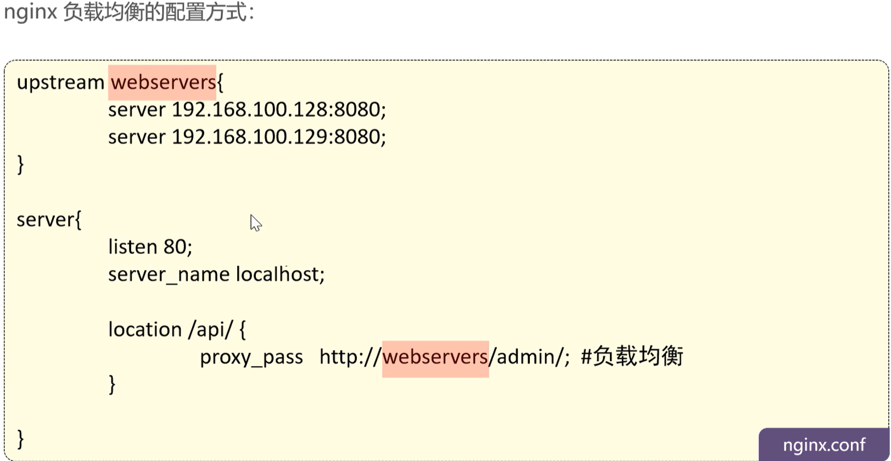
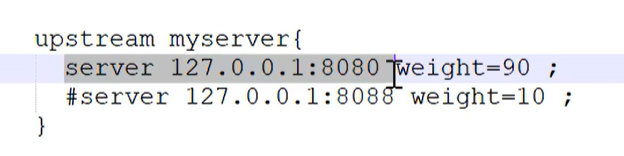
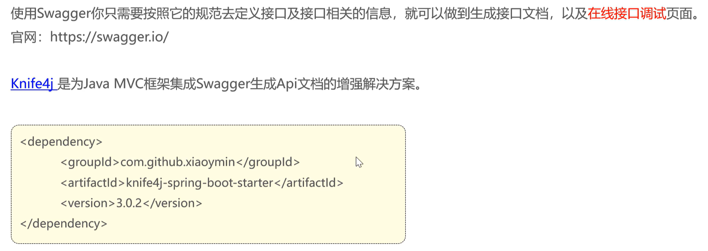
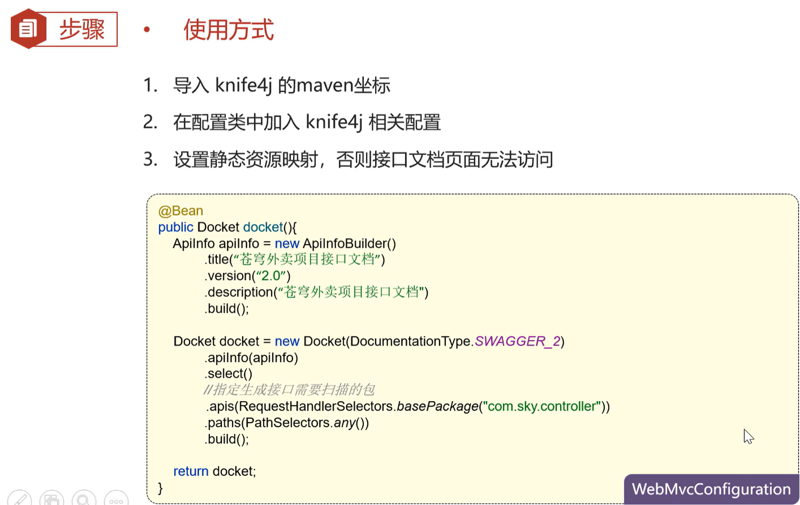

# nginx

## 优点

### 1. 提高访问速度

Nginx 通过**动静分离**和**多级缓存策略**来显著减少网络延迟和后端计算压力，从而提高响应速度。

- 静态资源直接响应：

	Nginx 擅长处理高并发 I/O。对于图片、CSS、JS 等静态文件，Nginx 直接从磁盘读取并返回给客户端，无需转发给 Tomcat（Java 后端）。这避免了 Java 虚拟机（JVM）处理简单文件时的资源浪费。

- 服务端代理缓存 (Proxy Cache)：

	这是 Nginx 自身的缓存。当 Nginx 接收到后端 Tomcat 返回的动态数据（如 JSON 响应）时，会根据配置将其写入本地磁盘或内存。当后续有相同的请求到来时，Nginx 直接读取本地缓存数据返回，完全截断了与后端的通信，从而实现毫秒级响应。

- 客户端浏览器缓存 (Browser Caching)：

	Nginx 通过修改 HTTP 响应头（添加 Cache-Control 或 Expires 字段），向客户端浏览器发送指令。浏览器接收指令后，会将资源存储在本地。在有效期内，用户再次访问时，浏览器直接读取本地文件，根本不发送网络请求。

### 2. 进行负载均衡

Nginx 作为流量的统一入口，负责将高并发的客户端请求分发到后端的多个服务节点上，以解决单机性能瓶颈并实现高可用。

- 流量分发策略：

	Nginx 接收所有进来的请求（通常监听 80/443 端口），并根据预设算法（如轮询、权重 Weight、IP Hash）将这些请求路由到后端的不同服务器实例（如运行在 8080、8081、8082 端口的多个 Tomcat）。

- 故障转移与健康检查：

	Nginx 会持续监控后端服务器的状态。如果其中一个后端节点（例如 8080）宕机或响应超时，Nginx 会自动将后续流量转发给其他健康的节点（如 8081），确保服务不中断，避免单点故障导致整个系统瘫痪。

### 3. 保证后端服务安全

Nginx 作为中间层，通过隔离外网与内网环境、隐藏架构细节来保护后端核心业务服务。

- 隐藏真实网络拓扑：

	客户端只与 Nginx 建立连接，只能看到 Nginx 的 IP 和端口。后端的真实业务服务器（Tomcat）运行在内网或受限网络中，不直接暴露给公网。这防止了攻击者直接扫描或攻击核心数据库和业务服务器的端口。

- 反向代理与路径重写：

	通过配置 proxy_pass，Nginx 将外部请求路径（如 /api/）映射为内部路径（如 /admin/）。这种抽象层屏蔽了后端真实的 API 目录结构和实现细节，增加了攻击者嗅探后端逻辑的难度。

- 请求过滤与黑名单：

	Nginx 可以在流量到达后端 Java 程序之前进行预处理，拦截恶意 IP、限制高频请求（防 DDoS）、拒绝不符合规范的 HTTP 请求，从而保护后端计算资源不被恶意占用。

## 配置方法

### 反向代理

### 负载均衡

 

# Swagger

## 简介

## 使用方式

