# nginx

## 优点

### 1. 提高访问速度

Nginx 通过**动静分离**和**多级缓存策略**来显著减少网络延迟和后端计算压力，从而提高响应速度。

- 静态资源直接响应：

	Nginx 擅长处理高并发 I/O。对于图片、CSS、JS 等静态文件，Nginx 直接从磁盘读取并返回给客户端，无需转发给 Tomcat（Java 后端）。这避免了 Java 虚拟机（JVM）处理简单文件时的资源浪费。

- 服务端代理缓存 (Proxy Cache)：

	这是 Nginx 自身的缓存。当 Nginx 接收到后端 Tomcat 返回的动态数据（如 JSON 响应）时，会根据配置将其写入本地磁盘或内存。当后续有相同的请求到来时，Nginx 直接读取本地缓存数据返回，完全截断了与后端的通信，从而实现毫秒级响应。

- 客户端浏览器缓存 (Browser Caching)：

	Nginx 通过修改 HTTP 响应头（添加 Cache-Control 或 Expires 字段），向客户端浏览器发送指令。浏览器接收指令后，会将资源存储在本地。在有效期内，用户再次访问时，浏览器直接读取本地文件，根本不发送网络请求。

### 2. 进行负载均衡

Nginx 作为流量的统一入口，负责将高并发的客户端请求分发到后端的多个服务节点上，以解决单机性能瓶颈并实现高可用。

- 流量分发策略：

	Nginx 接收所有进来的请求（通常监听 80/443 端口），并根据预设算法（如轮询、权重 Weight、IP Hash）将这些请求路由到后端的不同服务器实例（如运行在 8080、8081、8082 端口的多个 Tomcat）。

- 故障转移与健康检查：

	Nginx 会持续监控后端服务器的状态。如果其中一个后端节点（例如 8080）宕机或响应超时，Nginx 会自动将后续流量转发给其他健康的节点（如 8081），确保服务不中断，避免单点故障导致整个系统瘫痪。

### 3. 保证后端服务安全

Nginx 作为中间层，通过隔离外网与内网环境、隐藏架构细节来保护后端核心业务服务。

- 隐藏真实网络拓扑：

	客户端只与 Nginx 建立连接，只能看到 Nginx 的 IP 和端口。后端的真实业务服务器（Tomcat）运行在内网或受限网络中，不直接暴露给公网。这防止了攻击者直接扫描或攻击核心数据库和业务服务器的端口。

- 反向代理与路径重写：

	通过配置 proxy_pass，Nginx 将外部请求路径（如 /api/）映射为内部路径（如 /admin/）。这种抽象层屏蔽了后端真实的 API 目录结构和实现细节，增加了攻击者嗅探后端逻辑的难度。

- 请求过滤与黑名单：

	Nginx 可以在流量到达后端 Java 程序之前进行预处理，拦截恶意 IP、限制高频请求（防 DDoS）、拒绝不符合规范的 HTTP 请求，从而保护后端计算资源不被恶意占用。


## 配置方法

### 反向代理


### 负载均衡


 


# Swagger2 / Openapi3

## 简介


## 使用方式


```java
// 方法名：addResourceHandlers（添加资源处理器）
protected void addResourceHandlers(ResourceHandlerRegistry registry) {

    // -------------------------------------------------------
    // 第一组映射：处理主页
    // -------------------------------------------------------
    // A.【前端请求】当浏览器访问：http://localhost:8080/doc.html
    registry.addResourceHandler("/doc.html")
            // B.【后端指路】告诉 Spring 去 Jar 包里的这个位置找文件：
            // "classpath:" 意味着去所有引入的 Jar 包里找
            .addResourceLocations("classpath:/META-INF/resources/");

    // -------------------------------------------------------
    // 第二组映射：处理静态资源（CSS, JS 等）
    // -------------------------------------------------------
    // A.【前端请求】当浏览器访问：http://localhost:8080/webjars/css/app.css
    registry.addResourceHandler("/webjars/**")
            // B.【后端指路】告诉 Spring 去 Jar 包里的这个位置找：
            .addResourceLocations("classpath:/META-INF/resources/webjars/");
}
```


**当引入 Knife4j 的 Maven 依赖后**

- **真相**：接口文档的页面（`doc.html`）、样式（CSS）、脚本（JS）**并没有**被复制到你的 `src/main/resources/static` 目录下。
- **位置**：它们依然静静地躺在第三方 Jar 包（比如 `knife4j-spring-ui.jar`）的肚子里，具体路径是 `classpath:/META-INF/resources/`。

因为它们不在你的项目源代码文件夹里，Spring MVC 默认可能“视而不见”。


**什么要手动写这个？（关键）**

你可能会问：“Spring Boot 不是全自动的吗？为什么还要我手动写地图？”

- **原因**：你的配置类继承了 **`WebMvcConfigurationSupport`**。
- **后果**：这个类是 Spring MVC 的“高级自定义模式”。一旦你继承了它，Spring Boot 就会认为“这个开发者是个高手，他想完全自己控制 MVC 配置”，于是 Spring Boot 就会**自动关闭**默认的静态资源配置（Default Auto Configuration）。
- **结局**：因为默认配置失效了，Spring 就不再去 Jar 包的 `META-INF/resources` 里找东西了。如果你不写上面这段代码，访问文档就会报 **404 Not Found**。


> 当你启动项目时，Spring 会把：
>
> 1. 你自己写的 `src/main/resources`
> 2. 依赖 A.jar 里的 `META-INF/resources`
> 3. 依赖 B.jar 里的 `META-INF/resources`
>
> **在内存中**逻辑上合并成一个大的资源池。


## Swagger2和Openapi3的差别

### 核心Bean配置

#### 1. 核心配置速查表

| **配置项**       | **旧版 (Springfox / Swagger 2)**    | **新版 (SpringDoc / OpenAPI 3)**                         | **核心区别**                                                 |
| ---------------- | ----------------------------------- | -------------------------------------------------------- | ------------------------------------------------------------ |
| **核心配置对象** | `Docket`                            | **`OpenAPI`** (全局信息) **`GroupedOpenApi`** (分组扫描) | 旧版一个对象包揽所有；新版将“文档元数据”和“接口分组”拆分了。 |
| **文档基础信息** | `ApiInfo` / `ApiInfoBuilder`        | **`Info`** (`io.swagger.v3.oas.models.info.Info`)        | 类名变了，构造方式从 Builder 模式变为链式 Setter。           |
| **包扫描方式**   | `.apis(RequestHandlerSelectors...)` | **`.packagesToScan("...")`** (在 GroupedOpenApi 中)      | 新版方法名更直观，也可以直接在 YAML 中配置。                 |
| **路径过滤**     | `.paths(PathSelectors.any())`       | **`.pathsToMatch("/\**")`**                              | 新版直接使用 Ant 风格路径字符串。                            |
| **文档类型声明** | `DocumentationType.SWAGGER_2`       | **不需要声明**                                           | 默认就是 OpenAPI 3。                                         |
| **全局参数**     | `.globalOperationParameters(...)`   | `.components(...)`                                       | 新版需要配置 Components 或 SecuritySchemes。                 |


#### 2. 代码详细对比

#####  旧版方案 (Swagger 2)

**特点**：所有的配置（信息 + 扫描）都塞在一个 `Docket` Bean 里。

```java
@Bean
public Docket docket() {
    ApiInfo apiInfo = new ApiInfoBuilder()
            .title("苍穹外卖项目接口文档")
            .version("2.0")
            .description("项目描述")
            .build();
            
    return new Docket(DocumentationType.SWAGGER_2)
            .apiInfo(apiInfo) // 设置信息
            .select()
            .apis(RequestHandlerSelectors.basePackage("com.hongs.skyserver.controller")) // 设置扫描
            .build();
}
```


##### 新版方案 A：纯 Java Bean 配置 (Explicit Style)

特点：不依赖 YAML，完全通过 Java 代码控制。适合需要配置多个分组（如管理端、用户端）的复杂场景。

需要定义两个 Bean：

1. `OpenAPI`: 配置文档标题等元数据。
2. `GroupedOpenApi`: 配置具体的包扫描路径。

```java
@Configuration
public class WebMvcConfig {

    /**
     * 1. 配置文档元数据 (标题、版本)
     */
    @Bean
    public OpenAPI customOpenAPI() {
        return new OpenAPI()
                .info(new Info()
                        .title("苍穹外卖项目接口文档")
                        .version("2.0")
                        .description("项目描述"));
    }

    /**
     * 2. 配置接口扫描 (替代原来的 .apis 和 .paths)
     */
    @Bean
    public GroupedOpenApi publicApi() {
        return GroupedOpenApi.builder()
                .group("默认接口")                  // 设置分组名
                .packagesToScan("com.hongs.skyserver.controller") // 指定扫描包
                .pathsToMatch("/**")              // 匹配所有路径
                .build();
    }
    
    // 如果有管理端分组，可以再定义一个 Bean
    /*
    @Bean
    public GroupedOpenApi adminApi() {
        return GroupedOpenApi.builder()
                .group("管理端接口")
                .packagesToScan("com.hongs.skyserver.controller.admin")
                .build();
    }
    */
}
```


##### 新版方案 B：Java Bean + YAML 组合配置

**特点**：最简洁。Java 只负责定义“文档叫什么”，YAML 负责定义“扫描哪里”。

**第一步：Java 代码 (WebMvcConfig.java)**

```java
@Configuration
public class WebMvcConfig {

    /**
     * 仅配置文档元数据
     * 扫描逻辑移交 YAML 处理，这里不需要 GroupedOpenApi
     */
    @Bean
    public OpenAPI customOpenAPI() {
        return new OpenAPI()
                .info(new Info()
                        .title("苍穹外卖项目接口文档")
                        .version("2.0")
                        .description("项目描述"));
    }
}
```

**第二步：配置文件 (application.yml)**

```yaml
springdoc:
  # 对应 .apis(RequestHandlerSelectors.basePackage(...))
  packages-to-scan: com.hongs.skyserver.controller
  
  # 对应 .paths(PathSelectors.any())
  paths-to-match: /**
  
  # 其他常用配置
  api-docs:
    enabled: true
```


> 分组情况下的写法
>
> ```yaml
> springdoc:
>   # 全局配置（所有分组通用的）
>   api-docs:
>     enabled: true
>   
>   # 【核心】这里配置分组，替代 Java 中的 GroupedOpenApi Bean
>   group-configs:
>     # 第 1 组：管理端接口
>     - group: "admin"
>       paths-to-match: "/admin/**"
>       packages-to-scan: com.hongs.skyserver.controller.admin
>       
>     # 第 2 组：用户端接口
>     - group: "user"
>       paths-to-match: "/user/**"
>       packages-to-scan: com.hongs.skyserver.controller.user
> ```


### 主要注解变化

#### 1. 核心注解速查表

| **作用域**          | **旧版注解 (Swagger 2)** | **新版注解 (OpenAPI 3)** | **常用属性变化 (旧 -> 新)**                       |
| ------------------- | ------------------------ | ------------------------ | ------------------------------------------------- |
| **Controller 类**   | `@Api`                   | **`@Tag`**               | `tags` -> `name`                                  |
| **接口方法**        | `@ApiOperation`          | **`@Operation`**         | `value` -> `summary` `notes` -> `description`     |
| **实体类 (DTO/VO)** | `@ApiModel`              | **`@Schema`**            | `value` -> `description`/`title`                  |
| **实体属性**        | `@ApiModelProperty`      | **`@Schema`**            | `value` -> `description`                          |
| **参数 (非Body)**   | `@ApiParam`              | **`@Parameter`**         | `value` -> `description` `required` -> `required` |
| **忽略/隐藏**       | `@ApiIgnore`             | **`@Hidden`**            | 无                                                |


#### 2. 详细代码对比示例

假设你有一个 `EmployeeController` 和一个 `EmployeeLoginDTO`，我们来看看具体的写法区别。

##### A. Controller 层对比

**旧版 (Swagger 2):**

```java
import io.swagger.annotations.Api;
import io.swagger.annotations.ApiOperation;
import io.swagger.annotations.ApiParam;

@Api(tags = "员工管理接口") // 旧版
@RestController
@RequestMapping("/admin/employee")
public class EmployeeController {

    @ApiOperation(value = "员工登录", notes = "返回token") // 旧版
    @PostMapping("/login")
    public Result<EmployeeLoginVO> login(
            @RequestBody @ApiParam("登录参数") EmployeeLoginDTO employeeLoginDTO) { // 旧版
        // ...
        return Result.success();
    }
}
```

**新版 (OpenAPI 3):**

```java
import io.swagger.v3.oas.annotations.tags.Tag;
import io.swagger.v3.oas.annotations.Operation;
import io.swagger.v3.oas.annotations.Parameter;

@Tag(name = "员工管理接口") // 【变化1】用 @Tag，属性为 name
@RestController
@RequestMapping("/admin/employee")
public class EmployeeController {

    @Operation(summary = "员工登录", description = "返回token") // 【变化2】value变summary, notes变description
    @PostMapping("/login")
    public Result<EmployeeLoginVO> login(
            @RequestBody @Parameter(description = "登录参数") EmployeeLoginDTO employeeLoginDTO) { // 【变化3】用 @Parameter
        // ...
        return Result.success();
    }
}
```

##### B. 实体类 (DTO/VO) 层的对比

这是改动最大的地方，旧版区分了 `@ApiModel` (类) 和 `@ApiModelProperty` (字段)，**新版统一使用 `@Schema`**。

**旧版 (Swagger 2):**

```java
import io.swagger.annotations.ApiModel;
import io.swagger.annotations.ApiModelProperty;

@Data
@ApiModel(description = "员工登录DTO") // 旧版
public class EmployeeLoginDTO {

    @ApiModelProperty(value = "用户名", example = "admin", required = true) // 旧版
    private String username;

    @ApiModelProperty("密码")
    private String password;
}
```

**新版 (OpenAPI 3):**

```java
import io.swagger.v3.oas.annotations.media.Schema;

@Data
@Schema(description = "员工登录DTO") // 【变化1】类上也用 @Schema
public class EmployeeLoginDTO {

    @Schema(description = "用户名", example = "admin", requiredMode = Schema.RequiredMode.REQUIRED) // 【变化2】统一用 @Schema
    private String username;

    @Schema(description = "密码")
    private String password;
}
```


#### 3. 其他常见细节变化

##### 1. 忽略某个参数或接口

- **旧版**: `@ApiIgnore`
- **新版**: `@Hidden` (可以加在方法上，也可以加在参数上)

##### 2. 多个参数描述

虽然 Spring Boot 推荐直接在参数前加注解，但如果你习惯用方法头的注解：

- **旧版**:

	```java
	@ApiImplicitParams({
	    @ApiImplicitParam(name = "id", value = "用户ID", required = true)
	})
	```

- **新版**:

	```java
	import io.swagger.v3.oas.annotations.Parameters;
	
	@Parameters({
	    @Parameter(name = "id", description = "用户ID", required = true)
	})
	```


#### 4. 迁移建议

1. 全局替换包名：

	在 IDEA 中全局替换 import io.swagger.annotations. -> import io.swagger.v3.oas.annotations. (注意这会导致报错，需要配合后续步骤)。

2. 正则替换常用注解：

	利用 IDEA 的全局替换 (Ctrl+Shift+R)，使用正则表达式或直接文本替换：

	- `@Api(tags =`  ->  `@Tag(name =`
	- `@ApiOperation(value =`  ->  `@Operation(summary =`
	- `@ApiModelProperty`  ->  `@Schema`
	- `@ApiModel` -> `@Schema`

3. 处理编译错误：

	替换完后，肯定会有很多属性名报错（比如 @Schema 没有 value 属性，只有 description）。这时再针对性地修改报错的地方。通常 @Schema("描述") 这种写法在新版中也是支持的（它是 description 的别名），所以大部分 @ApiModelProperty("描述") 替换为 @Schema("描述") 后是可以直接运行的。


## DTO的请求体和请求参数的识别

### OpenAPI3标准

使用 `@ParameterObject` (推荐 - SpringDoc/OpenAPI 3)

如果你使用的是 Spring Boot3 或者集成了 `springdoc-openapi` 的 Knife4j 版本，这是最标准的做法。

```java
/**
 * 员工分页查询
 * @param pageQueryDTO
 * @return
 */
@Operation(summary = "员工分页查询")
@GetMapping("/page")
public Result<PageResult> page(@ParameterObject EmployeePageQueryDTO pageQueryDTO) {
    log.info("员工分页查询: {}", pageQueryDTO);
    PageResult pageResult = employeeService.page(pageQueryDTO);
    return Result.success(pageResult);
}
```


### Swagger2标准

使用 `@ModelAttribute` (强烈推荐)

这是最稳定、最通用的方案。它明确告诉 Spring (以及 Swagger 2) 将 URL 中的查询参数绑定到这个对象上。

```java
import org.springframework.web.bind.annotation.ModelAttribute; // 引入这个包
import io.swagger.annotations.ApiOperation; // Swagger 2 的注解通常是这个

@ApiOperation(value = "员工分页查询") // Swagger 2 使用 @ApiOperation
@GetMapping("/page")
// 核心：加上 @ModelAttribute
public Result<PageResult> page(@ModelAttribute EmployeePageQueryDTO pageQueryDTO) {
    log.info("员工分页查询: {}", pageQueryDTO);
    PageResult pageResult = employeeService.page(pageQueryDTO);
    return Result.success(pageResult);
}
```


# ThreadLocal

## 介绍


## 使用

```java
public class BaseContext {
    private static final ThreadLocal<Long> thread = new ThreadLocal<>();

    public static void setCurrentId(Long id) {
        thread.set(id);
    }

    public static Long getCurrentId() {
        return thread.get();
    }

    public static void removeCurrentId() {
        thread.remove();
    }
}
```


```java
package com.hongs.skyserver.interceptor;

import com.hongs.skycommon.constant.JwtClaimsConstant;
import com.hongs.skycommon.context.BaseContext;
import com.hongs.skycommon.properties.JwtProperties;
import com.hongs.skycommon.utils.JwtUtil;
import io.jsonwebtoken.Claims;
import jakarta.servlet.http.HttpServletRequest;
import jakarta.servlet.http.HttpServletResponse;
import lombok.extern.slf4j.Slf4j;
import org.springframework.beans.factory.annotation.Autowired;
import org.springframework.stereotype.Component;
import org.springframework.web.method.HandlerMethod;
import org.springframework.web.servlet.HandlerInterceptor;

/**
 * Jwt令牌校验的拦截器
 */
@Component
@Slf4j
public class JwtTokenAdminInterceptor implements HandlerInterceptor {
    @Autowired
    private JwtProperties jwtProperties;

    /**
     * 校验Jwt
     *
     * @param request
     * @param response
     * @param handler
     * @return
     * @throws Exception
     */
    public boolean preHandle(final HttpServletRequest request, final HttpServletResponse response, final Object handler) throws Exception {
        // 判断当前拦截到的是Controller的方法还是其他资源
        if (!(handler instanceof HandlerMethod)) {
            // 当前拦截到的不是动态方法，直接放行
            return true;
        }

        String token = request.getHeader(jwtProperties.getAdminTokenName());

        try {
            log.info("Jwt令牌校验: {}", token);
            Claims claims = JwtUtil.parseJWT(jwtProperties.getAdminSecretKey(), token);
            Long empId = Long.valueOf(claims.get(JwtClaimsConstant.EMP_ID).toString());
            log.info("当前员工ID: {}", empId);
            BaseContext.setCurrentId(empId);

            return true;
        } catch (Exception e) {
            response.setStatus(HttpServletResponse.SC_UNAUTHORIZED);
            return false;
        }
    }
}
```


## **ThreadLocal** 与 **HttpServletRequest** 方案对比

### 方案一：放入 HttpServletRequest

这种方案直接利用 Web 容器提供的 Request 域进行属性传递。

#### 1. 实现方式

- **拦截器层**：`request.setAttribute("userId", 100L);`
- **Controller层**：`Long userId = (Long) request.getAttribute("userId");`
- **Service层**：方法参数必须显式接收 `userId`。

#### 2. 代码演示

```java
// Controller
@PostMapping
public Result save(@RequestBody OrderDTO dto, HttpServletRequest request) {
    Long userId = (Long) request.getAttribute("userId");
    // 必须把 userId 传给 Service
    orderService.createOrder(dto, userId); 
    return Result.success();
}

// Service
public void createOrder(OrderDTO dto, Long userId) {
    // 业务逻辑...
    order.setUserId(userId);
    
    // ❌ 如果 Service 还要调用其他 Service，还得继续往下传
    inventoryService.deduct(dto.getSkuId(), userId); 
}
```

#### 3. 缺点分析 (痛点)

1. 代码侵入严重（参数污染）：

	Service 层的每个方法都需要增加一个 Long userId 参数。如果调用链路很深（Controller -> Service A -> Service B -> Manager -> Dao），每一层的方法签名都要改，代码极其臃肿。

2. 架构耦合（依赖 Web 层）：

	Service 应该是纯粹的业务逻辑。如果 Service 依赖了 HttpServletRequest 或者为了拿 ID 被迫修改方法签名，一旦未来项目迁移（例如改为 Dubbo RPC 接口、MQ 消费者逻辑），这些没有 Request 对象的场景下，Service 代码就会报错。


### 方案二：使用 ThreadLocal

这种方案利用 JVM 的线程特性，将 ID 绑定在“当前线程”上，实现跨层级的数据共享。

#### 1. 实现方式

- **工具类**：封装 `ThreadLocal`，提供 `set` / `get` / `remove` 方法。
- **拦截器层**：`BaseContext.setCurrentId(userId);`
- **任意层级**：`BaseContext.getCurrentId();` 直接获取。

#### 2. 代码演示 (无需传参)

**ThreadLocal 工具类：**

```java
public class BaseContext {
    private static final ThreadLocal<Long> THREAD_LOCAL = new ThreadLocal<>();

    public static void setCurrentId(Long id) { THREAD_LOCAL.set(id); }
    public static Long getCurrentId() { return THREAD_LOCAL.get(); }
    public static void removeCurrentId() { THREAD_LOCAL.remove(); }
}
```

**业务代码（清爽）：**

```java
// Controller
@PostMapping
public Result save(@RequestBody OrderDTO dto) {
    // 不需要从 request 拿，也不用传参
    orderService.createOrder(dto);
    return Result.success();
}

// Service A
public void createOrder(OrderDTO dto) {
    // ✅ 需要用到 ID 时，随时随地直接取
    Long currentId = BaseContext.getCurrentId();
    
    order.setUserId(currentId);
    
    // 调用 Service B (完全不用管 ID 传递的问题)
    inventoryService.checkStock(dto.getSkuId());
}

// Service B (深层调用示例)
public void checkStock(Long skuId) {
    // 假如这里需要记录“是谁在查库存”的日志
    log.info("用户 {} 正在检查库存", BaseContext.getCurrentId()); 
}
```

#### 3. 优点分析

1. **数据“隐形”传递**：实现了数据的**穿透**。无论调用链有多深（比如在 Service 内部调用的工具类、日志切面 Aspect、或者私有辅助方法中），只要在同一个线程内，都能直接拿到 ID，无需层层传参。
2. **松耦合**：Service 层不需要知道 `HttpServletRequest` 的存在，也不需要知道 Token 是怎么解析的。代码更纯粹，易于单元测试和复用。


### 常用场景对比 (为什么 ThreadLocal 更好)

| **场景**               | **使用 Request 方案的后果**                                  | **使用 ThreadLocal 方案的效果**                              |
| ---------------------- | ------------------------------------------------------------ | ------------------------------------------------------------ |
| **公共字段赋值**       | `save`, `update` 等所有 Service 方法都要多加一个参数 `userId`。 | Service 内部直接 `setCreateUser(BaseContext.getCurrentId())`，方法签名保持干净。 |
| **操作日志记录 (AOP)** | 想在 `@Aspect` 切面里记录“谁操作了该接口”，很难拿到参数里的 userId。 | 在 Aspect 任意位置直接调用 `BaseContext.getCurrentId()` 即可拿到操作人。 |
| **数据权限校验**       | 底层 Dao 或 Manager 需要根据 UserId 过滤数据（如只能查自己的单）。 | 不需要从 Controller 一路传到 Dao，Dao 层直接获取 ID 拼装 SQL 条件。 |
| **RPC 调用/MQ**        | 如果未来接口不是通过 HTTP 触发的（无 Request 对象）。        | ThreadLocal 方案依然适用（只需在入口处 mock 一个 ID 放入上下文即可）。 |


## 注意事项

使用 `ThreadLocal` 方案时，必须遵守 **“有借有还”** 的原则：

在拦截器的 `afterCompletion` 方法中，**必须**调用 `BaseContext.removeCurrentId()`。

- **原因**：Tomcat 使用线程池复用线程。如果当前请求结束不清理，该线程处理下一个请求时，ThreadLocal 里可能还残留着上一个用户的 ID，导致严重的**数据泄露**（用户 A 看到了用户 B 的数据）。

```java
@Override
public void afterCompletion(...) {
    BaseContext.removeCurrentId(); // 必须清理！
}
```

>拦截器的三种方法
>
>| **方法名**          | **含义**   | **返回值** | **核心用途**       | **你的项目用处**                   |
>| ------------------- | ---------- | ---------- | ------------------ | ---------------------------------- |
>| **preHandle**       | 目标方法前 | `boolean`  | 登录校验、权限拦截 | **解析 Token，存入 ThreadLocal**   |
>| **postHandle**      | 目标方法后 | `void`     | 修改 ModelAndView  | 基本不用 (因为是 JSON 接口)        |
>| **afterCompletion** | 请求完成后 | `void`     | 资源清理、异常兜底 | **清理 ThreadLocal，防止内存泄漏** |


# 自定义消息转换器


！<font color='red'>knife4j 4.0.0以上版本不要用最高优先级，否则接口文档会异常</font>


# 阿里云OSS

## 配置阿里云OSS[文件上传]


> @Request是将 json 类型的数据序列化


[使用JavaSDK快速入门OSS文件管理-对象存储-阿里云](https://help.aliyun.com/zh/oss/user-guide/oss-sdk-quick-start?spm=a2c4g.11186623.help-menu-31815.d_0_0_3_4.7d7024b3d5Q3Ig#887997b287kuz)

```java
/**
 * 阿里云OSS属性配置
 */
@Component
@ConfigurationProperties(prefix = "sky.alioss")
@Data
public class AliOssProperties {

    private String endpoint;
    private String accessKeyId;
    private String accessKeySecret;
    private String bucketName;
    private String region;
}
```


```yaml
hongs:
  alioss:
    endpoint: oss-cn-beijing.aliyuncs.com
    access-key-id: ${OSS_ACCESS_KEY_ID}
    access-key-secret: ${OSS_ACCESS_KEY_SECRET}
    bucket-name: hongs-cai-java-sky-take-out
    region: cn-beijing
```

> Spring会自动在环境变量中寻找yml的定义


```java
/**
 * 阿里云OSS工具类
 */
@Slf4j
@Data
@AllArgsConstructor
public class AliOSSUtil {

    private String endpoint;
    private String accessKeyId;
    private String accessKeySecret;
    private String bucketName;
    private String region;

    /**
     * 文件上传
     *
     * @param objectName 文件名
     * @param bytes 文件字节数组
     * @return 文件访问路径
     */
    public String upload(String objectName, byte[] bytes) {

        // 创建凭证提供者
        DefaultCredentialProvider provider = new DefaultCredentialProvider(accessKeyId, accessKeySecret);

        // 创建客户端配置
        ClientBuilderConfiguration clientBuilderConfiguration = new ClientBuilderConfiguration();

        // 设置签名算法版本为V4，提供更高的安全性
        clientBuilderConfiguration.setSignatureVersion(SignVersion.V4);

        // 初始化OSS客户端
        OSS ossClient = OSSClientBuilder.create()
                .endpoint(endpoint)
                .credentialsProvider(provider)
                .clientConfiguration(clientBuilderConfiguration)
                .region(region)
                .build();

        try {
            // 上传文件
            ossClient.putObject(bucketName, objectName, new ByteArrayInputStream(bytes));
        } catch (OSSException oe) {
            System.out.println("Caught an OSSException, which means your request made it to OSS, "
                    + "but was rejected with an error response for some reason.");
            System.out.println("Error Message:" + oe.getErrorMessage());
            System.out.println("Error Code:" + oe.getErrorCode());
            System.out.println("Request ID:" + oe.getRequestId());
            System.out.println("Host ID:" + oe.getHostId());
        } catch (ClientException ce) {
            System.out.println("Caught an ClientException, which means the client encountered "
                    + "a serious internal problem while trying to communicate with OSS, "
                    + "such as not being able to access the network.");
            System.out.println("Error Message:" + ce.getMessage());
        } finally {
            if (ossClient != null) {
                ossClient.shutdown();
            }
        }

        //文件访问路径规则 https://BucketName.Endpoint/ObjectName
        StringBuilder stringBuilder = new StringBuilder("https://")
                .append(bucketName)
                .append(".")
                .append(endpoint)
                .append("/")
                .append(objectName);

        log.info("文件上传到:{}", stringBuilder.toString());
        return stringBuilder.toString();
    }
}
```


```java
/**
 * AliOSSUtil配置类
 */
@Configuration
@Slf4j
public class AliOSSConfig {
    @Bean
    @ConditionalOnMissingBean
    public AliOSSUtil aliOSSUtil(AliOSSProperties aliOSSProperties) {
        log.info("开始创建AliOSSUtil对象...");
        return new AliOSSUtil(aliOSSProperties.getEndpoint(),
                aliOSSProperties.getAccessKeyId(),
                aliOSSProperties.getAccessKeySecret(),
                aliOSSProperties.getBucketName(),
                aliOSSProperties.getRegion());
    }
}
```


```java
/**
 * 通用接口
 */
@RestController
@RequestMapping("/admin/common")
@Tag(name = "通用接口")
@Slf4j
public class CommonController {

    @Autowired
    private AliOSSUtil aliOSSUtil;

    /**
     * 文件上传
     * @param file
     * @return
     */
    @Operation(summary = "文件上传")
    @PostMapping("/update")
    public Result<String> update(MultipartFile file) {
        log.info("文件上传");
        try {
            // 生成文件名: UUID + 文件后缀
            String fileName = UUID.randomUUID().toString() + file.getName().substring(file.getName().lastIndexOf("."));

            // 按年月文件上传路径
            String objectName = LocalDateTime.now().format(DateTimeFormatter.ofPattern("yyyy/MM")) + "/" + fileName;

            String url = aliOSSUtil.upload(objectName, file.getBytes());
            return Result.success(url);
        } catch (IOException e) {
            throw new BaseException(MessageConstant.UPLOAD_FAILED);
        }
    }
}
```


```yaml
spring:
  servlet:
    multipart:
      max-file-size: 10MB
      max-request-size: 10MB
```


## 分目录的原因

**技术上不强制（OSS 是扁平的），但在工程实践中，强烈建议分目录。**

### 1. 核心原理：对象存储其实是“假的”文件系统

Windows 或 Linux 的文件系统，文件夹是真的存在的。 但在对象存储（OSS、S3）中，**本质上它是 Key-Value 的结构**，它是扁平的。

- **你以为的结构：** `folder` (文件夹) -> `subfolder` (子文件夹) -> `file.jpg`
- **OSS 实际存储的结构：** 它只存了一个 Key（文件名），这个 Key 的字符串就是：`folder/subfolder/file.jpg`。 **“/” 对 OSS 来说，只是文件名字符串的一部分而已。**

### 2. 既然是扁平的，为什么还要我手动加 "/" 分层？

虽然底层是扁平的，但 **分层（分目录）** 有以下 3 个巨大的实际价值：

#### ① 避免“控制台爆炸” (最直接的原因)

阿里云、AWS 的网页版管理控制台（Console），都会把 `/` 识别为模拟文件夹。

- **如果不分目录：** 假设你存了 10 万张图在根目录。当你登录阿里云 OSS 后台想找某张图时，浏览器会尝试加载这 10 万条记录。**结果通常是：网页卡死、崩溃，或者加载极慢。**
- **如果分目录：** 打开根目录，你只看到几个年份文件夹（如 `2023/`, `2024/`），系统非常流畅。

#### ② 数据管理与生命周期 (最值钱的原因)

OSS 都有**生命周期管理 (Lifecycle)** 功能。

- **场景：** 老板说，“原本去年的临时图片（temp）太占钱了，我们要自动删除，但保留今年的”。
- **没目录：** 你完了。所有图片都在一起，怎么区分哪张是去年的？只能写脚本一个个遍历（耗时耗钱）。
- **有目录：** 你可以直接在阿里云后台配一条规则：**“对前缀为 `2023/temp/` 的对象，设置 30 天后自动删除。”** —— **一键搞定。**

#### ③ 性能优化 (Listing 性能)

如果你需要通过 API 列出某个文件，虽然 OSS 很快，但如果你在根目录下 List Object，而根目录下有 100 万个文件，API 只能分页返回（比如一次 1000 个）。你要找到第 90 万个文件，需要请求 900 次 API。 如果有目录结构，你可以直接 List `2024/10/12/` 下的文件，效率高得多。


# Redis

## 简介


## Redis常用数据类型


> value为哈希的时候可以用来存储些对象
>
> value为有序集合的时候可以用来存储排行榜


## Redis常用命令

[Redis 命令大全](https://www.runoob.com/redis/redis-commands.html)

### 字符串操作命令


### 哈希操作命令


### 列表操作命令


### 集合操作命令


### 有序集合操作命令


### 通用命令


### SCAN命令

Redis 的 `SCAN` 是一个用于**增量迭代（Incrementally Iterate）**集合元素的命令族。简单来说，它是 Redis 官方为了解决 `KEYS` 命令在海量数据场景下会造成**线程阻塞**而推出的“安全版”遍历工具。


```bash
SCAN cursor [MATCH pattern] [COUNT count] [TYPE type]
```

```bash
127.0.0.1:6379> SCAN 0 MATCH key* COUNT 10
1) "17"           # 这是返回的下一个游标，下次 SCAN 用这个数字
2) 1) "key:12"    # 这是本次迭代获取到的 key 列表
   2) "key:8"
   3) "key:4"
   ...

127.0.0.1:6379> SCAN 17 MATCH key* COUNT 10  # 使用上次返回的 17 继续查
1) "0"            # 返回 0，说明遍历结束
2) 1) "key:99"
   ...
```


Redis 的 `SCAN` 是一个用于**增量迭代（Incrementally Iterate）**集合元素的命令族。

简单来说，它是 Redis 官方为了解决 `KEYS` 命令在海量数据场景下会造成**线程阻塞**而推出的“安全版”遍历工具。

以下是关于 `SCAN` 的全方位介绍，包含它的原理、优缺点和底层机制：

#### 1.  核心设计初衷

Redis 是**单线程**处理命令的。

- **`KEYS pattern` 的问题：** 它是一个暴力命令，复杂度是 O(N)。如果你的 Redis 里有 1 亿个 Key，执行 `KEYS *` 可能需要几十秒。在这几十秒内，Redis 无法响应任何其他请求（如 SET/GET），导致线上服务雪崩。
- **`SCAN` 的方案：** 它把遍历操作拆分成无数个小步骤（Step）。每次只读一小部分数据（默认 10 个左右的槽位），读完立即返回结果和游标，释放线程去处理其他命令。

#### 2. 工作原理：游标（Cursor）机制

`SCAN` 是**无状态**的，Redis 服务端不保存你的遍历进度，进度完全由客户端传回来的“游标”决定。

1. **初始状态：** 客户端发起命令 `SCAN 0`。
2. **服务端处理：** Redis 根据游标 0，去内部的哈希表（Dict）中扫描一部分 Bucket（哈希槽）。
3. **返回结果：**
   - 返回一批 Key。
   - 返回**下一个游标（Next Cursor）**（比如 105）。
4. **循环迭代：** 客户端下次请求时带上 `SCAN 105`，Redis 就知道从哪里继续扫。
5. **终止状态：** 当服务端返回的游标再次变为 `0` 时，表示遍历完成。

#### 3. 三大重要特性（面试/开发必考）

##### A. 非阻塞（Non-blocking）

每次执行 `SCAN` 的复杂度是 O(1)（实际上是 O(Count)），非常快。即使扫描整个数据库需要很久，但它中间会有无数次的“间歇”，允许其他命令插入执行。

##### B. 可能会返回重复数据（Duplicate Elements）

这是 `SCAN` 最让人困惑的地方。

- **原因：** Redis 的底层是哈希表。在遍历过程中，如果 Redis 刚好进行了 **Rehash（扩容或缩容）**，哈希槽的映射关系会发生改变。
- **结果：** 某些已经扫过的 Key 可能会被挪到未扫过的槽位，或者反之。为了不漏掉数据，Redis 的算法倾向于“宁可重复，不可遗漏”。
- **解决：** **客户端必须自行去重**（例如将结果放入 Set 集合）。

##### C. 提供的是“弱一致性”保证

`SCAN` 不是快照（Snapshot）。

- 在迭代开始到结束期间，如果有新的 Key 被插入或旧 Key 被删除，这些变化**可能**会被返回，也**可能**不会。你无法获得一个“某个时间点”的精确视图。


## 在Java中操作Redis

### Redis的Java客户端


### Spring Data Redis使用方式


#### Maven导入依赖

```xml
        <dependency>
            <groupId>org.springframework.boot</groupId>
            <artifactId>spring-boot-starter-data-redis</artifactId>
        </dependency>
```

> 由于继承spring父项目，不需要指定版本号。
>
> ```xml
> <parent>
>     <groupId>org.springframework.boot</groupId>
>     <artifactId>spring-boot-starter-parent</artifactId>
>     <version>3.2.12</version>
> </parent>
> ```


#### 配置Redis数据源

```yaml
spring:
  data:
    redis:
      host: localhost
      port: 6379
      password: ~
```

> yaml文件配置为空值可以用 `null` 或者 `~`


Redis 默认配置下确实分成了 **16 个数据库**。

如果不指定，默认进入的是 **0 号数据库**。


特点与表现

1. **数据隔离**： 你在 `DB 0` 存入一个 key 叫 `name`，在 `DB 1` 里是查不到的。你也可以在 `DB 1` 里同时也存一个 `name`，它们互不冲突。

2. **切换命令**： 在命令行（redis-cli）中，使用 `SELECT` 命令切换：

   ```Bash
   127.0.0.1:6379> SET name "hongs"
   OK
   127.0.0.1:6379> SELECT 1        # 切换到 1 号库
   OK
   127.0.0.1:6379[1]> GET name     # 查不到 0 号库的数据
   (nil)
   ```

3. **配置方式**： 这个数量是可以改的。在 `redis.conf` 配置文件中有一行：

   ```
   databases 16
   ```

   你可以把它改成 100，也可以改成 1。

Spring Boot 配置文件中指定数据库

```YAML
spring:
  data:
    redis:
      # ... 其他配置
      database: 0  # 这里指定连接第几个库，默认是0
```


>虽然 Redis 提供了分库功能，但在**现代开发规范**和**大规模生产环境**中，**并不推荐过度依赖多个数据库**，原因如下：
>
>1. **Redis Cluster（集群模式）不支持**： 这是最大的痛点。如果你未来业务做大了，要升级到 Redis Cluster 集群模式，**集群模式只支持 0 号数据库**。如果你现在的代码里把数据分散在 0-15 号库里，升级时就必须重构代码，把数据全部迁移回来。
>2. **单线程阻塞**： Redis 是单线程的。如果你对 1 号库执行 `FLUSHDB`（清空当前库）或者复杂的聚合计算，可能会导致 Redis 暂时卡顿，这会影响到 0 号库、2 号库等所有库的读写，因为大家共用一个 CPU 线程。
>3. **部分工具支持不佳**： 很多 Redis 的可视化监控工具或迁移工具，对多数据库的支持并不完美，往往默认只监控 0 号库。


#### 编写配置类

##### 配置类模板

```java
@Configuration
@Slf4j
public class RedisConfig {

    private static final String PROJECT_PREFIX = "sky_take_out";
    private final GenericJackson2JsonRedisSerializer jacksonSerializer;

    /**
     * 构造函数：初始化序列化器
     * 在 Config 类实例化时执行一次，配置好所有的序列化规则
     */
    public RedisConfig() {
        log.info("RedisConfig: 初始化序列化器...");

        // 获取基础 ObjectMapper (复用 sky-common 中的时间格式配置)
        ObjectMapper mapper = JacksonBaseConfig.createObjectMapper();

        // 创建 GenericJackson2JsonRedisSerializer
        this.jacksonSerializer = new GenericJackson2JsonRedisSerializer(mapper);
    }

    /**
     * RedisTemplate 配置
     * 用于代码中手动操作 Redis (如: redisTemplate.opsForValue().set(...))
     */
    @Bean
    public RedisTemplate<String, Object> redisTemplate(RedisConnectionFactory factory) {
        log.info("RedisConfig: 开始配置 RedisTemplate...");
        RedisTemplate<String, Object> template = new RedisTemplate<>();
        template.setConnectionFactory(factory);

        StringRedisSerializer stringSerializer = new StringRedisSerializer();

        // Key 序列化：使用 String
        // 原因：Key 通常是字符串，使用 String 序列化后在 Redis 客户端(RDM)中可读性强，方便调试
        template.setKeySerializer(stringSerializer);
        template.setHashKeySerializer(stringSerializer);

        // Value 序列化：使用 JSON (复用成员变量)
        // 原因：Value 通常是对象，需要转为 JSON 存储。复用上面的 jacksonSerializer 确保能处理日期和多态类型。
        template.setValueSerializer(this.jacksonSerializer);
        template.setHashValueSerializer(this.jacksonSerializer);

        template.afterPropertiesSet();
        return template;
    }

    /**
     * RedisCacheConfiguration 配置
     */
    @Bean
    public RedisCacheConfiguration redisCacheConfiguration() {
        log.info("RedisConfig: 开始配置 RedisCacheConfiguration...");

        return RedisCacheConfiguration.defaultCacheConfig()
                // Key 使用 String 序列化
                .serializeKeysWith(RedisSerializationContext.SerializationPair.fromSerializer(new StringRedisSerializer()))
                // Value 使用 JSON 序列化
                .serializeValuesWith(RedisSerializationContext.SerializationPair.fromSerializer(this.jacksonSerializer))
                // 不缓存 null 值，防止缓存穿透/击穿时的误判
                .disableCachingNullValues()
                // 设置默认过期时间 (例如 1 小时)，防止缓存无限堆积
                .entryTtl(Duration.ofHours(1))
                // 统一前缀格式: sky_take_out:模块名:维度:
                .computePrefixWith(name -> PROJECT_PREFIX + ":" + name + ":");
    }
}
```


- **`RedisTemplate<Object, Object>` (宽松模式)**
  - **表现**：`opsForValue().set(key, value)` 中的 `key` 可以是任何对象（Integer, User, List...）。
  - **隐患**：如果你不小心写了 `redisTemplate.opsForValue().set(100, val)`（传了个整数），编译器不会报错。
  - **运行时崩盘**：因为你配置了 `setKeySerializer(new StringRedisSerializer())`，当你运行代码时，序列化器试图把 `Integer` 强转为 `String`，程序会直接抛出 `ClassCastException` 异常。
- **`RedisTemplate<String, Object>` (严格模式)**
  - **表现**：`key` **必须**是 `String` 类型。
  - **优势**：如果你试图写 `set(100, val)`，IDEA 直接划红线报错，连编译都过不去。这强迫你必须显式转为字符串：`set("100", val)` 或 `set(String.valueOf(100), val)`。
  - **符合事实**：Redis 的 Key 本质上就是字符串，这样定义符合 Redis 的设计初衷。


##### 序列化与反序列化

###### 什么是序列化与反序列化？

Redis 是一个基于内存的键值数据库，它**并不认识** Java 的对象（如 `User`, `Order`, `List`），它只认识**字节（byte）**。

因此，由于 Java 对象和 Redis 存储格式不互通，我们需要一个“翻译官”：

- 序列化 (Java -> Redis)：

  把 Java 内存中的对象（Object）转换成二进制字节流（byte[]）的过程。这样数据才能通过网络传输并存储在 Redis 中。

- 反序列化 (Redis -> Java)：

  把 Redis 中的二进制字节流（byte[]）还原成 Java 内存中的对象（Object）的过程。


###### 三大序列化器的深度对比

Spring Data Redis 提供了多种序列化策略，最常用的就是你提到的这三种。

A. `JdkSerializationRedisSerializer` (Spring 的默认默认值)

如果不配置任何东西，Spring Boot 就会用这个。

- **原理**：使用 Java 原生的 `ObjectOutputStream` 进行转换。
- **存储格式**：一堆乱码般的二进制数据（以 `\xac\xed\x00\x05` 开头）。
- **优点**：万能，只要你的类实现了 `Serializable` 接口就能存。
- **缺点**：
  1. **数据体积大**：它不仅存数据，还存了类的元数据（包名、类名、版本号），浪费内存。
  2. **不可读**：在 Redis 客户端（如 RDM）里完全看不懂，没法调试。
  3. **语言封闭**：只有 Java 能读懂，Python 或 Go 无法解析这种数据。
  4. **强制要求**：被存储的类**必须**实现 `java.io.Serializable` 接口，否则报错。

B. `StringRedisSerializer`

- **原理**：直接利用 String 的 `getBytes()` 方法，将字符串转为字节。
- **存储格式**：纯文本。
- **优点**：
  1. **极度轻量**：没有额外的类信息。
  2. **完全可读**：存的是 "hello"，Redis 里看到的就是 "hello"。
  3. **通用**：任何语言都能读懂字符串。
- **缺点**：**只支持 String 类型**。如果你想存一个 `User` 对象，必须先自己把它转成 JSON 字符串，再调用这个序列化器，比较麻烦。

C. `Jackson2JsonRedisSerializer` (及 Generic 版本)

- **原理**：使用 Jackson 库将 Java 对象转成 **JSON 字符串**，再转字节。
- **存储格式**：JSON 格式，例如 `{"id":1, "name":"Gemini"}`。
- **优点**：
  1. **格式标准**：JSON 是全球通用的数据交换格式，跨语言无压力。
  2. **可读性强**：在 Redis 客户端里一目了然。
  3. **无需接口**：POJO 不需要实现 `Serializable`。
- **缺点**：比原生字节流稍微慢一点点（通常可忽略），且为了反序列化，通常需要存储类的信息（`@class` 属性），这会增加一点体积。


###### 为什么 Key 用 String，Value 用 Jackson？

这是企业开发中最标准的“黄金搭档”配置。

1. 为什么 Key 要用 `StringRedisSerializer`？

- **便于查找和调试**：Key 通常是 ID 或者具有业务含义的标识符（如 `user:1001:profile`）。如果 Key 使用 JDK 序列化，它在 Redis 里会变成 `\xac\xed...\x74\x00\x0buser:1001`。
  - 当你试图在命令行用 `keys *user*` 搜索时，你会因为二进制前缀匹配不到而崩溃。
  - Key 必须是肉眼可读的，这样运维和开发才能一眼看出这是什么数据。
- **Key 本质就是字符串**：我们在设计 Redis Key 时，本来就是按照字符串拼接的，不需要复杂的对象结构。

2. 为什么 Value 要用 `Jackson2JsonRedisSerializer`？

- **数据结构复杂**：Value 通常是业务对象（如用户信息、商品详情、缓存列表）。如果用 String 序列化，你每次存取都要手动写代码 `JsonUtils.toJson(obj)` 和 `JsonUtils.fromJson(json)`，代码重复且累。
- **可视化管理**：使用 Jackson 后，你在 Redis Desktop Manager 里看到的 Value 是漂亮的 JSON 对象。你可以直接修改某个字段（比如手动把缓存里的 `status: 0` 改成 `1` 来测试），这在 JDK 序列化下是不可能完成的。
- **跨平台兼容**：现在的系统往往是分布式的。Java 写入的缓存，可能是由 Python 的数据分析脚本来读取的。如果存的是 Java 特有的 JDK 二进制流，Python 就读不了；但如果是 JSON，谁都能读。


###### Redis 序列化配置与类型转换异常

**核心问题现象**

在使用 `RedisTemplate<Object, Object>` 配置 JSON 序列化（如 `Jackson2JsonRedisSerializer`）处理 Value 时，从 Redis 读取数据并强制转换为具体业务对象（如 `User`）时，常抛出以下异常：

> ```
> java.lang.ClassCastException: java.util.LinkedHashMap cannot be cast to com.hongs.skycommon.pojo.entity.User
> ```

异常产生原因

- **存储阶段**：当使用普通 JSON 序列化器时，Java 对象被转换为纯 JSON 字符串（例如 `{"id":1, "name":"test"}`），其中**不包含**原对象的类信息（Class Type）。
- **读取阶段**：反序列化器读取到 JSON 数据。由于不知道目标类是 `User` 还是 `Order`，Jackson 默认将其解析为通用的键值对集合 **`LinkedHashMap`**。
- **转换阶段**：代码试图将 `LinkedHashMap` 强转为 `User`，导致类型转换失败。


**三种配置策略对比**

**策略 A：混合模式（Key 字符串化，Value 保持默认）**

这是为了规避类型转换异常的一种折中配置。

- **配置方式**：
  - Key：`StringRedisSerializer`
  - Value：**默认（JDK 序列化）**
- **原理**：JDK 序列化会在二进制流中写入完整的类路径（如 `com.sky.entity.User`）。
- **优点**：
  - Key 可读，方便调试。
  - **类型安全**：反序列化时 JVM 知道确切的类类型，强转绝对安全，不会报 `ClassCastException`。
- **缺点**：
  - Redis 中的 Value 是二进制乱码，不可读。
  - 数据体积较大，且必须实现 `Serializable` 接口。


**策略 B：智能 JSON 模式（自动携带类型）**

- **配置方式**：Value 使用 **`GenericJackson2JsonRedisSerializer`**。

- **原理**：在存入 JSON 时，自动添加一个 `"@class"` 字段记录类名。

  ```json
  {
    "@class": "com.sky.entity.User",
    "id": 1, 
    "name": "test"
  }
  ```

- **优点**：数据可读，且自动处理类型转换。

- **缺点**：如果不小心修改了包名或类名，旧缓存反序列化会报错；由于多存了类名，体积略有增加。


**策略 C：全手动模式（推荐生产环境使用）**

- **配置方式**：直接使用 **`StringRedisTemplate`**。

- **原理**：Redis 只负责存字符串，序列化逻辑由业务代码控制。

- **代码示例**：

  ```java
  // 存
  stringRedisTemplate.opsForValue().set(key, JSON.toJSONString(user));
  // 取
  String json = stringRedisTemplate.opsForValue().get(key);
  User user = JSON.parseObject(json, User.class); // 手动指定类型
  ```

- **优点**：**完全可控**，彻底杜绝类型转换异常，跨语言兼容性最好。


**总结**

“只配置 Key 序列化，不配置 Value 序列化”的做法，本质上是利用 **JDK 原生序列化携带类信息** 的特性，以牺牲 Redis 中数据的可读性为代价，来换取 Java 代码中类型转换的稳定性（避免 `ClassCastException`）。


###### Jackson 序列化配置

**注意**

使用 `GenericJackson2JsonRedisSerializer` 会使用默认的 `ObjectMapper` 可能会导致`LocalDateTIme` 类型出错，因此要使用自定义的 `ObjectMapper` 。


若是要使用 `Jackson2JsonRedisSerializer` 并且手动设置类似于 `@class` 或者 `"class"`，避免返回 `LinkedHashMap`。


使用方法：

`GenericJackson2JsonRedisSerializer` 自定义 `ObjectMapper`

```java
private final GenericJackson2JsonRedisSerializer jacksonSerializer;

/**
 * 构造函数：初始化序列化器
 * 在 Config 类实例化时执行一次，配置好所有的序列化规则
 */
public RedisConfig() {
    log.info("RedisConfig: 初始化序列化器...");

    // 获取基础 ObjectMapper (复用 sky-common 中的时间格式配置)
    ObjectMapper mapper = JacksonBaseConfig.createObjectMapper();

    // 创建 GenericJackson2JsonRedisSerializer
    this.jacksonSerializer = new GenericJackson2JsonRedisSerializer(mapper);
}
```


`Jackson2JsonRedisSerializer` 自定义 `ObjectMapper`

```java
// 在 RedisConfig.java 中

ObjectMapper objectMapper = new JacksonObjectMapper();

// 【关键补丁】：加上这一行，Jackson2Json 就能达到和 Generic 一样的效果
// 作用：告诉 Jackson，如果属性类型是 Object，或者不是 final 的类，就把类名存进去
objectMapper.activateDefaultTyping(
    LaissezFaireSubTypeValidator.instance, 
    ObjectMapper.DefaultTyping.NON_FINAL
);

Jackson2JsonRedisSerializer<Object> serializer = new Jackson2JsonRedisSerializer<>(objectMapper, Object.class);
```


### 通过RedisTemplate对象操作Redis

1. 概览：获取操作接口通过 `RedisTemplate` 的 `opsFor*` 方法获取不同数据结构的操作接口。

```java
@Test
public void testRedisTemplate(){
    System.out.println(redisTemplate);

    ValueOperations valueOperations = redisTemplate.opsForValue(); // 操作 String 类型
    HashOperations hashOperations = redisTemplate.opsForHash();   // 操作 Hash 类型
    ListOperations listOperations = redisTemplate.opsForList();   // 操作 List 类型
    SetOperations setOperations = redisTemplate.opsForSet();     // 操作 Set 类型
    ZSetOperations zSetOperations = redisTemplate.opsForZSet();   // 操作 Sorted Set (ZSet) 类型
}

```


2. 操作字符串类型 (`ValueOperations`)对应 Redis **String** 类型的操作，包括基本设置、获取、带过期时间的设置 (`SETEX`) 和不存在时设置 (`SETNX`)。

```java
/**
 * 操作字符串类型的数据
 */
@Test
public void testString() {
    // 对应 Redis 命令: set get setex setnx
    
    // 1. set/get: 存储和获取键值对
    redisTemplate.opsForValue().set("name", "小明");
    String city = (String) redisTemplate.opsForValue().get("name");
    System.out.println(city);

    // 2. setex: 存储键值对并设置过期时间（3分钟）
    // key: "code", value: "1234", timeout: 3, TimeUnit.MINUTES
    redisTemplate.opsForValue().set("code", "1234", 3, TimeUnit.MINUTES);

    // 3. setIfAbsent: 相当于 Redis 的 SETNX，只有当 key 不存在时才设置成功
    redisTemplate.opsForValue().setIfAbsent("lock", "1"); // 第一次执行：成功设置 "lock" 为 "1"
    redisTemplate.opsForValue().setIfAbsent("lock", "2"); // 第二次执行：因为 "lock" 已存在，设置失败
}

```


3. 操作哈希类型 (`HashOperations`)对应 Redis **Hash** 类型的操作，常用于存储对象或结构化数据。

```java
/**
 * 操作哈希类型的数据
 */
@Test
public void testHash() {
    // 对应 Redis 命令: hset hget hdel hkeys hvals
    HashOperations hashOperations = redisTemplate.opsForHash();

    // 1. hset: 存储字段和值 (key: "100", hashKey: "name", value: "tom")
    hashOperations.put("100", "name", "tom");
    hashOperations.put("100", "age", "20");

    // 2. hget: 获取指定 hashKey 的值
    String name = (String) hashOperations.get("100", "name");
    System.out.println(name);

    // 3. hkeys: 获取所有 hashKey (字段名)
    Set keys = hashOperations.keys("100");
    System.out.println(keys);

    // 4. hvals: 获取所有 value (字段值)
    List values = hashOperations.values("100");

    // 5. hdel: 删除一个或多个 hashKey
    hashOperations.delete("100", "age");
}

```


4. 操作列表类型 (`ListOperations`)对应 Redis **List** 类型的操作，常用于实现队列、栈等。

```java
/**
 * 操作列表类型的数据
 */
@Test
public void testList() {
    // 对应 Redis 命令: lpush lrange rpop llen
    ListOperations listOperations = redisTemplate.opsForList();

    // 1. lpush: 从列表左侧（头部）批量插入元素
    listOperations.leftPushAll( "mylist", "a", "b", "c");
    // 2. lpush: 从列表左侧（头部）插入单个元素
    listOperations.leftPush("mylist", "d"); // 列表现在是: [d, c, b, a]

    // 3. lrange: 获取指定范围的元素 (start=0, end=-1 表示所有元素)
    List mylist = listOperations.range( "mylist", 0, -1);
    System.out.println(mylist); // 输出: [d, c, b, a]

    // 4. rpop: 弹出列表右侧（尾部）的元素
    listOperations.rightPop("mylist"); // 弹出 'a'

    // 5. llen: 获取列表的长度 (size)
    Long size = listOperations.size("mylist");
    System.out.println(size); // 列表长度为 3
}

```


5. 操作集合类型 (`SetOperations`)对应 Redis **Set** 类型的操作，支持添加、获取成员、以及集合间的数学操作（交集、并集），常用于标签、好友关系。

```java
/**
 * 操作集合类型的数据
 */
@Test
public void testSet() {
    // 对应 Redis 命令: sadd smembers scard sinter sunion srem
    SetOperations setOperations = redisTemplate.opsForSet();

    // 1. sadd: 添加成员
    setOperations.add("set1", "a", "b", "c", "d"); // set1: {a, b, c, d}
    setOperations.add("set2", "a", "b", "x", "y"); // set2: {a, b, x, y}

    // 2. smembers: 获取所有成员
    Set members = setOperations.members("set1");
    System.out.println(members);

    // 3. scard: 获取集合大小
    Long size = setOperations.size("set1");
    System.out.println(size); // 输出: 4

    // 4. sinter: 计算交集
    Set intersect = setOperations.intersect("set1", "set2");
    System.out.println(intersect); // 输出: [a, b]

    // 5. sunion: 计算并集
    Set union = setOperations.union("set1", "set2");
    System.out.println(union); // 输出: [a, b, c, d, x, y] (无序)

    // 6. srem: 移除成员
    setOperations.remove("set1", "a", "b"); // set1 变为: {c, d}
}

```


6. 操作有序集合类型 (`ZSetOperations`)对应 Redis **Sorted Set (ZSet)** 类型的操作，通过分数 (`score`) 对成员进行排序，常用于排行榜功能。

```java
/**
 * 操作有序集合类型的数据
 */
@Test
public void testZSet() {
    // 对应 Redis 命令: zadd zrange zincrby zrem
    ZSetOperations zSetOperations = redisTemplate.opsForZSet();

    // 1. zadd: 添加成员和分数
    zSetOperations.add("zset1", "a", 10);
    zSetOperations.add("zset1", "b", 12);
    zSetOperations.add("zset1", "c", 9); // zset1: {c:9, a:10, b:12}

    // 2. zrange: 获取指定范围的成员（按分数从小到大排序）
    // start=0, end=-1 表示所有成员
    Set zset1 = zSetOperations.range("zset1", 0, -1);
    System.out.println(zset1); // 输出: [c, a, b]

    // 3. zincrby: 增加指定成员的分数
    // 将 'c' 的分数增加 10，变为 9 + 10 = 19
    zSetOperations.incrementScore("zset1", "c", 10); 

    // 4. zrem: 移除一个或多个成员
    zSetOperations.remove("zset1", "a", "b"); // zset1 变为: {c:19}
}

```


7. 通用命令操作 (`RedisTemplate` 自身)这些操作不针对特定的数据类型，而是针对 Key 本身的操作，如查找、判断存在、获取类型和删除。

```java
/**
 * 通用命令操作
 */
@Test
public void testCommon() {
    // 对应 Redis 命令: keys exists type del
    
    // 1. keys: 查找匹配模式的所有键
    Set keys = redisTemplate.keys(pattern: "*");
    System.out.println(keys);

    // 2. exists/hasKey: 检查键是否存在
    Boolean name = redisTemplate.hasKey("name");
    Boolean set1 = redisTemplate.hasKey("set1");
    // System.out.println(name); // 输出 true or false
    // System.out.println(set1); // 输出 true or false

    // 3. type: 获取键存储的数据类型
    for (Object key : keys) {
        DataType type = redisTemplate.type(key);
        System.out.println(type.name());
    }

    // 4. del/delete: 删除指定的键
    redisTemplate.delete(key: "mylist"); // 删除 key 为 "mylist" 的数据
}
```


# SpringCache

## 介绍


继承了springboot父工程，不需要导入版本。

```xml
<dependency>
    <groupId>org.springframework.boot</groupId>
    <artifactId>spring-boot-starter-cache</artifactId>
</dependency>
```


## 使用

### 定义key的方法
##### Spring Cache Key 写法速查表

| **分类**               | **写法示例 (SpEL)**                   | **说明**                                                     | **推荐指数** | **适用场景**                                                 |
| ---------------------- | ------------------------------------- | ------------------------------------------------------------ | ------------ | ------------------------------------------------------------ |
| **1. 引用参数 (推荐)** | `#id` `#example.id`                   | 直接使用方法入参名或其属性。语义清晰，重构安全。             | ⭐⭐⭐⭐⭐        | 绝大多数场景，如根据 ID 查询/更新。                          |
| **2. 引用返回值**      | `#result.id`                          | 获取方法执行后的返回值。**仅限 `@CachePut` 或 `@CacheEvict`**。 | ⭐⭐⭐⭐⭐        | 插入数据场景（ID 由数据库生成）。                            |
| **3. 引用参数索引**    | `#p0`, `#p1.id` `#a0`, `#a1.id`       | 代表第1个参数、第2个参数。`p`=param, `a`=arg。               | ⭐⭐           | 参数名不可用时（如未开启 `-parameters` 编译参数）。**易读性差**。 |
| **4. Root 根对象**     | `#root.methodName` `#root.args[0].id` | 获取当前被拦截的方法名、类名、参数数组等元数据。             | ⭐⭐⭐          | 需要区分不同方法但 ID 相同，或编写通用切面时。               |
| **5. 静态方法/工具**   | `T(cn.hutool.SecureUtil).md5(#id)`    | 调用静态方法生成复杂的 Key。                                 | ⭐⭐⭐          | 仅靠参数无法生成唯一 Key，需要哈希或加密时。                 |
| **6. 组合/拼接**       | `'USER:' + #id` `#k1 + '-' + #k2`     | 字符串拼接，构建有层级的 Redis Key。                         | ⭐⭐⭐⭐         | 防止 Key 冲突，Redis 可视化管理更方便。                      |


##### 详细用法解析

###### 1. 基于“入参” (最稳健)

这是最标准、最不易出错的写法。只要参数名不变，Key 生成逻辑就很稳定。

```java
// 基础类型
@CachePut(cacheNames="users", key="#id")
public User update(Long id) { ... }

// 对象导航
@CachePut(cacheNames="users", key="#example.id") 
public User update(Example example) { ... }

```


###### 2. 基于“返回值” (新增数据必用)

在 Insert 操作中，入参通常没有 ID，ID 是方法执行完后才有的。此时必须用 `#result`。

```java
// 注意：@Cacheable 不能用 #result，因为 @Cacheable 在方法执行前就要查缓存
@CachePut(cacheNames="users", key="#result.id")
public User save(User user) { 
    return repo.save(user); // 返回的对象里才有 id
}

```


###### 3. 基于“上下文环境” (#root)

当你需要让 Key 包含更多元数据，或者防止不同方法即使 ID 一样也混用缓存时。

* `#root.methodName`: 当前方法名
* `#root.targetClass`: 当前被调用的类
* `#root.caches`: 当前注解上的 cacheNames

```java
// Key 结果示例: "UserService:findUser:123"
@CachePut(cacheNames="users", key="#root.targetClass.simpleName + ':' + #root.methodName + ':' + #id")
public User findUser(Long id) { ... }

```


###### 4. 高级处理 (判空与静态调用)

* **空指针安全 (`?.`)**: 防止参数为 null 报错。
* `key = "#user?.id"`


* **调用静态方法 (`T(...)`)**:
* `key = "T(java.util.Objects).hash(#p0, #p1)"`


###### 替代方案：自定义 KeyGenerator

如果你发现 SpEL 写得太长（比如超过 50 个字符），或者每个方法都要写重复的拼接逻辑，**建议直接放弃在注解里写 key**，改为自定义生成策略。

**定义：**

```java
@Component("myKeyGenerator")
public class MyKeyGenerator implements KeyGenerator {
    @Override
    public Object generate(Object target, Method method, Object... params) {
        // 自定义逻辑：例如 类名 + 方法名 + 所有参数的哈希
        return method.getName() + "_" + params[0];
    }
}

```

**使用：**

```java
// 不再写 key="..."，而是指定 keyGenerator
@CachePut(cacheNames="users", keyGenerator="myKeyGenerator")
public User save(User user) { ... }

```

###### 总结建议

* **简单场景：** 用 `#参数名.属性`（如 `#user.id`）。
* **新增场景：** 用 `#result.id`。
* **复杂场景：** 不要硬写 SpEL，使用 `keyGenerator` 保持代码整洁。

需要我为你演示一下如何配置一个**全局通用的自定义 KeyGenerator** 吗？这样你就不用在每个注解里都手写 key 了。


### 快速入门

模拟了一个标准的 `UserService` 业务流程，展示了如何配合使用这 4 个注解来实现“增删改查”的缓存自动管理。


#### 1. SpringCache的配置

>  像 Redis 的 RedisTemplate 一样配置 SpringCache 的序列化方式

```java
@Configuration
@Slf4j
public class RedisConfig {

    private static final String PROJECT_PREFIX = "sky_take_out";
    private final GenericJackson2JsonRedisSerializer jacksonSerializer;

    /**
     * 构造函数：初始化序列化器
     * 在 Config 类实例化时执行一次，配置好所有的序列化规则
     */
    public RedisConfig() {
        log.info("RedisConfig: 初始化序列化器...");

        // 获取基础 ObjectMapper (复用 sky-common 中的时间格式配置)
        ObjectMapper mapper = JacksonBaseConfig.createObjectMapper();

        // 创建 GenericJackson2JsonRedisSerializer
        this.jacksonSerializer = new GenericJackson2JsonRedisSerializer(mapper);
    }

    /**
     * RedisTemplate 配置
     * 用于代码中手动操作 Redis (如: redisTemplate.opsForValue().set(...))
     */
    @Bean
    public RedisTemplate<String, Object> redisTemplate(RedisConnectionFactory factory) {
        log.info("RedisConfig: 开始配置 RedisTemplate...");
        RedisTemplate<String, Object> template = new RedisTemplate<>();
        template.setConnectionFactory(factory);

        StringRedisSerializer stringSerializer = new StringRedisSerializer();

        // Key 序列化：使用 String
        // 原因：Key 通常是字符串，使用 String 序列化后在 Redis 客户端(RDM)中可读性强，方便调试
        template.setKeySerializer(stringSerializer);
        template.setHashKeySerializer(stringSerializer);

        // Value 序列化：使用 JSON (复用成员变量)
        // 原因：Value 通常是对象，需要转为 JSON 存储。复用上面的 jacksonSerializer 确保能处理日期和多态类型。
        template.setValueSerializer(this.jacksonSerializer);
        template.setHashValueSerializer(this.jacksonSerializer);

        template.afterPropertiesSet();
        return template;
    }

    /**
     * RedisCacheConfiguration 配置
     */
    @Bean
    public RedisCacheConfiguration redisCacheConfiguration() {
        log.info("RedisConfig: 开始配置 RedisCacheConfiguration...");

        return RedisCacheConfiguration.defaultCacheConfig()
                // Key 使用 String 序列化
                .serializeKeysWith(RedisSerializationContext.SerializationPair.fromSerializer(new StringRedisSerializer()))
                // Value 使用 JSON 序列化
                .serializeValuesWith(RedisSerializationContext.SerializationPair.fromSerializer(this.jacksonSerializer))
                // 不缓存 null 值，防止缓存穿透/击穿时的误判
                .disableCachingNullValues()
                // 设置默认过期时间 (例如 1 小时)，防止缓存无限堆积
                .entryTtl(Duration.ofHours(1))
                // 统一前缀格式: sky_take_out:模块名:维度:
                .computePrefixWith(name -> PROJECT_PREFIX + ":" + name + ":");
    }
}
```


#### 2. 开启缓存功能 (`@EnableCaching`)

位置： 通常放在启动类或配置类上。

作用： 相当于总开关，没有它，下面的注解都不会生效。

```Java
import org.springframework.boot.SpringApplication;
import org.springframework.boot.autoconfigure.SpringBootApplication;
import org.springframework.cache.annotation.EnableCaching;

@SpringBootApplication
@EnableCaching  // <--- 核心：开启缓存注解支持
public class Application {
    public static void main(String[] args) {
        SpringApplication.run(Application.class, args);
    }
}
```


#### 3. 业务层缓存实战 (Service)

这里模拟对“用户”数据的缓存操作。请注意观察 `key` 是如何保持一致的。

```Java
import org.springframework.cache.annotation.CacheConfig;
import org.springframework.cache.annotation.CacheEvict;
import org.springframework.cache.annotation.CachePut;
import org.springframework.cache.annotation.Cacheable;
import org.springframework.stereotype.Service;

@Service
// @CacheConfig(cacheNames = "userCache") // 可选：如果整个类都用同一个 cacheName，可以在这里统一定义
public class UserService {

    // 模拟数据库
    private Map<Long, User> db = new ConcurrentHashMap<>();

    /**
     * 1. 查询 (@Cacheable)
     * 场景：如果缓存有，直接返回；如果没有，查库并写入缓存。
     * key: 使用参数 id，例如 "userCache::1"
     */
    @Cacheable(cacheNames = "userCache", key = "#id")
    public User getUserById(Long id) {
        System.out.println("查询数据库... id=" + id);
        return db.get(id);
    }

    /**
     * 2. 更新 (@CachePut)
     * 场景：必须执行方法（更新数据库），然后将方法的返回值更新到缓存中。
     * key: 必须和查询的 key 保持一致！这里使用对象导航 "#user.id"
     * 参考你的图1：也可以写成 #p0.id (不推荐) 或 #a0.id
     */
    @CachePut(cacheNames = "userCache", key = "#user.id")
    public User updateUser(User user) {
        System.out.println("更新数据库... id=" + user.getId());
        db.put(user.getId(), user);
        return user; // 返回值会被自动写入缓存，覆盖旧数据
    }

    /**
     * 3. 新增 (@CachePut 特殊用法)
     * 场景：插入新数据，ID 是自动生成的。
     * key: 只能用 "#result.id"，因为方法执行前 id 是空的。
     * 参考你的图1：这是 "#result.id" 最典型的应用场景。
     */
    @CachePut(cacheNames = "userCache", key = "#result.id")
    public User saveUser(User user) {
        // 模拟数据库自增 ID
        Long newId = System.currentTimeMillis();
        user.setId(newId);
        db.put(newId, user);
        System.out.println("新增用户... 生成ID=" + newId);
        return user; // 将带有新 ID 的用户对象存入缓存
    }

    /**
     * 4. 删除 (@CacheEvict)
     * 场景：删除数据库数据，同时删除缓存。
     * key: 使用参数 id	
     */
    @CacheEvict(cacheNames = "userCache", key = "#id")
    public void deleteUser(Long id) {
        System.out.println("删除数据库... id=" + id);
        db.remove(id);
    }
    
    /**
     * 5. 清空所有 (@CacheEvict)
     * 场景：删除整个缓存分区（例如批量导入数据后）。
     * allEntries = true: 清空 userCache 下所有数据
     */
    @CacheEvict(cacheNames = "userCache", allEntries = true)
    public void deleteAllCache() {
        System.out.println("清空所有用户缓存...");
    }
}
```


#### 核心逻辑总结

1. **一致性是关键：** `getUserById` 用什么 key（比如 id），`updateUser` 和 `deleteUser` 就必须针对同一个 key 进行操作。
2. **`@Cacheable` vs `@CachePut`：**
   - 想“少查库”（有缓存就不查），用 `@Cacheable`。
   - 想“同步更新”（只要改了库就必须改缓存），用 `@CachePut`。
3. **SpEL 写法对应你的图片：**
   - `#user.id`：用于更新操作，直接从入参取 ID。
   - `#result.id`：用于新增操作，从返回结果取生成的 ID。


# HttpClient

## 介绍

HttpClient 是Apache Jakarta Common 下的子项目，可以用来提供高效的、最新的、功能丰富的支持 HTTP 协议的客户端编程工具包，并且它支持 HTTP 协议最新的版本和建议。

```xml
<!-- https://mvnrepository.com/artifact/org.apache.httpcomponents.client5/httpclient5 -->
<dependency>
    <groupId>org.apache.httpcomponents.client5</groupId>
    <artifactId>httpclient5</artifactId>
    <version>5.5</version>
</dependency>
```

如果使用了阿里云或者腾讯云，可以不用导入 HttpClient，可以传递依赖。


核心API:

* HttpClient
* HttpClients
* CloseableHttpClient
* HttpGet
* HttpPost


发送请求步骤:

* 创建HttpClient对象
* 创建Http请求对象
* 调用HttpClient的execute方法发送请求


## 配置

### 默认配置

```java
CloseableHttpClient client = HttpClients.createDefault();
```

对于 **学习、测试、写小工具**，这种写法**完美**。

但在**企业级项目**中不推荐，主要原因是：

1. **没有超时限制**：如果目标网站卡死，你的程序会一直死等（无限等待），可能导致你的服务器卡死。
2. **默认重试**：如果网络抖动，它会默认重试 3 次，有时这在非幂等操作（如付款接口）中可能导致重复提交。

**只要不是高并发或核心业务系统，直接用 `HttpClients.createDefault()` 完全没问题。**


### 自定义配置

```java
public class HttpClientFactory {

    // 全局单例
    private static CloseableHttpClient httpClient;

    public static synchronized CloseableHttpClient getHttpClient() {
        if (httpClient == null) {
            // 1. 创建连接池管理器
            PoolingHttpClientConnectionManager cm = new PoolingHttpClientConnectionManager();
            cm.setMaxTotal(200);           // 整个连接池最大连接数
            cm.setDefaultMaxPerRoute(20);  // 每个路由（域名）的最大连接数

            // 2. 配置请求超时参数
            RequestConfig requestConfig = RequestConfig.custom()
                    .setConnectTimeout(5000)         // 连接超时 (三次握手时间)
                    .setSocketTimeout(10000)         // 读取超时 (数据传输时间)
                    .setConnectionRequestTimeout(2000) // 从池中获取连接的超时时间
                    .build();

            // 3. 创建客户端
            httpClient = HttpClients.custom()
                    .setConnectionManager(cm)
                    .setDefaultRequestConfig(requestConfig)
                    .build();
        }
        return httpClient;
    }
}
```


## 入门案例

```java
@Test
public void testGET() throws Exception{
    // 创建httpclient对象
    CloseableHttpClient httpClient = HttpClients.createDefault();

    // 创建请求对象
    HttpGet httpGet = new HttpGet("http://localhost:8080/user/shop/status");

    // 发送请求，接受响应结果
    CloseableHttpResponse response = httpClient.execute(httpGet);

    // 获取服务端返回的状态码
    // HTTP/1.1 200 OK             <-- 这就是 Status Line
    int statusCode = response.getStatusLine().getStatusCode();
    System.out.println("服务端返回的状态码为： " + statusCode);

    HttpEntity entity = response.getEntity();
    String body = EntityUtils.toString(entity);
    System.out.println("服务端返回的数据为： " + body);

    // 关闭资源
    response.close();
    httpClient.close();
}
```


```java
@Test
public void testPOST() throws Exception {
    // 创建httpclient对象
    CloseableHttpClient httpClient = HttpClients.createDefault();

    // 创建请求对象
    HttpPost httpPost = new HttpPost("http://localhost:8080/admin/employee/login");

    JSONObject jsonObject = new JSONObject();
    jsonObject.put("username", "admin");
    jsonObject.put("password", "123456");

    StringEntity entity = new StringEntity(jsonObject.toString());
    // 指定请求编码方式
    entity.setContentEncoding("utf-8");
    // 数据格式
    entity.setContentType("application/json");
    httpPost.setEntity(entity);

    // 发送请求
    CloseableHttpResponse response = httpClient.execute(httpPost);

    // 解析返回结果
    int statusCode = response.getStatusLine().getStatusCode();
    System.out.println("响应码为：" + statusCode);

    HttpEntity entity1 = response.getEntity();
    String body = EntityUtils.toString(entity1);
    System.out.println("响应数据为：" + body);

    // 关闭资源
    response.close();
    httpClient.close();
}
```


## 封装为HttpClientUtil的代码

```java
public class HttpClientUtil {
    private final static int TIMEOUT = 5 * 1000;
    private final static String CHARSET = "UTF-8";
    private final static String CONTENT_TYPE_JSON = "application/json";

    private final static ObjectMapper objectMapper = JacksonBaseConfig.createObjectMapper();

    private static RequestConfig builderRequestConfig() {
        return RequestConfig.custom()
                .setConnectTimeout(TIMEOUT)
                .setConnectionRequestTimeout(TIMEOUT)
                .setSocketTimeout(TIMEOUT)
                .build();
    }

    public static String doGet(String url, Map<String, Object> params) {
        CloseableHttpClient httpClient = HttpClients.createDefault();
        CloseableHttpResponse response = null;
        String result = "";

        try {
            URIBuilder uriBuilder = new URIBuilder(url);
            if (params != null) {
                for (Map.Entry<String, Object> entry : params.entrySet()) {
                    if (entry.getValue() != null) {
                        uriBuilder.addParameter(entry.getKey(), String.valueOf(entry.getValue()));
                    }
                }
            }
            URI uri = uriBuilder.build();
            HttpGet httpGet = new HttpGet(uri);
            httpGet.setConfig(builderRequestConfig());
            response = httpClient.execute(httpGet);
            if (response.getStatusLine().getStatusCode() == 200) {
                result = EntityUtils.toString(response.getEntity(), CHARSET);
            }
        } catch (Exception e) {
            e.printStackTrace();
        } finally {
            closeResources(response, httpClient);
        }
        return result;
    }

    public static String doPost(String url, Map<String, Object> params) {
        CloseableHttpClient httpClient = HttpClients.createDefault();
        CloseableHttpResponse response = null;
        String result = "";

        try {
            HttpPost httpPost = new HttpPost(url);
            if (params != null) {
                List<NameValuePair> nameValuePairs = params.entrySet().stream()
                        .filter(entry -> entry.getValue() != null)
                        .map(entry -> new BasicNameValuePair(entry.getKey(), String.valueOf(entry.getValue()))
                ).collect(Collectors.toList());
                UrlEncodedFormEntity entity = new UrlEncodedFormEntity(nameValuePairs, CHARSET);
                httpPost.setEntity(entity);
            }
            httpPost.setConfig(builderRequestConfig());
            response = httpClient.execute(httpPost);
            if (response.getStatusLine().getStatusCode() == 200) {
                result = EntityUtils.toString(response.getEntity(), CHARSET);
            }
        } catch (Exception e) {
            e.printStackTrace();
        } finally {
            closeResources(response, httpClient);
        }
        return result;
    }

    public static String doPostJson(String url, Map<String, Object> params) {
        CloseableHttpClient httpClient = HttpClients.createDefault();
        CloseableHttpResponse response = null;
        String result = "";

        try {
            HttpPost httpPost = new HttpPost(url);
            if (params != null) {
                String json = objectMapper.writeValueAsString(params);
                StringEntity stringEntity = new StringEntity(json, CHARSET);
                stringEntity.setContentType(CONTENT_TYPE_JSON);

                httpPost.setEntity(stringEntity);
            }
            httpPost.setConfig(builderRequestConfig());
            response = httpClient.execute(httpPost);
            if (response.getStatusLine().getStatusCode() == 200) {
                result = EntityUtils.toString(response.getEntity(), CHARSET);
            }
        } catch (Exception e) {
            e.printStackTrace();
        } finally {
            closeResources(response, httpClient);
        }
        return result;
    }

    // 提取一个通用的关闭资源方法
    private static void closeResources(CloseableHttpResponse response, CloseableHttpClient httpClient) {
        try {
            if (response != null) {
                response.close();
            }
            if (httpClient != null) {
                httpClient.close();
            }
        } catch (Exception e) {
            e.printStackTrace();
        }
    }

    public static Map<String, Object> jsonToMap(String json) {
        Map<String, Object> result = null;
        try {
             result = objectMapper.readValue(json, Map.class);
        } catch (JsonProcessingException e) {
            e.printStackTrace();
        }
        return result;
    }
}

```


# 微信支付

## 简介


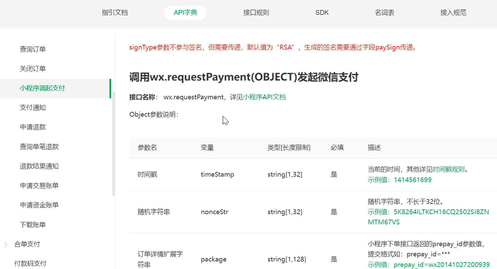


## 实现

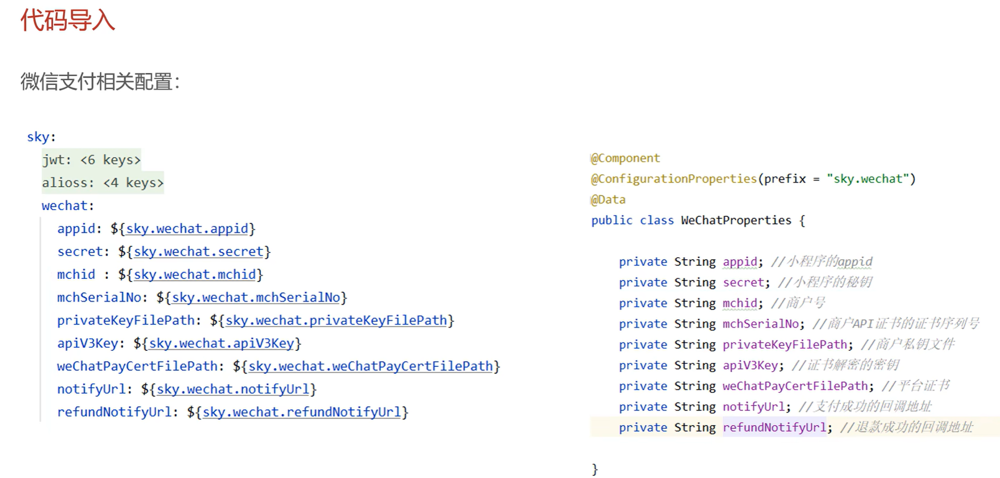


# Spring Task

## 简介

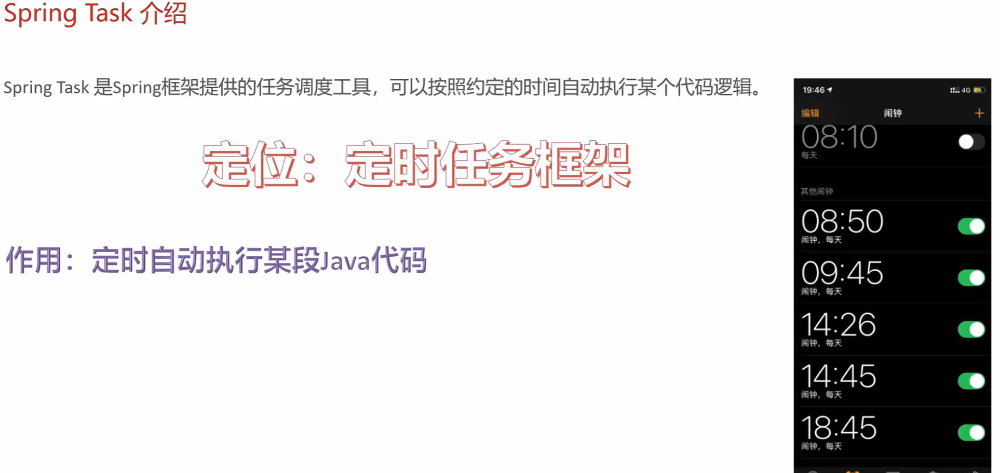

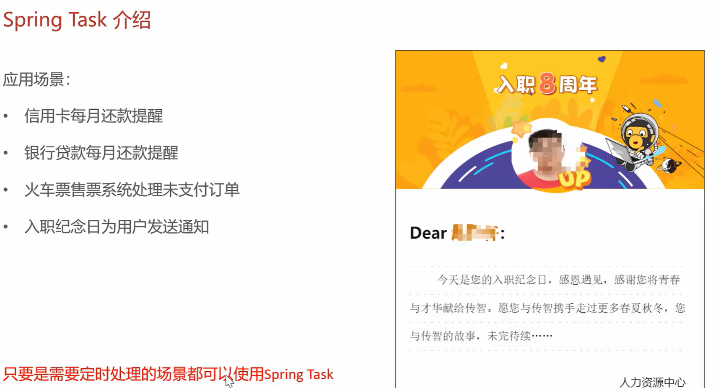

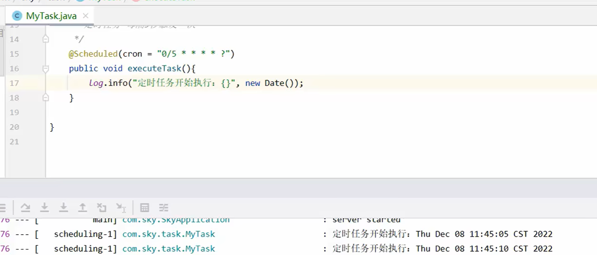


## Corn表达式

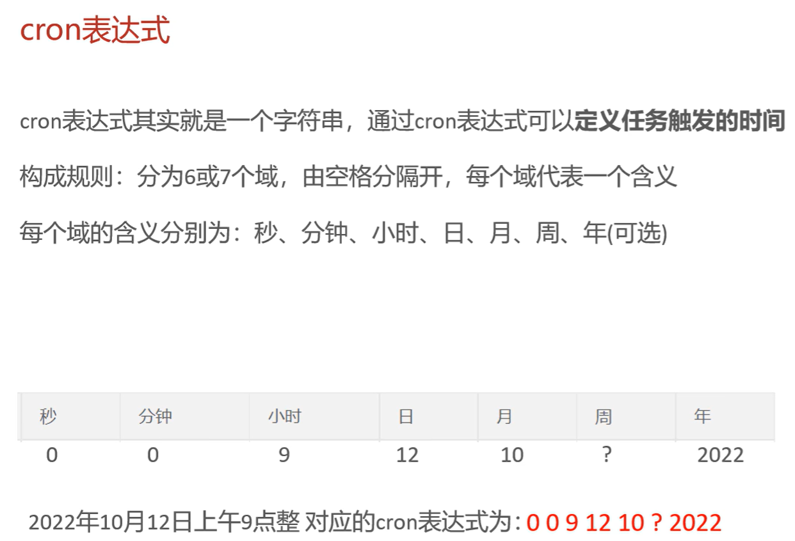


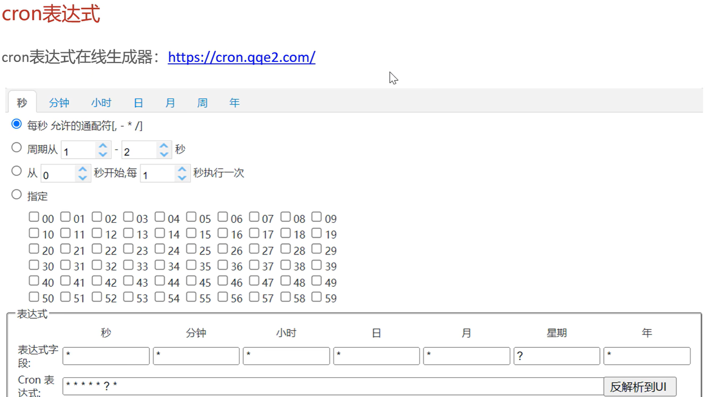


## 入门案例

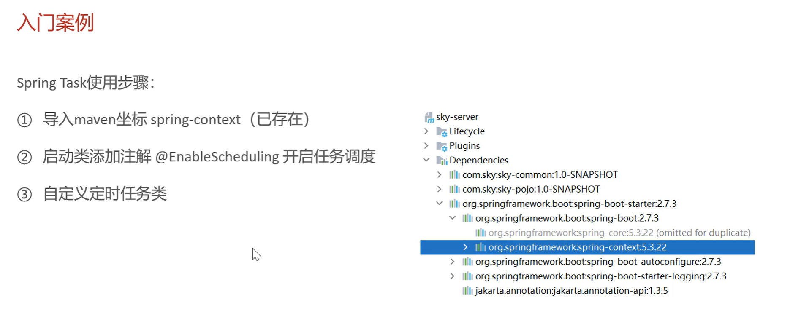

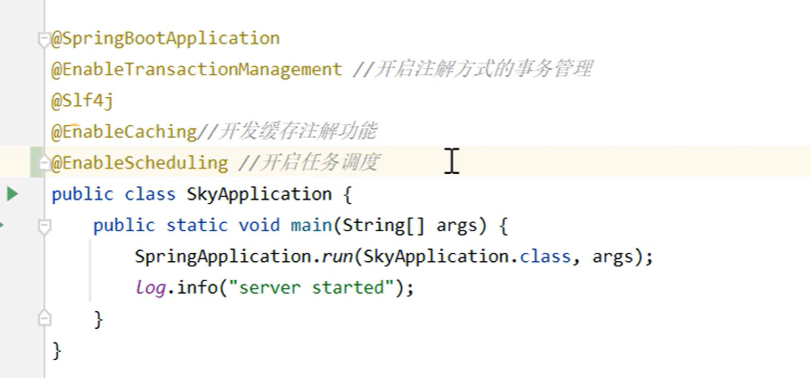

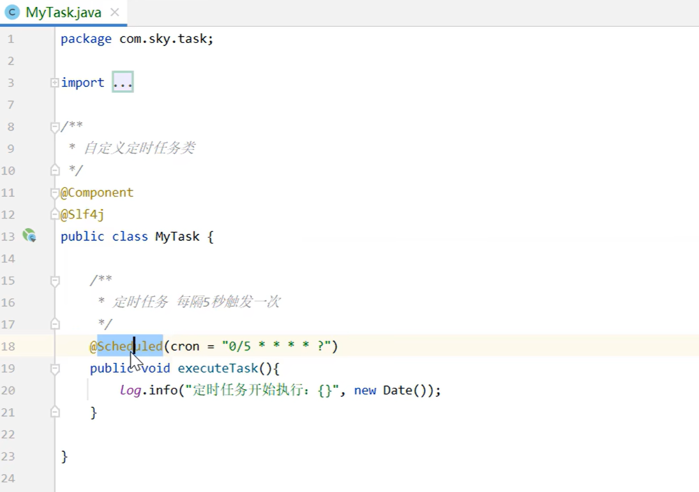


## 应用

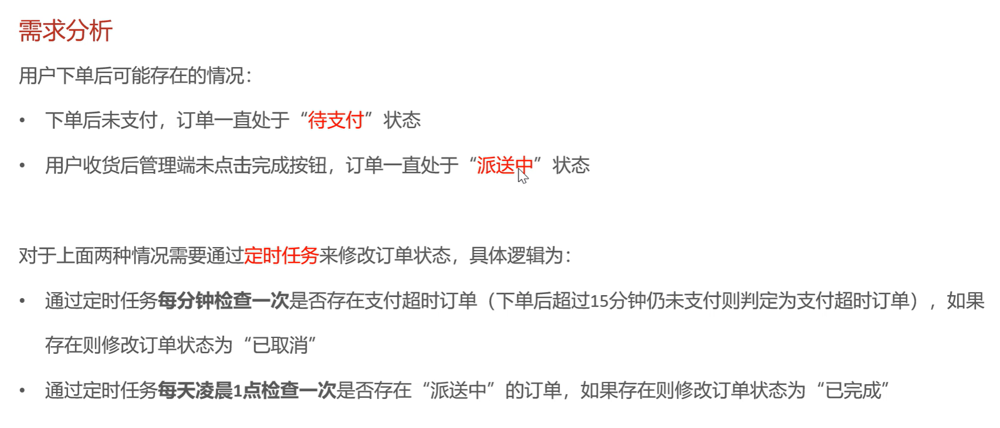

> 美团使用的 Redis + MQ 处理这种情况


```java
@SpringBootApplication
@ComponentScan("com.hongs")
@EnableTransactionManagement
@EnableCaching
@EnableScheduling
public class SkyServerApplication {

    public static void main(String[] args) {
        SpringApplication.run(SkyServerApplication.class, args);
    }

}
```


```java
@Component
@Slf4j
public class OrderTask {

    @Autowired
    private OrderService orderService;

    @Scheduled(cron = "0 0/1 * * * ?")
    public void processPayTimeOutOrder(){
        log.info("定时处理支付超时订单-当前时间: {}", LocalDateTime.now());
        orderService.processPayTimeOutOrder();
    }

    @Scheduled(cron = "0 0 4 * * ?")
    public void processDeliveryTimeOutOrder(){
        log.info("定时处理派送超时订单-当前时间: {}", LocalDateTime.now());
        orderService.processDeliveryTimeOutOrder();
    }
}
```


```java
/**
 * 处理超时订单
 */
@Override
public void processPayTimeOutOrder() {
    this.update(new LambdaUpdateWrapper<Orders>()
            .eq(Orders::getStatus, OrderConstant.PENDING_PAYMENT)
            .le(Orders::getOrderTime, LocalDateTime.now().minusMinutes(15))
            .set(Orders::getStatus, OrderConstant.CANCELLED)
            .set(Orders::getCancelReason, MessageConstant.ORDER_PAYMENT_TIMEOUT)
            .set(Orders::getCancelTime, LocalDateTime.now())
    );
}

/**
 * 处理派送超时订单
 */
@Override
public void processDeliveryTimeOutOrder() {
    this.update(new LambdaUpdateWrapper<Orders>()
            .eq(Orders::getStatus, OrderConstant.DELIVERY_IN_PROGRESS)
            .le(Orders::getDeliveryTime, LocalDateTime.now().minusHours(4))
            .set(Orders::getStatus, OrderConstant.COMPLETED));
}
```


# WebSocket

## 介绍

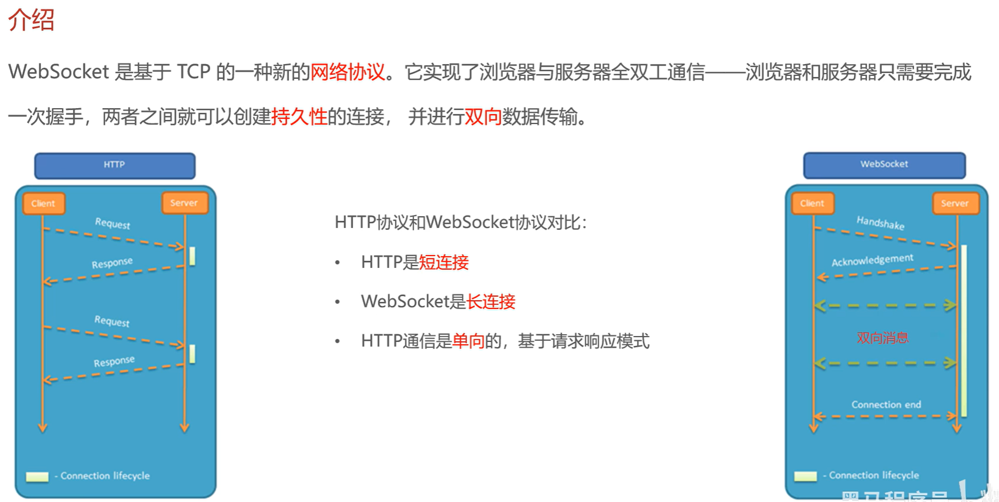


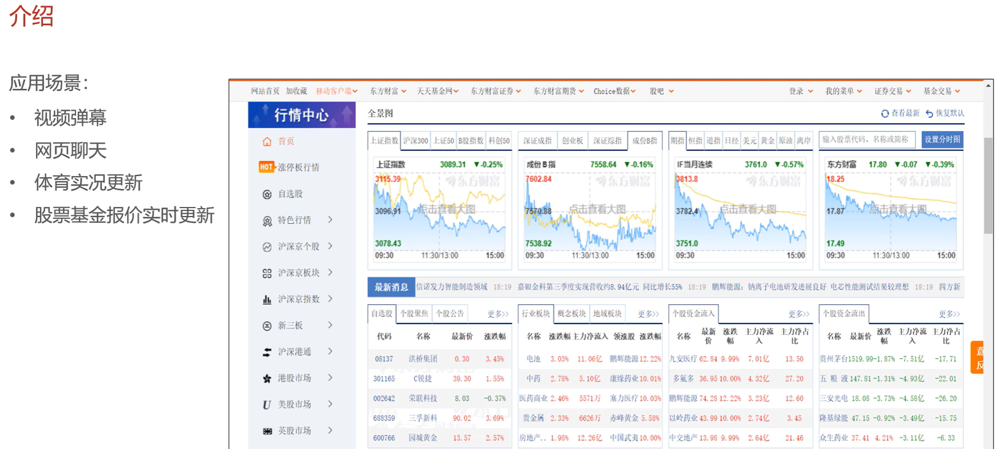


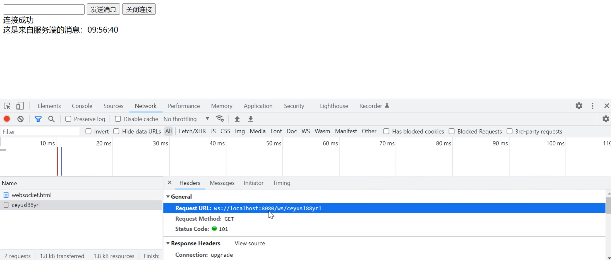

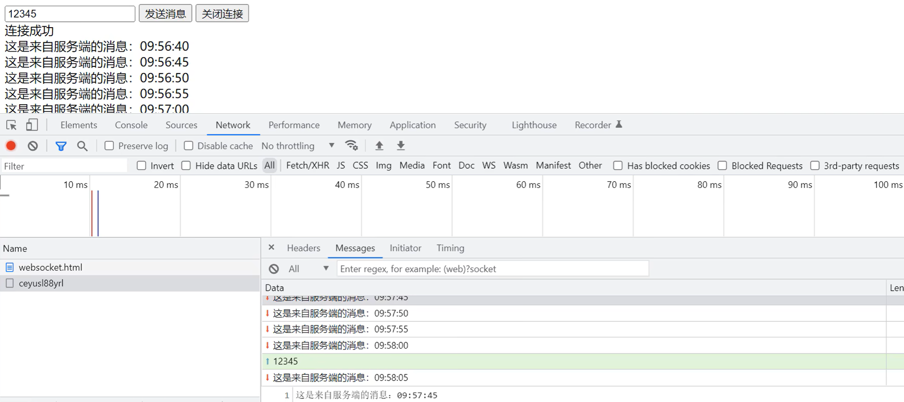


> 前端并没有发起请求，而是服务器直接发出去的。


## 入门案例

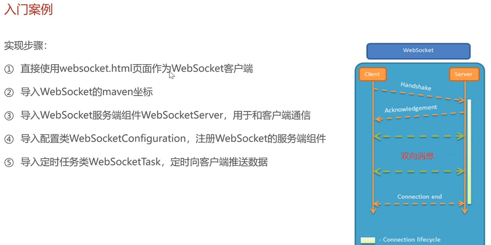

### 客户端的 javascript 代码

```html
<script type="text/javascript">
    var websocket = null;
    // 生成随机的客户端ID
    var clientId = Math.random().toString(36).substr(2);

    // 判断当前浏览器是否支持WebSocket
    if ('WebSocket' in window) {
        // 连接WebSocket节点，地址包含clientId
        websocket = new WebSocket("ws://localhost:8080/ws/" + clientId);
    }
    else {
        alert('Not support websocket')
    }

    // 连接发生错误的回调方法
    websocket.onerror = function() {
        setMessageInnerHTML("error");
    };

    // 连接成功建立的回调方法
    websocket.onopen = function() {
        setMessageInnerHTML("连接成功");
    }

    // 接收到消息的回调方法
    websocket.onmessage = function(event) {
        setMessageInnerHTML(event.data);
    }

    // 连接关闭的回调方法
    websocket.onclose = function() {
        setMessageInnerHTML("close");
    }

    // 监听窗口关闭事件，当窗口关闭时，主动去关闭websocket连接，防止连接还没断开就关闭窗口，server端会抛异常。
    window.onbeforeunload = function() {
        websocket.close();
    }

    // 将消息显示在网页上
    function setMessageInnerHTML(innerHTML) {
        document.getElementById('message').innerHTML += innerHTML + '<br/>';
    }

    // 发送消息
    function send() {
        var message = document.getElementById('text').value;
        websocket.send(message);
    }

    // 关闭连接
    function closeWebSocket() {
        websocket.close();
    }
</script>
```


### 服务端的 java 代码

```java
@Component
@ServerEndpoint("/ws/{sid}")
public class WebSocketServer {

    // 存放会话对象
    private static Map<String, Session> sessionMap = new HashMap<>();

    /**
     * 连接建立成功调用的方法
     */
    @OnOpen
    public void onOpen(Session session, @PathParam("sid") String sid) {
        System.out.println("客户端：" + sid + "建立连接");
        sessionMap.put(sid, session);
    }

    /**
     * 收到客户端消息后调用的方法
     *
     * @param message 客户端发送过来的消息
     */
    @OnMessage
    public void onMessage(String message, @PathParam("sid") String sid) {
        System.out.println("收到来自客户端：" + sid + "的信息：" + message);
    }
    
    
    /**
     * 连接关闭调用的方法
     *
     * @param sid
     */
    @OnClose
    public void onClose(@PathParam("sid") String sid) {
        System.out.println("连接断开：" + sid);
        sessionMap.remove(sid);
    }
    
    
    /**
     * 群发
     *
     * @param message
     */
    public void sendToAllClient(String message) {
        Collection<Session> sessions = sessionMap.values();
        for (Session session : sessions) {
            try {
                // 服务器向客户端发送消息
                session.getBasicRemote().sendText(message);
            } catch (Exception e) {
                e.printStackTrace();
            }
        }
    }
}
```


### WebSocket配置类

```java
/**
 * WebSocket配置类，用于注册WebSocket的Bean
 */
@Configuration
public class WebSocketConfiguration {

    @Bean
    public ServerEndpointExporter serverEndpointExporter() {
        return new ServerEndpointExporter();
    }

}
```

 

### 测试所用的定时任务

```java
@Component
public class WebSocketTask {
    
    @Autowired
    private WebSocketServer webSocketServer;

    /**
     * 通过WebSocket每隔5秒向客户端发送消息
     */
    @Scheduled(cron = "0/5 * * * * ?")
    public void sendMessageToClient() {
        webSocketServer.sendToAllClient("这是来自服务端的消息：" + DateTimeFormatter.ofPattern("HH:mm:ss").format(LocalDateTime.now()));
    }
}
```


### 最后效果

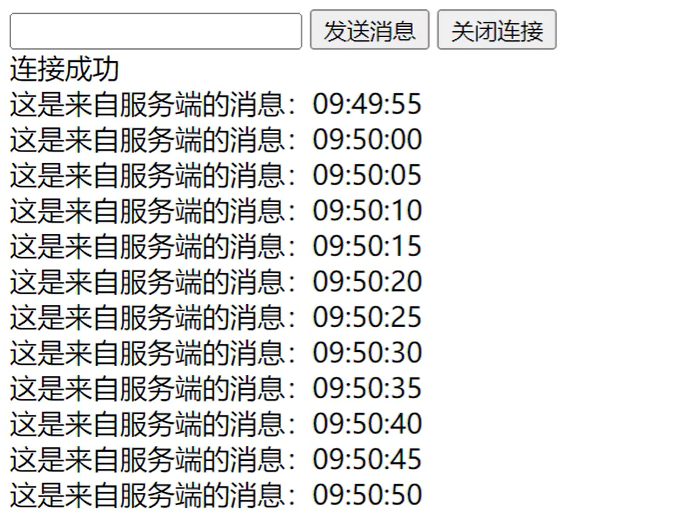
