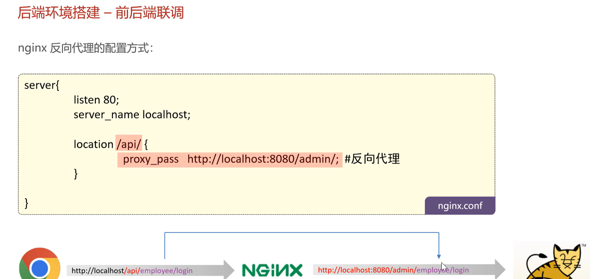
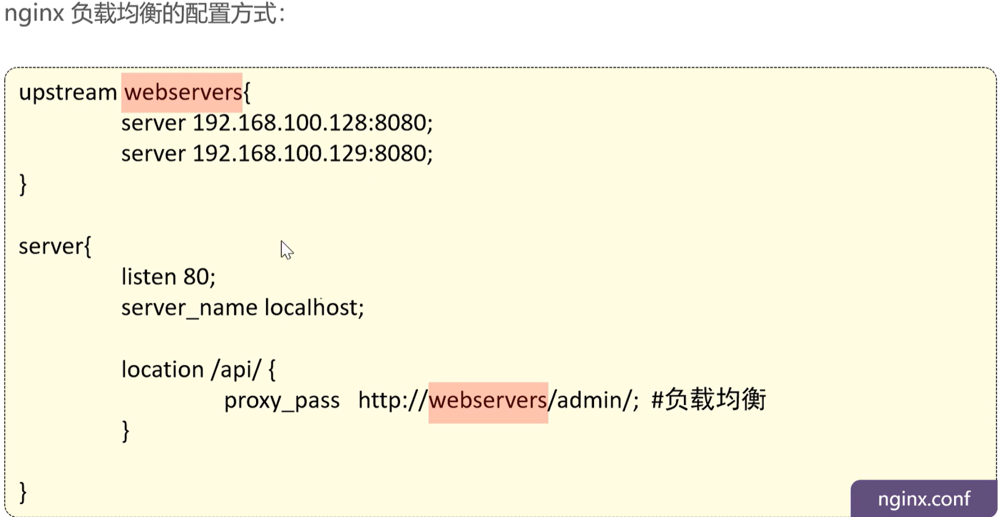
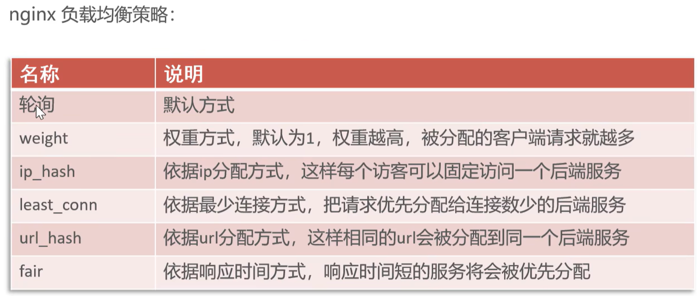
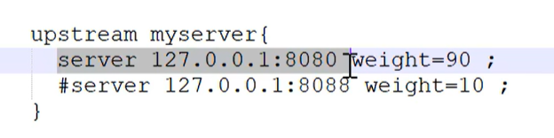
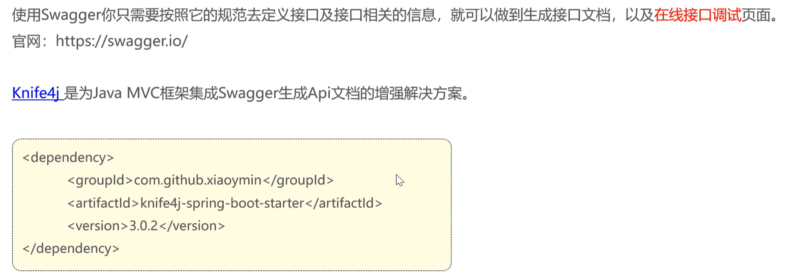
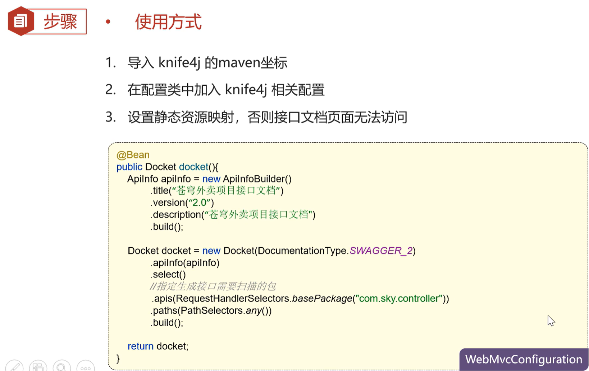
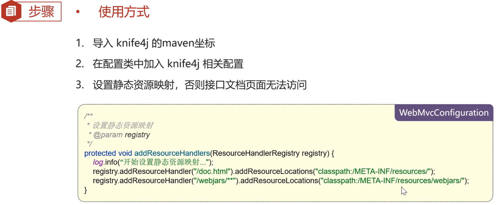
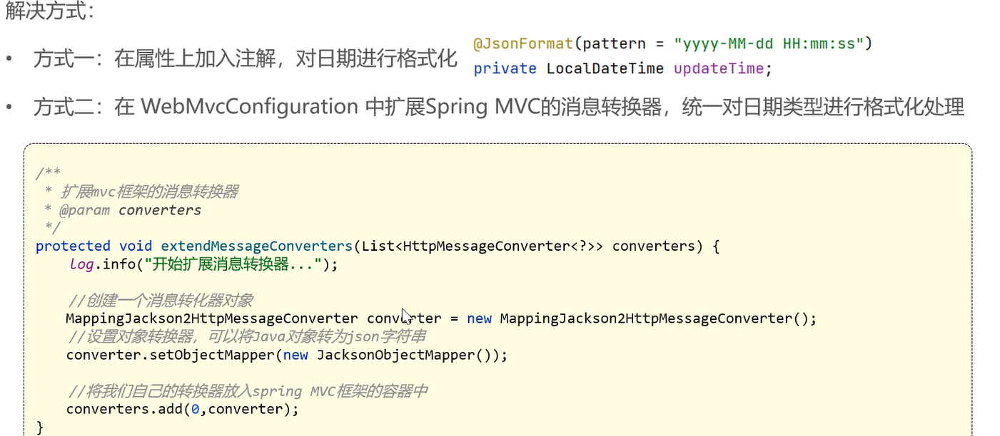

# nginx

## 优点

### 1. 提高访问速度

Nginx 通过**动静分离**和**多级缓存策略**来显著减少网络延迟和后端计算压力，从而提高响应速度。

- 静态资源直接响应：

	Nginx 擅长处理高并发 I/O。对于图片、CSS、JS 等静态文件，Nginx 直接从磁盘读取并返回给客户端，无需转发给 Tomcat（Java 后端）。这避免了 Java 虚拟机（JVM）处理简单文件时的资源浪费。

- 服务端代理缓存 (Proxy Cache)：

	这是 Nginx 自身的缓存。当 Nginx 接收到后端 Tomcat 返回的动态数据（如 JSON 响应）时，会根据配置将其写入本地磁盘或内存。当后续有相同的请求到来时，Nginx 直接读取本地缓存数据返回，完全截断了与后端的通信，从而实现毫秒级响应。

- 客户端浏览器缓存 (Browser Caching)：

	Nginx 通过修改 HTTP 响应头（添加 Cache-Control 或 Expires 字段），向客户端浏览器发送指令。浏览器接收指令后，会将资源存储在本地。在有效期内，用户再次访问时，浏览器直接读取本地文件，根本不发送网络请求。

### 2. 进行负载均衡

Nginx 作为流量的统一入口，负责将高并发的客户端请求分发到后端的多个服务节点上，以解决单机性能瓶颈并实现高可用。

- 流量分发策略：

	Nginx 接收所有进来的请求（通常监听 80/443 端口），并根据预设算法（如轮询、权重 Weight、IP Hash）将这些请求路由到后端的不同服务器实例（如运行在 8080、8081、8082 端口的多个 Tomcat）。

- 故障转移与健康检查：

	Nginx 会持续监控后端服务器的状态。如果其中一个后端节点（例如 8080）宕机或响应超时，Nginx 会自动将后续流量转发给其他健康的节点（如 8081），确保服务不中断，避免单点故障导致整个系统瘫痪。

### 3. 保证后端服务安全

Nginx 作为中间层，通过隔离外网与内网环境、隐藏架构细节来保护后端核心业务服务。

- 隐藏真实网络拓扑：

	客户端只与 Nginx 建立连接，只能看到 Nginx 的 IP 和端口。后端的真实业务服务器（Tomcat）运行在内网或受限网络中，不直接暴露给公网。这防止了攻击者直接扫描或攻击核心数据库和业务服务器的端口。

- 反向代理与路径重写：

	通过配置 proxy_pass，Nginx 将外部请求路径（如 /api/）映射为内部路径（如 /admin/）。这种抽象层屏蔽了后端真实的 API 目录结构和实现细节，增加了攻击者嗅探后端逻辑的难度。

- 请求过滤与黑名单：

	Nginx 可以在流量到达后端 Java 程序之前进行预处理，拦截恶意 IP、限制高频请求（防 DDoS）、拒绝不符合规范的 HTTP 请求，从而保护后端计算资源不被恶意占用。


## 配置方法

### 反向代理




### 负载均衡





 


# Swagger2 / Openapi3

## 简介




## 使用方式







```java
// 方法名：addResourceHandlers（添加资源处理器）
protected void addResourceHandlers(ResourceHandlerRegistry registry) {

    // -------------------------------------------------------
    // 第一组映射：处理主页
    // -------------------------------------------------------
    // A.【前端请求】当浏览器访问：http://localhost:8080/doc.html
    registry.addResourceHandler("/doc.html")
            // B.【后端指路】告诉 Spring 去 Jar 包里的这个位置找文件：
            // "classpath:" 意味着去所有引入的 Jar 包里找
            .addResourceLocations("classpath:/META-INF/resources/");

    // -------------------------------------------------------
    // 第二组映射：处理静态资源（CSS, JS 等）
    // -------------------------------------------------------
    // A.【前端请求】当浏览器访问：http://localhost:8080/webjars/css/app.css
    registry.addResourceHandler("/webjars/**")
            // B.【后端指路】告诉 Spring 去 Jar 包里的这个位置找：
            .addResourceLocations("classpath:/META-INF/resources/webjars/");
}
```


**当引入 Knife4j 的 Maven 依赖后**

- **真相**：接口文档的页面（`doc.html`）、样式（CSS）、脚本（JS）**并没有**被复制到你的 `src/main/resources/static` 目录下。
- **位置**：它们依然静静地躺在第三方 Jar 包（比如 `knife4j-spring-ui.jar`）的肚子里，具体路径是 `classpath:/META-INF/resources/`。

因为它们不在你的项目源代码文件夹里，Spring MVC 默认可能“视而不见”。


**什么要手动写这个？（关键）**

你可能会问：“Spring Boot 不是全自动的吗？为什么还要我手动写地图？”

- **原因**：你的配置类继承了 **`WebMvcConfigurationSupport`**。
- **后果**：这个类是 Spring MVC 的“高级自定义模式”。一旦你继承了它，Spring Boot 就会认为“这个开发者是个高手，他想完全自己控制 MVC 配置”，于是 Spring Boot 就会**自动关闭**默认的静态资源配置（Default Auto Configuration）。
- **结局**：因为默认配置失效了，Spring 就不再去 Jar 包的 `META-INF/resources` 里找东西了。如果你不写上面这段代码，访问文档就会报 **404 Not Found**。


> 当你启动项目时，Spring 会把：
>
> 1. 你自己写的 `src/main/resources`
> 2. 依赖 A.jar 里的 `META-INF/resources`
> 3. 依赖 B.jar 里的 `META-INF/resources`
>
> **在内存中**逻辑上合并成一个大的资源池。


## Swagger2和Openapi3的差别

### 核心Bean配置

#### 1. 核心配置速查表

| **配置项**       | **旧版 (Springfox / Swagger 2)**    | **新版 (SpringDoc / OpenAPI 3)**                         | **核心区别**                                                 |
| ---------------- | ----------------------------------- | -------------------------------------------------------- | ------------------------------------------------------------ |
| **核心配置对象** | `Docket`                            | **`OpenAPI`** (全局信息) **`GroupedOpenApi`** (分组扫描) | 旧版一个对象包揽所有；新版将“文档元数据”和“接口分组”拆分了。 |
| **文档基础信息** | `ApiInfo` / `ApiInfoBuilder`        | **`Info`** (`io.swagger.v3.oas.models.info.Info`)        | 类名变了，构造方式从 Builder 模式变为链式 Setter。           |
| **包扫描方式**   | `.apis(RequestHandlerSelectors...)` | **`.packagesToScan("...")`** (在 GroupedOpenApi 中)      | 新版方法名更直观，也可以直接在 YAML 中配置。                 |
| **路径过滤**     | `.paths(PathSelectors.any())`       | **`.pathsToMatch("/\**")`**                              | 新版直接使用 Ant 风格路径字符串。                            |
| **文档类型声明** | `DocumentationType.SWAGGER_2`       | **不需要声明**                                           | 默认就是 OpenAPI 3。                                         |
| **全局参数**     | `.globalOperationParameters(...)`   | `.components(...)`                                       | 新版需要配置 Components 或 SecuritySchemes。                 |


#### 2. 代码详细对比

#####  旧版方案 (Swagger 2)

**特点**：所有的配置（信息 + 扫描）都塞在一个 `Docket` Bean 里。

```java
@Bean
public Docket docket() {
    ApiInfo apiInfo = new ApiInfoBuilder()
            .title("苍穹外卖项目接口文档")
            .version("2.0")
            .description("项目描述")
            .build();
            
    return new Docket(DocumentationType.SWAGGER_2)
            .apiInfo(apiInfo) // 设置信息
            .select()
            .apis(RequestHandlerSelectors.basePackage("com.hongs.skyserver.controller")) // 设置扫描
            .build();
}
```


##### 新版方案 A：纯 Java Bean 配置 (Explicit Style)

特点：不依赖 YAML，完全通过 Java 代码控制。适合需要配置多个分组（如管理端、用户端）的复杂场景。

需要定义两个 Bean：

1. `OpenAPI`: 配置文档标题等元数据。
2. `GroupedOpenApi`: 配置具体的包扫描路径。

```java
@Configuration
public class WebMvcConfig {

    /**
     * 1. 配置文档元数据 (标题、版本)
     */
    @Bean
    public OpenAPI customOpenAPI() {
        return new OpenAPI()
                .info(new Info()
                        .title("苍穹外卖项目接口文档")
                        .version("2.0")
                        .description("项目描述"));
    }

    /**
     * 2. 配置接口扫描 (替代原来的 .apis 和 .paths)
     */
    @Bean
    public GroupedOpenApi publicApi() {
        return GroupedOpenApi.builder()
                .group("默认接口")                  // 设置分组名
                .packagesToScan("com.hongs.skyserver.controller") // 指定扫描包
                .pathsToMatch("/**")              // 匹配所有路径
                .build();
    }
    
    // 如果有管理端分组，可以再定义一个 Bean
    /*
    @Bean
    public GroupedOpenApi adminApi() {
        return GroupedOpenApi.builder()
                .group("管理端接口")
                .packagesToScan("com.hongs.skyserver.controller.admin")
                .build();
    }
    */
}
```


##### 新版方案 B：Java Bean + YAML 组合配置

**特点**：最简洁。Java 只负责定义“文档叫什么”，YAML 负责定义“扫描哪里”。

**第一步：Java 代码 (WebMvcConfig.java)**

```java
@Configuration
public class WebMvcConfig {

    /**
     * 仅配置文档元数据
     * 扫描逻辑移交 YAML 处理，这里不需要 GroupedOpenApi
     */
    @Bean
    public OpenAPI customOpenAPI() {
        return new OpenAPI()
                .info(new Info()
                        .title("苍穹外卖项目接口文档")
                        .version("2.0")
                        .description("项目描述"));
    }
}
```

**第二步：配置文件 (application.yml)**

```yaml
springdoc:
  # 对应 .apis(RequestHandlerSelectors.basePackage(...))
  packages-to-scan: com.hongs.skyserver.controller
  
  # 对应 .paths(PathSelectors.any())
  paths-to-match: /**
  
  # 其他常用配置
  api-docs:
    enabled: true
```


> 分组情况下的写法
>
> ```yaml
> springdoc:
>   # 全局配置（所有分组通用的）
>   api-docs:
>     enabled: true
>   
>   # 【核心】这里配置分组，替代 Java 中的 GroupedOpenApi Bean
>   group-configs:
>     # 第 1 组：管理端接口
>     - group: "admin"
>       paths-to-match: "/admin/**"
>       packages-to-scan: com.hongs.skyserver.controller.admin
>       
>     # 第 2 组：用户端接口
>     - group: "user"
>       paths-to-match: "/user/**"
>       packages-to-scan: com.hongs.skyserver.controller.user
> ```


### 主要注解变化

#### 1. 核心注解速查表

| **作用域**          | **旧版注解 (Swagger 2)** | **新版注解 (OpenAPI 3)** | **常用属性变化 (旧 -> 新)**                       |
| ------------------- | ------------------------ | ------------------------ | ------------------------------------------------- |
| **Controller 类**   | `@Api`                   | **`@Tag`**               | `tags` -> `name`                                  |
| **接口方法**        | `@ApiOperation`          | **`@Operation`**         | `value` -> `summary` `notes` -> `description`     |
| **实体类 (DTO/VO)** | `@ApiModel`              | **`@Schema`**            | `value` -> `description`/`title`                  |
| **实体属性**        | `@ApiModelProperty`      | **`@Schema`**            | `value` -> `description`                          |
| **参数 (非Body)**   | `@ApiParam`              | **`@Parameter`**         | `value` -> `description` `required` -> `required` |
| **忽略/隐藏**       | `@ApiIgnore`             | **`@Hidden`**            | 无                                                |


#### 2. 详细代码对比示例

假设你有一个 `EmployeeController` 和一个 `EmployeeLoginDTO`，我们来看看具体的写法区别。

##### A. Controller 层对比

**旧版 (Swagger 2):**

```java
import io.swagger.annotations.Api;
import io.swagger.annotations.ApiOperation;
import io.swagger.annotations.ApiParam;

@Api(tags = "员工管理接口") // 旧版
@RestController
@RequestMapping("/admin/employee")
public class EmployeeController {

    @ApiOperation(value = "员工登录", notes = "返回token") // 旧版
    @PostMapping("/login")
    public Result<EmployeeLoginVO> login(
            @RequestBody @ApiParam("登录参数") EmployeeLoginDTO employeeLoginDTO) { // 旧版
        // ...
        return Result.success();
    }
}
```

**新版 (OpenAPI 3):**

```java
import io.swagger.v3.oas.annotations.tags.Tag;
import io.swagger.v3.oas.annotations.Operation;
import io.swagger.v3.oas.annotations.Parameter;

@Tag(name = "员工管理接口") // 【变化1】用 @Tag，属性为 name
@RestController
@RequestMapping("/admin/employee")
public class EmployeeController {

    @Operation(summary = "员工登录", description = "返回token") // 【变化2】value变summary, notes变description
    @PostMapping("/login")
    public Result<EmployeeLoginVO> login(
            @RequestBody @Parameter(description = "登录参数") EmployeeLoginDTO employeeLoginDTO) { // 【变化3】用 @Parameter
        // ...
        return Result.success();
    }
}
```

##### B. 实体类 (DTO/VO) 层的对比

这是改动最大的地方，旧版区分了 `@ApiModel` (类) 和 `@ApiModelProperty` (字段)，**新版统一使用 `@Schema`**。

**旧版 (Swagger 2):**

```java
import io.swagger.annotations.ApiModel;
import io.swagger.annotations.ApiModelProperty;

@Data
@ApiModel(description = "员工登录DTO") // 旧版
public class EmployeeLoginDTO {

    @ApiModelProperty(value = "用户名", example = "admin", required = true) // 旧版
    private String username;

    @ApiModelProperty("密码")
    private String password;
}
```

**新版 (OpenAPI 3):**

```java
import io.swagger.v3.oas.annotations.media.Schema;

@Data
@Schema(description = "员工登录DTO") // 【变化1】类上也用 @Schema
public class EmployeeLoginDTO {

    @Schema(description = "用户名", example = "admin", requiredMode = Schema.RequiredMode.REQUIRED) // 【变化2】统一用 @Schema
    private String username;

    @Schema(description = "密码")
    private String password;
}
```


#### 3. 其他常见细节变化

##### 1. 忽略某个参数或接口

- **旧版**: `@ApiIgnore`
- **新版**: `@Hidden` (可以加在方法上，也可以加在参数上)

##### 2. 多个参数描述

虽然 Spring Boot 推荐直接在参数前加注解，但如果你习惯用方法头的注解：

- **旧版**:

	```java
	@ApiImplicitParams({
	    @ApiImplicitParam(name = "id", value = "用户ID", required = true)
	})
	```

- **新版**:

	```java
	import io.swagger.v3.oas.annotations.Parameters;
	
	@Parameters({
	    @Parameter(name = "id", description = "用户ID", required = true)
	})
	```


#### 4. 迁移建议

1. 全局替换包名：

	在 IDEA 中全局替换 import io.swagger.annotations. -> import io.swagger.v3.oas.annotations. (注意这会导致报错，需要配合后续步骤)。

2. 正则替换常用注解：

	利用 IDEA 的全局替换 (Ctrl+Shift+R)，使用正则表达式或直接文本替换：

	- `@Api(tags =`  ->  `@Tag(name =`
	- `@ApiOperation(value =`  ->  `@Operation(summary =`
	- `@ApiModelProperty`  ->  `@Schema`
	- `@ApiModel` -> `@Schema`

3. 处理编译错误：

	替换完后，肯定会有很多属性名报错（比如 @Schema 没有 value 属性，只有 description）。这时再针对性地修改报错的地方。通常 @Schema("描述") 这种写法在新版中也是支持的（它是 description 的别名），所以大部分 @ApiModelProperty("描述") 替换为 @Schema("描述") 后是可以直接运行的。


## DTO的请求体和请求参数的识别

### OpenAPI3标准

使用 `@ParameterObject` (推荐 - SpringDoc/OpenAPI 3)

如果你使用的是 Spring Boot3 或者集成了 `springdoc-openapi` 的 Knife4j 版本，这是最标准的做法。

```java
/**
 * 员工分页查询
 * @param pageQueryDTO
 * @return
 */
@Operation(summary = "员工分页查询")
@GetMapping("/page")
public Result<PageResult> page(@ParameterObject EmployeePageQueryDTO pageQueryDTO) {
    log.info("员工分页查询: {}", pageQueryDTO);
    PageResult pageResult = employeeService.page(pageQueryDTO);
    return Result.success(pageResult);
}
```


### Swagger2标准

使用 `@ModelAttribute` (强烈推荐)

这是最稳定、最通用的方案。它明确告诉 Spring (以及 Swagger 2) 将 URL 中的查询参数绑定到这个对象上。

```java
import org.springframework.web.bind.annotation.ModelAttribute; // 引入这个包
import io.swagger.annotations.ApiOperation; // Swagger 2 的注解通常是这个

@ApiOperation(value = "员工分页查询") // Swagger 2 使用 @ApiOperation
@GetMapping("/page")
// 核心：加上 @ModelAttribute
public Result<PageResult> page(@ModelAttribute EmployeePageQueryDTO pageQueryDTO) {
    log.info("员工分页查询: {}", pageQueryDTO);
    PageResult pageResult = employeeService.page(pageQueryDTO);
    return Result.success(pageResult);
}
```


# ThreadLocal

## 介绍


## 使用

```java
public class BaseContext {
    private static final ThreadLocal<Long> thread = new ThreadLocal<>();

    public static void setCurrentId(Long id) {
        thread.set(id);
    }

    public static Long getCurrentId() {
        return thread.get();
    }

    public static void removeCurrentId() {
        thread.remove();
    }
}
```


```java
package com.hongs.skyserver.interceptor;

import com.hongs.skycommon.constant.JwtClaimsConstant;
import com.hongs.skycommon.context.BaseContext;
import com.hongs.skycommon.properties.JwtProperties;
import com.hongs.skycommon.utils.JwtUtil;
import io.jsonwebtoken.Claims;
import jakarta.servlet.http.HttpServletRequest;
import jakarta.servlet.http.HttpServletResponse;
import lombok.extern.slf4j.Slf4j;
import org.springframework.beans.factory.annotation.Autowired;
import org.springframework.stereotype.Component;
import org.springframework.web.method.HandlerMethod;
import org.springframework.web.servlet.HandlerInterceptor;

/**
 * Jwt令牌校验的拦截器
 */
@Component
@Slf4j
public class JwtTokenAdminInterceptor implements HandlerInterceptor {
    @Autowired
    private JwtProperties jwtProperties;

    /**
     * 校验Jwt
     *
     * @param request
     * @param response
     * @param handler
     * @return
     * @throws Exception
     */
    public boolean preHandle(final HttpServletRequest request, final HttpServletResponse response, final Object handler) throws Exception {
        // 判断当前拦截到的是Controller的方法还是其他资源
        if (!(handler instanceof HandlerMethod)) {
            // 当前拦截到的不是动态方法，直接放行
            return true;
        }

        String token = request.getHeader(jwtProperties.getAdminTokenName());

        try {
            log.info("Jwt令牌校验: {}", token);
            Claims claims = JwtUtil.parseJWT(jwtProperties.getAdminSecretKey(), token);
            Long empId = Long.valueOf(claims.get(JwtClaimsConstant.EMP_ID).toString());
            log.info("当前员工ID: {}", empId);
            BaseContext.setCurrentId(empId);

            return true;
        } catch (Exception e) {
            response.setStatus(HttpServletResponse.SC_UNAUTHORIZED);
            return false;
        }
    }
}
```


## **ThreadLocal** 与 **HttpServletRequest** 方案对比

### 方案一：放入 HttpServletRequest

这种方案直接利用 Web 容器提供的 Request 域进行属性传递。

#### 1. 实现方式

- **拦截器层**：`request.setAttribute("userId", 100L);`
- **Controller层**：`Long userId = (Long) request.getAttribute("userId");`
- **Service层**：方法参数必须显式接收 `userId`。

#### 2. 代码演示

```java
// Controller
@PostMapping
public Result save(@RequestBody OrderDTO dto, HttpServletRequest request) {
    Long userId = (Long) request.getAttribute("userId");
    // 必须把 userId 传给 Service
    orderService.createOrder(dto, userId); 
    return Result.success();
}

// Service
public void createOrder(OrderDTO dto, Long userId) {
    // 业务逻辑...
    order.setUserId(userId);
    
    // ❌ 如果 Service 还要调用其他 Service，还得继续往下传
    inventoryService.deduct(dto.getSkuId(), userId); 
}
```

#### 3. 缺点分析 (痛点)

1. 代码侵入严重（参数污染）：

	Service 层的每个方法都需要增加一个 Long userId 参数。如果调用链路很深（Controller -> Service A -> Service B -> Manager -> Dao），每一层的方法签名都要改，代码极其臃肿。

2. 架构耦合（依赖 Web 层）：

	Service 应该是纯粹的业务逻辑。如果 Service 依赖了 HttpServletRequest 或者为了拿 ID 被迫修改方法签名，一旦未来项目迁移（例如改为 Dubbo RPC 接口、MQ 消费者逻辑），这些没有 Request 对象的场景下，Service 代码就会报错。


### 方案二：使用 ThreadLocal

这种方案利用 JVM 的线程特性，将 ID 绑定在“当前线程”上，实现跨层级的数据共享。

#### 1. 实现方式

- **工具类**：封装 `ThreadLocal`，提供 `set` / `get` / `remove` 方法。
- **拦截器层**：`BaseContext.setCurrentId(userId);`
- **任意层级**：`BaseContext.getCurrentId();` 直接获取。

#### 2. 代码演示 (无需传参)

**ThreadLocal 工具类：**

```java
public class BaseContext {
    private static final ThreadLocal<Long> THREAD_LOCAL = new ThreadLocal<>();

    public static void setCurrentId(Long id) { THREAD_LOCAL.set(id); }
    public static Long getCurrentId() { return THREAD_LOCAL.get(); }
    public static void removeCurrentId() { THREAD_LOCAL.remove(); }
}
```

**业务代码（清爽）：**

```java
// Controller
@PostMapping
public Result save(@RequestBody OrderDTO dto) {
    // 不需要从 request 拿，也不用传参
    orderService.createOrder(dto);
    return Result.success();
}

// Service A
public void createOrder(OrderDTO dto) {
    // ✅ 需要用到 ID 时，随时随地直接取
    Long currentId = BaseContext.getCurrentId();
    
    order.setUserId(currentId);
    
    // 调用 Service B (完全不用管 ID 传递的问题)
    inventoryService.checkStock(dto.getSkuId());
}

// Service B (深层调用示例)
public void checkStock(Long skuId) {
    // 假如这里需要记录“是谁在查库存”的日志
    log.info("用户 {} 正在检查库存", BaseContext.getCurrentId()); 
}
```

#### 3. 优点分析

1. **数据“隐形”传递**：实现了数据的**穿透**。无论调用链有多深（比如在 Service 内部调用的工具类、日志切面 Aspect、或者私有辅助方法中），只要在同一个线程内，都能直接拿到 ID，无需层层传参。
2. **松耦合**：Service 层不需要知道 `HttpServletRequest` 的存在，也不需要知道 Token 是怎么解析的。代码更纯粹，易于单元测试和复用。


### 常用场景对比 (为什么 ThreadLocal 更好)

| **场景**               | **使用 Request 方案的后果**                                  | **使用 ThreadLocal 方案的效果**                              |
| ---------------------- | ------------------------------------------------------------ | ------------------------------------------------------------ |
| **公共字段赋值**       | `save`, `update` 等所有 Service 方法都要多加一个参数 `userId`。 | Service 内部直接 `setCreateUser(BaseContext.getCurrentId())`，方法签名保持干净。 |
| **操作日志记录 (AOP)** | 想在 `@Aspect` 切面里记录“谁操作了该接口”，很难拿到参数里的 userId。 | 在 Aspect 任意位置直接调用 `BaseContext.getCurrentId()` 即可拿到操作人。 |
| **数据权限校验**       | 底层 Dao 或 Manager 需要根据 UserId 过滤数据（如只能查自己的单）。 | 不需要从 Controller 一路传到 Dao，Dao 层直接获取 ID 拼装 SQL 条件。 |
| **RPC 调用/MQ**        | 如果未来接口不是通过 HTTP 触发的（无 Request 对象）。        | ThreadLocal 方案依然适用（只需在入口处 mock 一个 ID 放入上下文即可）。 |


## 注意事项

使用 `ThreadLocal` 方案时，必须遵守 **“有借有还”** 的原则：

在拦截器的 `afterCompletion` 方法中，**必须**调用 `BaseContext.removeCurrentId()`。

- **原因**：Tomcat 使用线程池复用线程。如果当前请求结束不清理，该线程处理下一个请求时，ThreadLocal 里可能还残留着上一个用户的 ID，导致严重的**数据泄露**（用户 A 看到了用户 B 的数据）。

```java
@Override
public void afterCompletion(...) {
    BaseContext.removeCurrentId(); // 必须清理！
}
```

>拦截器的三种方法
>
>| **方法名**          | **含义**   | **返回值** | **核心用途**       | **你的项目用处**                   |
>| ------------------- | ---------- | ---------- | ------------------ | ---------------------------------- |
>| **preHandle**       | 目标方法前 | `boolean`  | 登录校验、权限拦截 | **解析 Token，存入 ThreadLocal**   |
>| **postHandle**      | 目标方法后 | `void`     | 修改 ModelAndView  | 基本不用 (因为是 JSON 接口)        |
>| **afterCompletion** | 请求完成后 | `void`     | 资源清理、异常兜底 | **清理 ThreadLocal，防止内存泄漏** |


# 自定义消息转换器



！<font color='red'>knife4j 4.0.0以上版本不要用最高优先级，否则接口文档会异常</font>


# 阿里云OSS

## 配置阿里云OSS[文件上传]


> @Request是将 json 类型的数据序列化


[使用JavaSDK快速入门OSS文件管理-对象存储-阿里云](https://help.aliyun.com/zh/oss/user-guide/oss-sdk-quick-start?spm=a2c4g.11186623.help-menu-31815.d_0_0_3_4.7d7024b3d5Q3Ig#887997b287kuz)

```java
/**
 * 阿里云OSS属性配置
 */
@Component
@ConfigurationProperties(prefix = "sky.alioss")
@Data
public class AliOssProperties {

    private String endpoint;
    private String accessKeyId;
    private String accessKeySecret;
    private String bucketName;
    private String region;
}
```


```yaml
hongs:
  alioss:
    endpoint: oss-cn-beijing.aliyuncs.com
    access-key-id: ${OSS_ACCESS_KEY_ID}
    access-key-secret: ${OSS_ACCESS_KEY_SECRET}
    bucket-name: hongs-cai-java-sky-take-out
    region: cn-beijing
```

> Spring会自动在环境变量中寻找yml的定义


```java
/**
 * 阿里云OSS工具类
 */
@Slf4j
@Data
@AllArgsConstructor
public class AliOSSUtil {

    private String endpoint;
    private String accessKeyId;
    private String accessKeySecret;
    private String bucketName;
    private String region;

    /**
     * 文件上传
     *
     * @param objectName 文件名
     * @param bytes 文件字节数组
     * @return 文件访问路径
     */
    public String upload(String objectName, byte[] bytes) {

        // 创建凭证提供者
        DefaultCredentialProvider provider = new DefaultCredentialProvider(accessKeyId, accessKeySecret);

        // 创建客户端配置
        ClientBuilderConfiguration clientBuilderConfiguration = new ClientBuilderConfiguration();

        // 设置签名算法版本为V4，提供更高的安全性
        clientBuilderConfiguration.setSignatureVersion(SignVersion.V4);

        // 初始化OSS客户端
        OSS ossClient = OSSClientBuilder.create()
                .endpoint(endpoint)
                .credentialsProvider(provider)
                .clientConfiguration(clientBuilderConfiguration)
                .region(region)
                .build();

        try {
            // 上传文件
            ossClient.putObject(bucketName, objectName, new ByteArrayInputStream(bytes));
        } catch (OSSException oe) {
            System.out.println("Caught an OSSException, which means your request made it to OSS, "
                    + "but was rejected with an error response for some reason.");
            System.out.println("Error Message:" + oe.getErrorMessage());
            System.out.println("Error Code:" + oe.getErrorCode());
            System.out.println("Request ID:" + oe.getRequestId());
            System.out.println("Host ID:" + oe.getHostId());
        } catch (ClientException ce) {
            System.out.println("Caught an ClientException, which means the client encountered "
                    + "a serious internal problem while trying to communicate with OSS, "
                    + "such as not being able to access the network.");
            System.out.println("Error Message:" + ce.getMessage());
        } finally {
            if (ossClient != null) {
                ossClient.shutdown();
            }
        }

        //文件访问路径规则 https://BucketName.Endpoint/ObjectName
        StringBuilder stringBuilder = new StringBuilder("https://")
                .append(bucketName)
                .append(".")
                .append(endpoint)
                .append("/")
                .append(objectName);

        log.info("文件上传到:{}", stringBuilder.toString());
        return stringBuilder.toString();
    }
}
```


```java
/**
 * AliOSSUtil配置类
 */
@Configuration
@Slf4j
public class AliOSSConfig {
    @Bean
    @ConditionalOnMissingBean
    public AliOSSUtil aliOSSUtil(AliOSSProperties aliOSSProperties) {
        log.info("开始创建AliOSSUtil对象...");
        return new AliOSSUtil(aliOSSProperties.getEndpoint(),
                aliOSSProperties.getAccessKeyId(),
                aliOSSProperties.getAccessKeySecret(),
                aliOSSProperties.getBucketName(),
                aliOSSProperties.getRegion());
    }
}
```


```java
/**
 * 通用接口
 */
@RestController
@RequestMapping("/admin/common")
@Tag(name = "通用接口")
@Slf4j
public class CommonController {

    @Autowired
    private AliOSSUtil aliOSSUtil;

    /**
     * 文件上传
     * @param file
     * @return
     */
    @Operation(summary = "文件上传")
    @PostMapping("/update")
    public Result<String> update(MultipartFile file) {
        log.info("文件上传");
        try {
            // 生成文件名: UUID + 文件后缀
            String fileName = UUID.randomUUID().toString() + file.getName().substring(file.getName().lastIndexOf("."));

            // 按年月文件上传路径
            String objectName = LocalDateTime.now().format(DateTimeFormatter.ofPattern("yyyy/MM")) + "/" + fileName;

            String url = aliOSSUtil.upload(objectName, file.getBytes());
            return Result.success(url);
        } catch (IOException e) {
            throw new BaseException(MessageConstant.UPLOAD_FAILED);
        }
    }
}
```


```yaml
spring:
  servlet:
    multipart:
      max-file-size: 10MB
      max-request-size: 10MB
```


## 分目录的原因

**技术上不强制（OSS 是扁平的），但在工程实践中，强烈建议分目录。**

### 1. 核心原理：对象存储其实是“假的”文件系统

Windows 或 Linux 的文件系统，文件夹是真的存在的。 但在对象存储（OSS、S3）中，**本质上它是 Key-Value 的结构**，它是扁平的。

- **你以为的结构：** `folder` (文件夹) -> `subfolder` (子文件夹) -> `file.jpg`
- **OSS 实际存储的结构：** 它只存了一个 Key（文件名），这个 Key 的字符串就是：`folder/subfolder/file.jpg`。 **“/” 对 OSS 来说，只是文件名字符串的一部分而已。**

### 2. 既然是扁平的，为什么还要我手动加 "/" 分层？

虽然底层是扁平的，但 **分层（分目录）** 有以下 3 个巨大的实际价值：

#### ① 避免“控制台爆炸” (最直接的原因)

阿里云、AWS 的网页版管理控制台（Console），都会把 `/` 识别为模拟文件夹。

- **如果不分目录：** 假设你存了 10 万张图在根目录。当你登录阿里云 OSS 后台想找某张图时，浏览器会尝试加载这 10 万条记录。**结果通常是：网页卡死、崩溃，或者加载极慢。**
- **如果分目录：** 打开根目录，你只看到几个年份文件夹（如 `2023/`, `2024/`），系统非常流畅。

#### ② 数据管理与生命周期 (最值钱的原因)

OSS 都有**生命周期管理 (Lifecycle)** 功能。

- **场景：** 老板说，“原本去年的临时图片（temp）太占钱了，我们要自动删除，但保留今年的”。
- **没目录：** 你完了。所有图片都在一起，怎么区分哪张是去年的？只能写脚本一个个遍历（耗时耗钱）。
- **有目录：** 你可以直接在阿里云后台配一条规则：**“对前缀为 `2023/temp/` 的对象，设置 30 天后自动删除。”** —— **一键搞定。**

#### ③ 性能优化 (Listing 性能)

如果你需要通过 API 列出某个文件，虽然 OSS 很快，但如果你在根目录下 List Object，而根目录下有 100 万个文件，API 只能分页返回（比如一次 1000 个）。你要找到第 90 万个文件，需要请求 900 次 API。 如果有目录结构，你可以直接 List `2024/10/12/` 下的文件，效率高得多。


# Redis

## 简介


## Redis常用数据类型


> value为哈希的时候可以用来存储些对象
>
> value为有序集合的时候可以用来存储排行榜


## Redis常用命令

[Redis 命令大全](https://www.runoob.com/redis/redis-commands.html)

### 字符串操作命令


### 哈希操作命令


### 列表操作命令


### 集合操作命令


### 有序集合操作命令


### 通用命令


## 在Java中操作Redis

### Redis的Java客户端


### Spring Data Redis使用方式


#### Maven导入依赖

```xml
        <dependency>
            <groupId>org.springframework.boot</groupId>
            <artifactId>spring-boot-starter-data-redis</artifactId>
        </dependency>
```

> 由于继承spring父项目，不需要指定版本号。
>
> ```xml
> <parent>
>     <groupId>org.springframework.boot</groupId>
>     <artifactId>spring-boot-starter-parent</artifactId>
>     <version>3.2.12</version>
> </parent>
> ```


#### 配置Redis数据源

```yaml
spring:
  data:
    redis:
      host: localhost
      port: 6379
      password: ~
```

> yaml文件配置为空值可以用 `null` 或者 `~`


Redis 默认配置下确实分成了 **16 个数据库**。

如果不指定，默认进入的是 **0 号数据库**。


特点与表现

1. **数据隔离**： 你在 `DB 0` 存入一个 key 叫 `name`，在 `DB 1` 里是查不到的。你也可以在 `DB 1` 里同时也存一个 `name`，它们互不冲突。

2. **切换命令**： 在命令行（redis-cli）中，使用 `SELECT` 命令切换：

   ```Bash
   127.0.0.1:6379> SET name "hongs"
   OK
   127.0.0.1:6379> SELECT 1        # 切换到 1 号库
   OK
   127.0.0.1:6379[1]> GET name     # 查不到 0 号库的数据
   (nil)
   ```

3. **配置方式**： 这个数量是可以改的。在 `redis.conf` 配置文件中有一行：

   ```
   databases 16
   ```

   你可以把它改成 100，也可以改成 1。

Spring Boot 配置文件中指定数据库

```YAML
spring:
  data:
    redis:
      # ... 其他配置
      database: 0  # 这里指定连接第几个库，默认是0
```


>虽然 Redis 提供了分库功能，但在**现代开发规范**和**大规模生产环境**中，**并不推荐过度依赖多个数据库**，原因如下：
>
>1. **Redis Cluster（集群模式）不支持**： 这是最大的痛点。如果你未来业务做大了，要升级到 Redis Cluster 集群模式，**集群模式只支持 0 号数据库**。如果你现在的代码里把数据分散在 0-15 号库里，升级时就必须重构代码，把数据全部迁移回来。
>2. **单线程阻塞**： Redis 是单线程的。如果你对 1 号库执行 `FLUSHDB`（清空当前库）或者复杂的聚合计算，可能会导致 Redis 暂时卡顿，这会影响到 0 号库、2 号库等所有库的读写，因为大家共用一个 CPU 线程。
>3. **部分工具支持不佳**： 很多 Redis 的可视化监控工具或迁移工具，对多数据库的支持并不完美，往往默认只监控 0 号库。


#### 编写配置类

##### 配置类模板

```java
@Configuration
public class RedisConfig {
    @Bean
    public RedisTemplate<String, Object> redisTemplate(RedisConnectionFactory factory) {
        // 创建 RedisTemplate 对象
        RedisTemplate<String, Object> template = new RedisTemplate<>();
        // 绑定连接工厂，这样 Template 才有能力与 Redis 服务器通信
        template.setConnectionFactory(factory);

        // 1. Key 序列化：使用 String
        // 原因：Key 通常是字符串，需要可读性强，方便手动管理和调试
        StringRedisSerializer stringSerializer = new StringRedisSerializer();
        template.setKeySerializer(stringSerializer);
        template.setHashKeySerializer(stringSerializer);

        // 2. Value 序列化：使用 JSON (Jackson)
        // 原因：Value 通常是对象，JSON 格式通用、可读、跨语言，且不需要对象实现 Serializable 接口
        GenericJackson2JsonRedisSerializer jsonSerializer = new GenericJackson2JsonRedisSerializer();
        template.setValueSerializer(jsonSerializer);
        template.setHashValueSerializer(jsonSerializer);

        template.afterPropertiesSet();
        return template;
    }
}
```


- **`RedisTemplate<Object, Object>` (宽松模式)**
  - **表现**：`opsForValue().set(key, value)` 中的 `key` 可以是任何对象（Integer, User, List...）。
  - **隐患**：如果你不小心写了 `redisTemplate.opsForValue().set(100, val)`（传了个整数），编译器不会报错。
  - **运行时崩盘**：因为你配置了 `setKeySerializer(new StringRedisSerializer())`，当你运行代码时，序列化器试图把 `Integer` 强转为 `String`，程序会直接抛出 `ClassCastException` 异常。
- **`RedisTemplate<String, Object>` (严格模式，你的写法)**
  - **表现**：`key` **必须**是 `String` 类型。
  - **优势**：如果你试图写 `set(100, val)`，IDEA 直接划红线报错，连编译都过不去。这强迫你必须显式转为字符串：`set("100", val)` 或 `set(String.valueOf(100), val)`。
  - **符合事实**：Redis 的 Key 本质上就是字符串，这样定义符合 Redis 的设计初衷。


##### 序列化与反序列化

###### 什么是序列化与反序列化？

Redis 是一个基于内存的键值数据库，它**并不认识** Java 的对象（如 `User`, `Order`, `List`），它只认识**字节（byte）**。

因此，由于 Java 对象和 Redis 存储格式不互通，我们需要一个“翻译官”：

- 序列化 (Java -> Redis)：

  把 Java 内存中的对象（Object）转换成二进制字节流（byte[]）的过程。这样数据才能通过网络传输并存储在 Redis 中。

- 反序列化 (Redis -> Java)：

  把 Redis 中的二进制字节流（byte[]）还原成 Java 内存中的对象（Object）的过程。


###### 三大序列化器的深度对比

Spring Data Redis 提供了多种序列化策略，最常用的就是你提到的这三种。

A. `JdkSerializationRedisSerializer` (Spring 的默认默认值)

如果不配置任何东西，Spring Boot 就会用这个。

- **原理**：使用 Java 原生的 `ObjectOutputStream` 进行转换。
- **存储格式**：一堆乱码般的二进制数据（以 `\xac\xed\x00\x05` 开头）。
- **优点**：万能，只要你的类实现了 `Serializable` 接口就能存。
- **缺点**：
  1. **数据体积大**：它不仅存数据，还存了类的元数据（包名、类名、版本号），浪费内存。
  2. **不可读**：在 Redis 客户端（如 RDM）里完全看不懂，没法调试。
  3. **语言封闭**：只有 Java 能读懂，Python 或 Go 无法解析这种数据。
  4. **强制要求**：被存储的类**必须**实现 `java.io.Serializable` 接口，否则报错。

B. `StringRedisSerializer`

- **原理**：直接利用 String 的 `getBytes()` 方法，将字符串转为字节。
- **存储格式**：纯文本。
- **优点**：
  1. **极度轻量**：没有额外的类信息。
  2. **完全可读**：存的是 "hello"，Redis 里看到的就是 "hello"。
  3. **通用**：任何语言都能读懂字符串。
- **缺点**：**只支持 String 类型**。如果你想存一个 `User` 对象，必须先自己把它转成 JSON 字符串，再调用这个序列化器，比较麻烦。

C. `Jackson2JsonRedisSerializer` (及 Generic 版本)

- **原理**：使用 Jackson 库将 Java 对象转成 **JSON 字符串**，再转字节。
- **存储格式**：JSON 格式，例如 `{"id":1, "name":"Gemini"}`。
- **优点**：
  1. **格式标准**：JSON 是全球通用的数据交换格式，跨语言无压力。
  2. **可读性强**：在 Redis 客户端里一目了然。
  3. **无需接口**：POJO 不需要实现 `Serializable`。
- **缺点**：比原生字节流稍微慢一点点（通常可忽略），且为了反序列化，通常需要存储类的信息（`@class` 属性），这会增加一点体积。


###### 为什么 Key 用 String，Value 用 Jackson？

这是企业开发中最标准的“黄金搭档”配置。

1. 为什么 Key 要用 `StringRedisSerializer`？

- **便于查找和调试**：Key 通常是 ID 或者具有业务含义的标识符（如 `user:1001:profile`）。如果 Key 使用 JDK 序列化，它在 Redis 里会变成 `\xac\xed...\x74\x00\x0buser:1001`。
  - 当你试图在命令行用 `keys *user*` 搜索时，你会因为二进制前缀匹配不到而崩溃。
  - Key 必须是肉眼可读的，这样运维和开发才能一眼看出这是什么数据。
- **Key 本质就是字符串**：我们在设计 Redis Key 时，本来就是按照字符串拼接的，不需要复杂的对象结构。

2. 为什么 Value 要用 `Jackson2JsonRedisSerializer`？

- **数据结构复杂**：Value 通常是业务对象（如用户信息、商品详情、缓存列表）。如果用 String 序列化，你每次存取都要手动写代码 `JsonUtils.toJson(obj)` 和 `JsonUtils.fromJson(json)`，代码重复且累。
- **可视化管理**：使用 Jackson 后，你在 Redis Desktop Manager 里看到的 Value 是漂亮的 JSON 对象。你可以直接修改某个字段（比如手动把缓存里的 `status: 0` 改成 `1` 来测试），这在 JDK 序列化下是不可能完成的。
- **跨平台兼容**：现在的系统往往是分布式的。Java 写入的缓存，可能是由 Python 的数据分析脚本来读取的。如果存的是 Java 特有的 JDK 二进制流，Python 就读不了；但如果是 JSON，谁都能读。


###### Redis 序列化配置与类型转换异常

**核心问题现象**

在使用 `RedisTemplate<Object, Object>` 配置 JSON 序列化（如 `Jackson2JsonRedisSerializer`）处理 Value 时，从 Redis 读取数据并强制转换为具体业务对象（如 `User`）时，常抛出以下异常：

> ```
> java.lang.ClassCastException: java.util.LinkedHashMap cannot be cast to com.hongs.skycommon.pojo.entity.User
> ```

异常产生原因

- **存储阶段**：当使用普通 JSON 序列化器时，Java 对象被转换为纯 JSON 字符串（例如 `{"id":1, "name":"test"}`），其中**不包含**原对象的类信息（Class Type）。
- **读取阶段**：反序列化器读取到 JSON 数据。由于不知道目标类是 `User` 还是 `Order`，Jackson 默认将其解析为通用的键值对集合 **`LinkedHashMap`**。
- **转换阶段**：代码试图将 `LinkedHashMap` 强转为 `User`，导致类型转换失败。

**三种配置策略对比**

**策略 A：混合模式（Key 字符串化，Value 保持默认）**

这是为了规避类型转换异常的一种折中配置。

- **配置方式**：
  - Key：`StringRedisSerializer`
  - Value：**默认（JDK 序列化）**
- **原理**：JDK 序列化会在二进制流中写入完整的类路径（如 `com.sky.entity.User`）。
- **优点**：
  - Key 可读，方便调试。
  - **类型安全**：反序列化时 JVM 知道确切的类类型，强转绝对安全，不会报 `ClassCastException`。
- **缺点**：
  - Redis 中的 Value 是二进制乱码，不可读。
  - 数据体积较大，且必须实现 `Serializable` 接口。

**策略 B：智能 JSON 模式（自动携带类型）**

- **配置方式**：Value 使用 **`GenericJackson2JsonRedisSerializer`**。

- **原理**：在存入 JSON 时，自动添加一个 `"@class"` 字段记录类名。

  ```json
  {
    "@class": "com.sky.entity.User",
    "id": 1, 
    "name": "test"
  }
  ```

- **优点**：数据可读，且自动处理类型转换。

- **缺点**：如果不小心修改了包名或类名，旧缓存反序列化会报错；由于多存了类名，体积略有增加。

**策略 C：全手动模式（推荐生产环境使用）**

- **配置方式**：直接使用 **`StringRedisTemplate`**。

- **原理**：Redis 只负责存字符串，序列化逻辑由业务代码控制。

- **代码示例**：

  ```java
  // 存
  stringRedisTemplate.opsForValue().set(key, JSON.toJSONString(user));
  // 取
  String json = stringRedisTemplate.opsForValue().get(key);
  User user = JSON.parseObject(json, User.class); // 手动指定类型
  ```

- **优点**：**完全可控**，彻底杜绝类型转换异常，跨语言兼容性最好。

**总结**

“只配置 Key 序列化，不配置 Value 序列化”的做法，本质上是利用 **JDK 原生序列化携带类信息** 的特性，以牺牲 Redis 中数据的可读性为代价，来换取 Java 代码中类型转换的稳定性（避免 `ClassCastException`）。


#### 通过RedisTemplate对象操作Redis


1. 概览：获取操作接口通过 `RedisTemplate` 的 `opsFor*` 方法获取不同数据结构的操作接口。

```java
@Test
public void testRedisTemplate(){
    System.out.println(redisTemplate);

    ValueOperations valueOperations = redisTemplate.opsForValue(); // 操作 String 类型
    HashOperations hashOperations = redisTemplate.opsForHash();   // 操作 Hash 类型
    ListOperations listOperations = redisTemplate.opsForList();   // 操作 List 类型
    SetOperations setOperations = redisTemplate.opsForSet();     // 操作 Set 类型
    ZSetOperations zSetOperations = redisTemplate.opsForZSet();   // 操作 Sorted Set (ZSet) 类型
}

```


2. 操作字符串类型 (`ValueOperations`)对应 Redis **String** 类型的操作，包括基本设置、获取、带过期时间的设置 (`SETEX`) 和不存在时设置 (`SETNX`)。

```java
/**
 * 操作字符串类型的数据
 */
@Test
public void testString() {
    // 对应 Redis 命令: set get setex setnx
    
    // 1. set/get: 存储和获取键值对
    redisTemplate.opsForValue().set("name", "小明");
    String city = (String) redisTemplate.opsForValue().get("name");
    System.out.println(city);

    // 2. setex: 存储键值对并设置过期时间（3分钟）
    // key: "code", value: "1234", timeout: 3, TimeUnit.MINUTES
    redisTemplate.opsForValue().set("code", "1234", 3, TimeUnit.MINUTES);

    // 3. setIfAbsent: 相当于 Redis 的 SETNX，只有当 key 不存在时才设置成功
    redisTemplate.opsForValue().setIfAbsent("lock", "1"); // 第一次执行：成功设置 "lock" 为 "1"
    redisTemplate.opsForValue().setIfAbsent("lock", "2"); // 第二次执行：因为 "lock" 已存在，设置失败
}

```


3. 操作哈希类型 (`HashOperations`)对应 Redis **Hash** 类型的操作，常用于存储对象或结构化数据。

```java
/**
 * 操作哈希类型的数据
 */
@Test
public void testHash() {
    // 对应 Redis 命令: hset hget hdel hkeys hvals
    HashOperations hashOperations = redisTemplate.opsForHash();

    // 1. hset: 存储字段和值 (key: "100", hashKey: "name", value: "tom")
    hashOperations.put("100", "name", "tom");
    hashOperations.put("100", "age", "20");

    // 2. hget: 获取指定 hashKey 的值
    String name = (String) hashOperations.get("100", "name");
    System.out.println(name);

    // 3. hkeys: 获取所有 hashKey (字段名)
    Set keys = hashOperations.keys("100");
    System.out.println(keys);

    // 4. hvals: 获取所有 value (字段值)
    List values = hashOperations.values("100");

    // 5. hdel: 删除一个或多个 hashKey
    hashOperations.delete("100", "age");
}

```


4. 操作列表类型 (`ListOperations`)对应 Redis **List** 类型的操作，常用于实现队列、栈等。

```java
/**
 * 操作列表类型的数据
 */
@Test
public void testList() {
    // 对应 Redis 命令: lpush lrange rpop llen
    ListOperations listOperations = redisTemplate.opsForList();

    // 1. lpush: 从列表左侧（头部）批量插入元素
    listOperations.leftPushAll( "mylist", "a", "b", "c");
    // 2. lpush: 从列表左侧（头部）插入单个元素
    listOperations.leftPush("mylist", "d"); // 列表现在是: [d, c, b, a]

    // 3. lrange: 获取指定范围的元素 (start=0, end=-1 表示所有元素)
    List mylist = listOperations.range( "mylist", 0, -1);
    System.out.println(mylist); // 输出: [d, c, b, a]

    // 4. rpop: 弹出列表右侧（尾部）的元素
    listOperations.rightPop("mylist"); // 弹出 'a'

    // 5. llen: 获取列表的长度 (size)
    Long size = listOperations.size("mylist");
    System.out.println(size); // 列表长度为 3
}

```


5. 操作集合类型 (`SetOperations`)对应 Redis **Set** 类型的操作，支持添加、获取成员、以及集合间的数学操作（交集、并集），常用于标签、好友关系。

```java
/**
 * 操作集合类型的数据
 */
@Test
public void testSet() {
    // 对应 Redis 命令: sadd smembers scard sinter sunion srem
    SetOperations setOperations = redisTemplate.opsForSet();

    // 1. sadd: 添加成员
    setOperations.add("set1", "a", "b", "c", "d"); // set1: {a, b, c, d}
    setOperations.add("set2", "a", "b", "x", "y"); // set2: {a, b, x, y}

    // 2. smembers: 获取所有成员
    Set members = setOperations.members("set1");
    System.out.println(members);

    // 3. scard: 获取集合大小
    Long size = setOperations.size("set1");
    System.out.println(size); // 输出: 4

    // 4. sinter: 计算交集
    Set intersect = setOperations.intersect("set1", "set2");
    System.out.println(intersect); // 输出: [a, b]

    // 5. sunion: 计算并集
    Set union = setOperations.union("set1", "set2");
    System.out.println(union); // 输出: [a, b, c, d, x, y] (无序)

    // 6. srem: 移除成员
    setOperations.remove("set1", "a", "b"); // set1 变为: {c, d}
}

```


6. 操作有序集合类型 (`ZSetOperations`)对应 Redis **Sorted Set (ZSet)** 类型的操作，通过分数 (`score`) 对成员进行排序，常用于排行榜功能。

```java
/**
 * 操作有序集合类型的数据
 */
@Test
public void testZSet() {
    // 对应 Redis 命令: zadd zrange zincrby zrem
    ZSetOperations zSetOperations = redisTemplate.opsForZSet();

    // 1. zadd: 添加成员和分数
    zSetOperations.add("zset1", "a", 10);
    zSetOperations.add("zset1", "b", 12);
    zSetOperations.add("zset1", "c", 9); // zset1: {c:9, a:10, b:12}

    // 2. zrange: 获取指定范围的成员（按分数从小到大排序）
    // start=0, end=-1 表示所有成员
    Set zset1 = zSetOperations.range("zset1", 0, -1);
    System.out.println(zset1); // 输出: [c, a, b]

    // 3. zincrby: 增加指定成员的分数
    // 将 'c' 的分数增加 10，变为 9 + 10 = 19
    zSetOperations.incrementScore("zset1", "c", 10); 

    // 4. zrem: 移除一个或多个成员
    zSetOperations.remove("zset1", "a", "b"); // zset1 变为: {c:19}
}

```


7. 通用命令操作 (`RedisTemplate` 自身)这些操作不针对特定的数据类型，而是针对 Key 本身的操作，如查找、判断存在、获取类型和删除。

```java
/**
 * 通用命令操作
 */
@Test
public void testCommon() {
    // 对应 Redis 命令: keys exists type del
    
    // 1. keys: 查找匹配模式的所有键
    Set keys = redisTemplate.keys(pattern: "*");
    System.out.println(keys);

    // 2. exists/hasKey: 检查键是否存在
    Boolean name = redisTemplate.hasKey("name");
    Boolean set1 = redisTemplate.hasKey("set1");
    // System.out.println(name); // 输出 true or false
    // System.out.println(set1); // 输出 true or false

    // 3. type: 获取键存储的数据类型
    for (Object key : keys) {
        DataType type = redisTemplate.type(key);
        System.out.println(type.name());
    }

    // 4. del/delete: 删除指定的键
    redisTemplate.delete(key: "mylist"); // 删除 key 为 "mylist" 的数据
}
```


# HttpClient

## 介绍

HttpClient 是Apache Jakarta Common 下的子项目，可以用来提供高效的、最新的、功能丰富的支持 HTTP 协议的客户端编程工具包，并且它支持 HTTP 协议最新的版本和建议。

```xml
<!-- https://mvnrepository.com/artifact/org.apache.httpcomponents.client5/httpclient5 -->
<dependency>
    <groupId>org.apache.httpcomponents.client5</groupId>
    <artifactId>httpclient5</artifactId>
    <version>5.5</version>
</dependency>
```

如果使用了阿里云或者腾讯云，可以不用导入 HttpClient，可以传递依赖。


核心API:

* HttpClient
* HttpClients
* CloseableHttpClient
* HttpGet
* HttpPost


发送请求步骤:

* 创建HttpClient对象
* 创建Http请求对象
* 调用HttpClient的execute方法发送请求


## 配置

### 默认配置

```java
CloseableHttpClient client = HttpClients.createDefault();
```

对于 **学习、测试、写小工具**，这种写法**完美**。

但在**企业级项目**中不推荐，主要原因是：

1. **没有超时限制**：如果目标网站卡死，你的程序会一直死等（无限等待），可能导致你的服务器卡死。
2. **默认重试**：如果网络抖动，它会默认重试 3 次，有时这在非幂等操作（如付款接口）中可能导致重复提交。

**只要不是高并发或核心业务系统，直接用 `HttpClients.createDefault()` 完全没问题。**


### 自定义配置

```java
public class HttpClientFactory {

    // 全局单例
    private static CloseableHttpClient httpClient;

    public static synchronized CloseableHttpClient getHttpClient() {
        if (httpClient == null) {
            // 1. 创建连接池管理器
            PoolingHttpClientConnectionManager cm = new PoolingHttpClientConnectionManager();
            cm.setMaxTotal(200);           // 整个连接池最大连接数
            cm.setDefaultMaxPerRoute(20);  // 每个路由（域名）的最大连接数

            // 2. 配置请求超时参数
            RequestConfig requestConfig = RequestConfig.custom()
                    .setConnectTimeout(5000)         // 连接超时 (三次握手时间)
                    .setSocketTimeout(10000)         // 读取超时 (数据传输时间)
                    .setConnectionRequestTimeout(2000) // 从池中获取连接的超时时间
                    .build();

            // 3. 创建客户端
            httpClient = HttpClients.custom()
                    .setConnectionManager(cm)
                    .setDefaultRequestConfig(requestConfig)
                    .build();
        }
        return httpClient;
    }
}
```


## 入门案例

```java
@Test
public void testGET() throws Exception{
    // 创建httpclient对象
    CloseableHttpClient httpClient = HttpClients.createDefault();

    // 创建请求对象
    HttpGet httpGet = new HttpGet("http://localhost:8080/user/shop/status");

    // 发送请求，接受响应结果
    CloseableHttpResponse response = httpClient.execute(httpGet);

    // 获取服务端返回的状态码
    // HTTP/1.1 200 OK             <-- 这就是 Status Line
    int statusCode = response.getStatusLine().getStatusCode();
    System.out.println("服务端返回的状态码为： " + statusCode);

    HttpEntity entity = response.getEntity();
    String body = EntityUtils.toString(entity);
    System.out.println("服务端返回的数据为： " + body);

    // 关闭资源
    response.close();
    httpClient.close();
}
```


```java
@Test
public void testPOST() throws Exception {
    // 创建httpclient对象
    CloseableHttpClient httpClient = HttpClients.createDefault();

    // 创建请求对象
    HttpPost httpPost = new HttpPost("http://localhost:8080/admin/employee/login");

    JSONObject jsonObject = new JSONObject();
    jsonObject.put("username", "admin");
    jsonObject.put("password", "123456");

    StringEntity entity = new StringEntity(jsonObject.toString());
    // 指定请求编码方式
    entity.setContentEncoding("utf-8");
    // 数据格式
    entity.setContentType("application/json");
    httpPost.setEntity(entity);

    // 发送请求
    CloseableHttpResponse response = httpClient.execute(httpPost);

    // 解析返回结果
    int statusCode = response.getStatusLine().getStatusCode();
    System.out.println("响应码为：" + statusCode);

    HttpEntity entity1 = response.getEntity();
    String body = EntityUtils.toString(entity1);
    System.out.println("响应数据为：" + body);

    // 关闭资源
    response.close();
    httpClient.close();
}
```


## 封装为HttpClientUtil的代码

```java
public class HttpClientUtil {
    private final static int TIMEOUT = 5 * 1000;
    private final static String CHARSET = "UTF-8";
    private final static String CONTENT_TYPE_JSON = "application/json";

    private final static JacksonObjectMapper objectMapper = new JacksonObjectMapper();

    private static RequestConfig builderRequestConfig() {
        return RequestConfig.custom()
                .setConnectTimeout(TIMEOUT)
                .setConnectionRequestTimeout(TIMEOUT)
                .setSocketTimeout(TIMEOUT)
                .build();
    }

    public static String doGet(String url, Map<String, String> params) {
        CloseableHttpClient httpClient = HttpClients.createDefault();
        String result = "";
        CloseableHttpResponse response = null;
        try {
            URIBuilder uriBuilder = new URIBuilder(url);
            if (params != null) {
                params.forEach(uriBuilder::addParameter);
            }
            URI uri = uriBuilder.build();
            HttpGet httpGet = new HttpGet(uri);
            response = httpClient.execute(httpGet);
            if (response.getStatusLine().getStatusCode() == 200) {
                result = EntityUtils.toString(response.getEntity(), CHARSET);
            }
        } catch (Exception e) {
            e.printStackTrace();
        } finally {
            closeResources(response, httpClient);
        }
        return result;
    }

    public static String doPost(String url, Map<String, String> params) {
        CloseableHttpClient httpClient = HttpClients.createDefault();
        CloseableHttpResponse response = null;
        String result = "";

        try {
            HttpPost httpPost = new HttpPost(url);
            if (params != null) {
                List<NameValuePair> nameValuePairs = params.entrySet().stream().map(
                        entry -> new BasicNameValuePair(entry.getKey(), entry.getValue())
                ).collect(Collectors.toList());
                UrlEncodedFormEntity entity = new UrlEncodedFormEntity(nameValuePairs, CHARSET);
                httpPost.setEntity(entity);
            }
            httpPost.setConfig(builderRequestConfig());
            response = httpClient.execute(httpPost);
            if (response.getStatusLine().getStatusCode() == 200) {
                result = EntityUtils.toString(response.getEntity(), CHARSET);
            }
        } catch (Exception e) {
            e.printStackTrace();
        } finally {
            closeResources(response, httpClient);
        }
        return result;
    }

    public static String doPostJson(String url, Map<String, String> params) {
        CloseableHttpClient httpClient = HttpClients.createDefault();
        CloseableHttpResponse response = null;
        String result = "";
        try {
            HttpPost httpPost = new HttpPost(url);
            if (params != null) {
                String json = objectMapper.writeValueAsString(params);
                StringEntity stringEntity = new StringEntity(json, CHARSET);
                stringEntity.setContentType(CONTENT_TYPE_JSON);

                httpPost.setEntity(stringEntity);
            }
            httpPost.setConfig(builderRequestConfig());
            response = httpClient.execute(httpPost);
            if (response.getStatusLine().getStatusCode() == 200) {
                result = EntityUtils.toString(response.getEntity(), CHARSET);
            }
        } catch (Exception e) {
            e.printStackTrace();
        } finally {
            closeResources(response, httpClient);
        }
        return result;
    }

    // 提取一个通用的关闭资源方法
    private static void closeResources(CloseableHttpResponse response, CloseableHttpClient httpClient) {
        try {
            if (response != null) {
                response.close();
            }
            if (httpClient != null) {
                httpClient.close();
            }
        } catch (Exception e) {
            e.printStackTrace();
        }
    }
}
```


# 微信小程序

## 项目结构


```
├── components            			// 【页面中使用的组件】
├── pages                 			// 【页面文件目录】
│   ├── index            			// 【页面】
│   │   ├── index.js      				// 【页面JS】
│   │   ├── index.json    				// 【页面配置】
│   │   ├── index.wxml    				// 【页面HTML】
│   │   └── index.wxss    				// 【页面CSS】
│   └── logs              			// 【页面】
│       ├── logs.js       				// ...
│       ├── logs.json     				// ...
│       ├── logs.wxml     				// ...
│       └── logs.wxss     				// ...
├── utils                 			// 【自定义工具】
│   └── utils.js          				// 【功能的定义】
├── app.js                			// 【全局JS】
├── app.json             			// 【全局配置】
├── app.wxss              			// 【全局CSS】
├── project.config.json   			// 【开发者工具默认配置】
├── project.private.config.json 	// 【开发者工具用户配置,在这里修改,优先用这个,可以删除】
├── .eslintrc.js          			// 【ESLint语法检查配置】
└── sitemap.json          			// 【微信收录页面，用于搜索，上线后，搜索关键字就可以找到我们】
```


## 配置文件

### 项目配置 (app.json)

[小程序配置](https://developers.weixin.qq.com/miniprogram/dev/framework/config.html#%E5%85%A8%E5%B1%80%E9%85%8D%E7%BD%AE)

[小程序配置组件](https://developers.weixin.qq.com/miniprogram/dev/reference/configuration/app.html)


### 页面配置 (xxx.json)

1 小程序页面配置文件

也称局部配置文件，用于配置当前页面的窗口样式、页面标题等。

2 配置优先级

app.json 中的部分配置，也支持对单个页面进行配置，可以在页面对应的 xx.json 文件来对本页面的表现进行配置。

3 覆盖规则

页面中配置项在当前页面会覆盖 app.json 中相同的配置项（样式相关的配置项属于 app.json 中的 window 属性，但这里不需要额外指定 window 字段），具体的取值和含义可参考全局配置文档说明。

4 参考文档

https://developers.weixin.qq.com/miniprogram/dev/reference/configuration/page.html

5 常用配置项示例

```JSON
{
  "navigationBarBackgroundColor": "#000000", // 导航栏背景颜色，如 #000000
  "navigationBarTextStyle": "white",       // 导航栏标题、状态栏颜色，仅支持 black / white
  "navigationBarTitleText": "页面标题内容"     // 导航栏标题文字内容
}
```


### 工程配置

**1 涉及文件**：包含 `project.config.json` 和 `project.private.config.json`。

**2 功能**：用于保存小程序项目的一些配置信息和开发者的**个人设置**。

**3 私有配置覆盖**：`project.private.config.json` 中的内容将**覆盖** `project.config.json` 中的相同字段。

https://developers.weixin.qq.com/miniprogram/dev/devtools/projectconfig.html


## WebVIew渲染

### WebView和Skyline渲染模式

`WebView` : 老一点，稳定，支持老版本和新版本
`Skyline` : 新一点，不太稳定，不支持老版本
调成 `WebView` 模式，更稳定一些


在 `app.json` 中去除以下内容即可采用 WebView

```json
  "renderer": "skyline",
  "rendererOptions": {
    "skyline": {
      "defaultDisplayBlock": true,
      "defaultContentBox": true,
      "tagNameStyleIsolation": "legacy",
      "disableABTest": true,
      "sdkVersionBegin": "3.0.0",
      "sdkVersionEnd": "15.255.255"
    }
  },
  "componentFramework": "glass-easel",
```


## 相关资料

[学习视频](https://www.bilibili.com/video/BV1WgQdYNERe)

[组件文档](https://developers.weixin.qq.com/miniprogram/dev/component/)

```
html中常见标签
a div span img ...

小程序中对应
text 	--> span 不换行
view 	--> div 换行
img 	--> image
```


## 小程序核心

### 尺寸单位和样式

在传统 Web 开发中，**px（CSS 像素）** 是一个固定单位，无法直接随屏幕宽度变化而自动伸缩，导致在不同分辨率的设备上难以实现等比缩放的布局。

微信小程序为了解决移动端屏幕尺寸碎片化的问题，提出了 **rpx (responsive pixel)** 这一**相对长度单位**。

`rpx` 将所有设备的屏幕宽度规定为 **750rpx**。小程序底层系统会根据当前设备的实际屏幕宽度，自动计算 `rpx` 与 `px` 之间的换算比例，从而实现一套代码在不同机型上的自适应渲染。”


### 样式

全局样式 app.wxss

局部样式 页面.wxss


```html
<view class="page-container">
  
  <view class="user-card">
    <view class="avatar"></view>
    <view class="info-box">
      <text class="user-name">James Gosling</text>
      <text class="user-desc">Java 之父</text>
    </view>
  </view>

  <view class="user-card active">
    <view class="avatar"></view>
    <view class="info-box">
      <text class="user-name">Linus Torvalds</text>
      <text class="user-desc">Linux 之父</text>
    </view>
  </view>

</view>
```


```css
/* 1. 页面容器 */
.page-container {
  padding: 30rpx;
  background-color: #f7f7f7;
  height: 100vh; /* 使用 vh 占满屏幕高度 */
}

/* 2. 卡片基础样式 */
.user-card {
  display: flex;             /* 开启 Flex 布局 */
  align-items: center;       /* 垂直居中 */
  background-color: #ffffff; /* 白色背景 */
  padding: 30rpx;            /* 内边距 */
  margin-bottom: 20rpx;      /* 卡片之间的间距 */
  border-radius: 16rpx;      /* 圆角 */
  box-shadow: 0 4rpx 10rpx rgba(0, 0, 0, 0.05); /* 轻微阴影 */
}

/* 3. 头像区域 (灰色圆圈模拟) */
.avatar {
  width: 100rpx;
  height: 100rpx;
  background-color: #ddd;
  border-radius: 50%;        /* 变圆 */
  margin-right: 24rpx;       /* 头像和文字的间距 */
}

/* 4. 信息区域容器 */
.info-box {
  display: flex;
  flex-direction: column;    /* 文字垂直排列 */
}

/* 5. 用户名文字 */
.user-name {
  font-size: 34rpx;
  color: #333333;
  font-weight: bold;
  margin-bottom: 8rpx;
}

/* 6. 描述文字 */
.user-desc {
  font-size: 26rpx;
  color: #888888;
}

/* --- 特殊样式演示 --- */

/* 7. 选中状态/特殊状态
   当元素同时拥有 .user-card 和 .active 时生效 
*/
.active {
  background-color: #e6f7ff;   /* 浅蓝色背景 */
  border: 2rpx solid #1890ff;  /* 蓝色边框 */
}

/* 嵌套选择器演示：
   只修改 .active 内部的 .user-name 颜色 
*/
.active .user-name {
  color: #096dd9;
}
```


### 引入矢量图标库

[阿里巴巴矢量图标库](https://www.iconfont.cn/)


如果把 css 都写到 app.wxss 中会导致非常臃肿，因此采用引入的方式。

> 需要注意 css 都要改名为 wxss


引入代码

```css
@import "/static/css/font.wxss";
```


引用代码

```html
<view>
    <text class="iconfont icon-tishi icon"></text>
    <text>欢迎使用，谢谢喵~~</text>
</view>
```

可以稍微调整图片格式

```css
.icon{
    padding-right: 10rpx;
}
```


### 盒子模型


#### 1. 核心解剖图：盒子的四个层级

想象你收到了一个快递包裹，盒子模型由内向外分为四层：

1. **Content (内容区)**
   - **实物**：这是盒子的核心，用来放文字、图片或子组件。
   - **大小**：默认由 `width` 和 `height` 决定。
   - **背景**：显示 `background-color` 或背景图。
2. **Padding (内边距)**
   - **填充物**：包裹在实物周围的泡沫纸，用于保护内容，把内容和边框隔开。
   - **特性**：**透明**，但会透出元素的背景色（除非使用了 `background-clip`）。
   - **交互**：点击 Padding 区域**会触发**点击事件（它属于盒子内部）。
3. **Border (边框)**
   - **纸箱壳**：包裹的最外层硬壳。
   - **特性**：可以有颜色、粗细、样式（实线/虚线）。
   - **层级**：如之前所说，背景色默认会延伸到 Border 下面。
4. **Margin (外边距)**
   - **安全距离**：快递箱放在地上时，与其他箱子保持的距离。
   - **特性**：**完全透明**，没有背景色。
   - **交互**：点击 Margin 区域**不会触发**该元素的点击事件（它是盒子外部的空间）。


#### 2. 关键分歧：两种盒子模式（标准的 vs 怪异的）

这是新手最容易晕的地方：**“我设置了 width: 100rpx，为什么盒子实际变大了？”**

这取决于 `box-sizing` 属性。

A. 标准盒子模型 (`content-box`) —— W3C 默认标准

- **逻辑**：你设置的 `width` 仅仅是 **Content** 的宽度。

- 公式：

  $$实际总宽度 = width + padding + border$$

- **后果**：如果你给一个 `100rpx` 的盒子加了 `10rpx` 的边框，它实际占位变成了 `120rpx`。这经常导致布局被撑破、换行。

B. 怪异盒子模型 (`border-box`) —— 现代开发推荐 🔥

- **逻辑**：你设置的 `width` 是 **整个盒子（Content + Padding + Border）** 的宽度。

- 公式：

  $$实际总宽度 = width$$

  (浏览器会自动压缩 Content 的空间来容纳 Padding 和 Border)

- **后果**：非常听话。说多大就多大，加边框也不会撑破布局。


#### 3. 一个特殊的现象：外边距合并 (Margin Collapse)

在盒子模型中，**垂直方向**的 Margin 有一个特殊的“物理定律”：

如果你有两个盒子上下排列：

- 盒子 A 下边距：`margin-bottom: 30rpx`
- 盒子 B 上边距：`margin-top: 20rpx`

问：它们中间隔多远？

答：不是 50rpx，而是 30rpx（取最大值）。

这就叫“合并”。（注：水平方向的 margin 不会合并，是相加的）。


#### 4. 综合代码演示 (WXSS)

```CSS
/* 推荐在 app.wxss 中全局设置，或者在组件最外层设置 */
view, text, image {
  /* 1. 开启“怪异盒子模型”，让布局更可控 */
  box-sizing: border-box;
}

.perfect-box {
  /* --- 尺寸控制 --- */
  /* 因为用了 border-box，这个盒子在屏幕上就严格占 300rpx */
  width: 300rpx;
  height: 300rpx;

  /* --- 装饰 --- */
  background-color: #fffae8; /* 浅黄背景 */
  
  /* --- 内部空间 (Padding) --- */
  /* 内容会被向内挤压，背景色会铺满这里 */
  padding: 20rpx;

  /* --- 边框 (Border) --- */
  /* 10rpx 的边框包含在 300rpx 宽度内，不会向外撑 */
  border: 10rpx dashed #ff9c6e;
  
  /* (进阶) 如果不想要背景色透出虚线边框，解开下面这行 */
  /* background-clip: padding-box; */

  /* --- 外部空间 (Margin) --- */
  /* 盒子外部留白，用来推开其他元素 */
  margin-bottom: 30rpx;
  
  /* --- 内容布局 --- */
  /* 盒子模型只管盒子本身，盒子里的东西怎么排由 Flex 决定 */
  display: flex;
  align-items: center;
  justify-content: center;
}
```

#### 总结

1. 盒子由内而外：**Content → Padding → Border → Margin**。
2. **Padding 和 Border** 属于盒子的一部分，**Margin** 属于盒子之外。
3. **背景色**默认会铺满 Content + Padding + Border。
4. 做开发时，强烈建议把所有元素设为 **`box-sizing: border-box`**，这样你的 `width` 设置才符合直觉（所见即所得）。


# Flex 布局

## 一 Flex 布局介绍

### 1.1 什么是Flex布局

```python
# 1 布局的传统解决方案，基于盒状模型，依赖 display 属性 + position 属性 + float 属性。它对于那些特殊布局非常不方便，比如，垂直居中就不容易实现

# 2 Flex 是  Flexible Box 或 flexbox 的缩写，意为"弹性布局"，用来为盒状模型提供最大的灵活性

# 3 任何一个容器都可以指定为 Flex 布局。

.box{  
    display: flex;
}

# 4 行内元素也可以使用 Flex 布局。

.box{  
    display: inline-flex;
}
```


### 1.2 flex布局的好处

1 简单易懂：与传统的布局方式相比，Flex布局的语法和理解起来更加简单，容易上手。
2 弹性和自适应：Flex布局能够自动适应不同尺寸的屏幕，让页面更具有弹性。
3 等高布局：Flex布局可以方便地实现多列等高布局。
4 对齐和排序：Flex布局支持各种对齐方式，包括水平和垂直对齐，并且可以通过设置order属性对子元素进行排序。
5 可以与传统布局结合使用：Flex布局并不是完全取代传统的布局方式，它可以与传统布局方式结合使用，实现更灵活的布局效果


### 1.3 概念

```python
# 1  采用 Flex 布局的元素，称为 Flex 容器（flex container），简称"容器"。它的所有子元素自动成为容器成员，称为 Flex 项目（flex item），简称"项目"
	-容器和项目：container、item

# 2 容器默认存在两根轴：水平的主轴（main axis）和垂直的交叉轴（cross axis）
	-主轴和交叉轴：main axis、cross axis
# 3 主轴的开始位置（与边框的交叉点）叫做main start，结束位置叫做main end；交叉轴的开始位置叫做cross start，结束位置叫做cross end。
	-起始位置：
    	main start 主轴起始位置
        cross start 侧轴起始位置
    -结束位置：
    	main end 主轴结束位置
        cross start 侧轴结束位置
# 4 项目默认沿主轴排列。单个项目占据的主轴空间叫做main size，占据的交叉轴空间叫做cross size
	-主轴尺寸
    -侧轴尺寸
```


## 二 容器样式属性(6个)

1 flex-direction：决定主轴的方向。
2 flex-wrap：如果一条轴线排不下，如何换行。
3 flex-flow：flex-direction 属性和 flex-wrap 属性的简写属性。
4 justify-content：定义项目在主轴上的对齐方式。
5 align-items：定义项目在交叉轴上如何对齐。
6 align-content：定义了多根轴线的对齐方式。如果项目只有一根轴线，该属性不起作用。


### 2.1 flex-direction

```python
# 1 flex-direction属性决定主轴的方向（即项目的排列方向）
# 2 有4个值（如下图）
row（默认值）：主轴为水平方向，起点在左端。
row-reverse：主轴为水平方向，起点在右端。
column：主轴为垂直方向，起点在上沿。
column-reverse：主轴为垂直方向，起点在下沿。

# 3 强调：使用 flex-direction属性后，因为主轴的位置发生了改变，使用和主轴或交叉轴有关的属性之前一定要确定好主轴的位置
```


```html
<!DOCTYPE html>
<html lang="en">
<head>
    <meta charset="UTF-8">
    <title>Title</title>
     <style>
        .box {
            width: 800px;
            height: 400px;
            border: 1px solid black;
            margin: auto; /* box 居中*/
            /* 使用弹性布局 */
            display: flex;
            /* row（默认值）：主轴为水平方向，起点在左端。 */
            flex-direction: row; /*  row-reverse    column    column-reverse */
        }

        .box div {
            width: 100px;
            height: 100px;
            background-color: pink;
            border: 1px solid red;

        }
    </style>
</head>
<body>
<div class="box">
        <div>1</div>
        <div>2</div>
        <div>3</div>
        <div>4</div>
        <div>5</div>
        <div>6</div>

    </div>
</body>
</html>
```


### 2.2 flex-wrap

```python
# 1 默认情况下，项目都排在一条线（又称"轴线"）上。flex-wrap属性定义，如果一条轴线排不下，如何换行。

# 2 flex-wrap 属性规定flex容器是单行或者多行，同时横轴的方向决定了新行堆叠的方向

# 3 3个值 flex-wrap: nowrap | wrap | wrap-reverse;
	- nowrap 不换行
    - wrap 换行，第一行在上方
    - wrap-reverse 换行，第一行在下方
```

```html
<!DOCTYPE html>
<html lang="en">
<head>
    <meta charset="UTF-8">
    <title>Title</title>
     <style>
        .box {
            width: 800px;
            height: 400px;
            border: 1px solid black;
            margin: auto; /* box 居中*/
            /* 使用弹性布局 */
            display: flex;
            /* row（默认值）：主轴为水平方向，起点在左端。 */
            flex-direction: row;
            /*flex-wrap: nowrap;  nowrap 默认值 */
            /*flex-wrap: wrap; /* wrap 换行，第一行在上方 */
            flex-wrap: wrap-reverse; /* wrap-reverse 换行，第一行在下方 */
        }

        .box div {
            width: 100px;
            height: 100px;
            background-color: pink;
            border: 1px solid red;

        }
    </style>
</head>
<body>
<div class="box">
        <div>1</div>
        <div>2</div>
        <div>3</div>
        <div>4</div>
        <div>5</div>
        <div>6</div>
        <div>7</div>
        <div>8</div>
        <div>9</div>

    </div>
</body>
</html>
```


### 2.3 flex-flow

```python
# 1 flex-flow属性是flex-direction属性和flex-wrap属性的简写形式，默认值为row nowrap。

.box {  
    flex-flow: flex-direction || flex-wrap;
}
```


```html
<!DOCTYPE html>
<html lang="en">
<head>
    <meta charset="UTF-8">
    <title>Title</title>
     <style>
        .box {
            width: 800px;
            height: 400px;
            border: 1px solid black;
            margin: auto; /* box 居中*/
            /* 使用弹性布局 */
            display: flex;
            /*flex-flow: row nowrap;*/
            flex-flow: column wrap;
            /*flex-flow: row nowrap;*/
        }

        .box div {
            width: 100px;
            height: 100px;
            background-color: pink;
            border: 1px solid red;

        }
    </style>
</head>
<body>
<div class="box">
        <div>1</div>
        <div>2</div>
        <div>3</div>
        <div>4</div>
        <div>5</div>
        <div>6</div>
        <div>7</div>
        <div>8</div>
        <div>9</div>

    </div>
</body>
</html>
```


### 2.4 justify-content

```python
# 1 justify-content属性定义了项目在主轴上的对齐方式
# 2  6个值，具体对齐方式与轴的方向有关。下面假设主轴为从左到右
justify-content: flex-start | flex-end | center | space-between | space-around | space-evenly;
    
    flex-start（默认值）：左对齐
    flex-end：右对齐
    center： 居中
    space-between：两端对齐，项目之间的间隔都相等。
    space-around：每个项目两侧的间隔相等。所以，项目之间的间隔比项目与边框的间隔大一倍。
    space-evenly：项目与项目之间，项目与边框之间的间隔都相等
```

#### 2.4.1 justify-content: flex-start(左对齐:默认值)


```html
<!DOCTYPE html>
<html lang="en">
<head>
    <meta charset="UTF-8">
    <title>Title</title>
    <style>
        .box {
            width: 800px;
            height: 400px;
            border: 1px solid black;
            margin: auto; /* box 居中*/
            /* 使用弹性布局 */
            display: flex;
            flex-flow: row wrap;
            justify-content: flex-start
        }

        .box div {
            width: 100px;
            height: 100px;
            background-color: pink;
            border: 1px solid red;

        }
    </style>
</head>
<body>
<div class="box">
    <div>1</div>
    <div>2</div>
    <div>3</div>

</div>
</body>
</html>
```

#### 2.4.2 justify-content: flex-end;右对齐


#### 2.4.3 justify-content: center; 居中


#### 2.4.4 justify-content: space-between;两端对齐，项目之间的间隔都相等


#### 2.4.5 justify-content: space-around;每个项目两侧的间隔相等。所以，项目之间的间隔比项目与边框的间隔大一倍


#### 2.4.6 justify-content: space-evenly;项目与项目之间，项目与边框之间的间隔都相等


```html
<!DOCTYPE html>
<html lang="en">
<head>
    <meta charset="UTF-8">
    <title>Title</title>
    <style>
        .box {
            width: 800px;
            height: 400px;
            border: 1px solid black;
            margin: auto; /* box 居中*/
            /* 使用弹性布局 */
            display: flex;
            flex-flow: row wrap;
            justify-content: flex-start;/* 左对齐 */
            justify-content: flex-end;/* 右对齐 */
            justify-content: center;/* 居中 */
            justify-content: space-between;/* 两端对齐，项目之间的间隔都相等 */
            justify-content: space-around;/*每个项目两侧的间隔相等。所以，项目之间的间隔比项目与边框的间隔大一倍*/
            justify-content: space-evenly;/*项目与项目之间，项目与边框之间的间隔都相等*/
        }

        .box div {
            width: 100px;
            height: 100px;
            background-color: pink;
            border: 1px solid red;

        }
    </style>
</head>
<body>
<div class="box">
    <div>1</div>
    <div>2</div>
    <div>3</div>

</div>
</body>
</html>
```


### 2.5 align-items

```python
# 1 align-items属性定义项目在交叉轴上如何对齐。
# 2 align-items: flex-start | flex-end | center | baseline | stretch   5个值
    flex-start：交叉轴的起点对齐。
    flex-end：交叉轴的终点对齐。
    center：交叉轴的中点对齐。
    baseline：项目的第一行文字的基线对齐。
    stretch（默认值）：如果项目未设置高度或设为 auto，将占满整个容器的高度
```


#### 2.5.1 align-items:flex-start;交叉轴的起点对齐


#### 2.5.2 align-items:flex-end;交叉轴的终点对齐


#### 2.5.3 align-items:center;交叉轴的中点对齐


#### 2.5.4 align-items:baseline;项目的第一行文字的基线对齐


```html
    <style>
        .box {
            width: 800px;
            height: 400px;
            border: 1px solid black;
            margin: auto; /* box 居中*/
            /* 使用弹性布局 */
            display: flex;
            flex-flow: row wrap;
            justify-content: flex-start; /* 左对齐 */
            justify-content: flex-end; /* 右对齐 */
            justify-content: center; /* 居中 */
            justify-content: space-between; /* 两端对齐，项目之间的间隔都相等 */
            justify-content: space-around; /*每个项目两侧的间隔相等。所以，项目之间的间隔比项目与边框的间隔大一倍*/
            justify-content: space-evenly; /*项目与项目之间，项目与边框之间的间隔都相等*/

            align-items: flex-start; /*交叉轴的起点对齐*/
            align-items: flex-end; /*交叉轴的终点对齐*/
            align-items: center; /*交叉轴的中点对齐*/
            align-items: baseline; /*项目的第一行文字的基线对齐*/
        }

        .box div {
            width: 100px;
            height: 100px;
            background-color: pink;
            border: 1px solid red;

        }

        .box div:nth-child(1) {
            padding-top: 10px;
        }

        .box div:nth-child(2) {
            padding-top: 15px;
        }

        .box div:nth-child(4) {
            padding-top: 20px;
        }
    </style>


<div class="box">
    <div>1</div>
    <div>2</div>
    <div>3</div>
    <div>4</div>
    <div>5</div>
    <div>6</div>

</div>
```

#### 2.5.5 align-items:stretch;（默认值）如果项目未设置高度或设为 auto，将占满整个容器的高度


```html
<!DOCTYPE html>
<html lang="en">
<head>
    <meta charset="UTF-8">
    <title>Title</title>
    <style>
        .box {
            width: 800px;
            height: 400px;
            border: 1px solid black;
            margin: auto; /* box 居中*/
            /* 使用弹性布局 */
            display: flex;
            flex-flow: row wrap;
            justify-content: flex-start; /* 左对齐 */
            justify-content: flex-end; /* 右对齐 */
            justify-content: center; /* 居中 */
            justify-content: space-between; /* 两端对齐，项目之间的间隔都相等 */
            justify-content: space-around; /*每个项目两侧的间隔相等。所以，项目之间的间隔比项目与边框的间隔大一倍*/
            justify-content: space-evenly; /*项目与项目之间，项目与边框之间的间隔都相等*/

            align-items: flex-start; /*交叉轴的起点对齐*/
            align-items: flex-end; /*交叉轴的终点对齐*/
            align-items: center; /*交叉轴的中点对齐*/
            align-items: baseline; /*项目的第一行文字的基线对齐*/
            align-items: stretch;; /*默认值）如果项目未设置高度或设为 auto，将占满整个容器的高度*/
        }

        .box div {
            width: 100px;
            /*height: 100px;*/
            background-color: pink;
            border: 1px solid red;

        }

        .box div:nth-child(1) {
            padding-top: 10px;
        }

        .box div:nth-child(2) {
            padding-top: 15px;
        }

        .box div:nth-child(4) {
            padding-top: 20px;
        }
    </style>
</head>
<body>
<div class="box">
    <div>1</div>
    <div>2</div>
    <div>3</div>
    <div>4</div>
    <div>5</div>
    <div>6</div>

</div>
</body>
</html>
```

### 2.6 align-content属性

```python
# 1 align-content属性定义了多根轴线的对齐方式。如果项目只有一根轴线，该属性不起作用。
	-允许项目换行【flex-wrap: wrap】，使用align-content属性的前提，否则align-content属性不生效
# 2 align-content: flex-start | flex-end | center | space-between | space-around | stretch; 6个值
    flex-start：与交叉轴的起点对齐。
    flex-end：与交叉轴的终点对齐。
    center：与交叉轴的中点对齐。
    space-between：与交叉轴两端对齐，轴线之间的间隔平均分布。
    space-around：每根轴线两侧的间隔都相等。所以，轴线之间的间隔比轴线与边框的间隔大一倍。
    stretch（默认值）：轴线占满整个交叉轴。

#3 align-content的属性值和前面的都一样， 只需要注意在使用align-content的属性之前一定要加上 flex-wrap: wrap;属性
```

#### 2.6.1 flex-start：与交叉轴的起点对齐


#### 2.6.2 flex-end：与交叉轴的终点对齐


#### 2.6.3 center：与交叉轴的中点对齐


#### 2.6.4 space-between：与交叉轴两端对齐，轴线之间的间隔平均分布


#### 2.6.5 space-around：每根轴线两侧的间隔都相等。所以，轴线之间的间隔比轴线与边框的间隔大一倍


#### 2.6.6 stretch（默认值）：轴线占满整个交叉轴


```html
<!DOCTYPE html>
<html lang="en">
<head>
    <meta charset="UTF-8">
    <title>Title</title>
    <style>
        .box {
            width: 800px;
            height: 400px;
            border: 1px solid black;
            margin: auto; /* box 居中*/
            /* 使用弹性布局 */
            display: flex;
            flex-flow: row wrap;

            /* flex-start：与交叉轴的起点对齐。 */
            align-content: flex-start;
            /* flex-end：与交叉轴的终点对齐。 */
            align-content: flex-end;
            /* center：与交叉轴的中点对齐。 */
            align-content: center;
            /* space-between：与交叉轴两端对齐，轴线之间的间隔平均分布。 */
            align-content: space-between;
            /* space-around：每根轴线两侧的间隔都相等。所以，轴线之间的间隔比轴线与边框的间隔大一倍。 */
            align-content: space-around;
             /* stretch（默认值）：轴线占满整个交叉轴。 */
            align-content: stretch;


        }

        .box div {
            width: 100px;
            height: 100px;  /*align-content: stretch  不设置高度*/
            background-color: pink;
            border: 1px solid red;

        }


    </style>
</head>
<body>
<div class="box">
    <div>1</div>
    <div>2</div>
    <div>3</div>
    <div>4</div>
    <div>5</div>
    <div>6</div>
    <div>7</div>
    <div>8</div>
    <div>9</div>

</div>
</body>
</html>
```


## 三 项目样式属性

```python
#1 以下6个属性设置在项目上。
order：定义项目的排列顺序。数值越小，排列越靠前，默认为 0

flex-grow：定义项目的放大比例，默认为 0，即如果存在剩余空间，也不放大

flex-shrink：定义了项目的缩小比例，默认为 1，即如果空间不足，该项目将缩小

flex-basis：定义了在分配多余空间之前，项目占据的主轴空间（main size）。它的默认值为 auto，即项目的本来大小

flex： flex-grow 、 flex-shrink 和 flex-basis 的简写，默认值为 0 1 auto 。后两个属性可选

align-self：允许单个项目有与其他项目不一样的对齐方式，可覆盖 align-items 属性。默认值为 auto 
```


### 3.1 order属性

```python
# 1 order属性定义项目的排列顺序。数值越小，排列越靠前，默认为0。
# 2 .item {  order: integer;}
```


```html
<!DOCTYPE html>
<html lang="en">
<head>
    <meta charset="UTF-8">
    <title>Title</title>
    <style>
        .box {
            width: 800px;
            height: 400px;
            border: 1px solid black;
            margin: auto; /* box 居中*/
            /* 使用弹性布局 */
            display: flex;
            flex-flow: row wrap;

            /* flex-start：与交叉轴的起点对齐。 */
            align-content: flex-start;
            /* flex-end：与交叉轴的终点对齐。 */
            align-content: flex-end;
            /* center：与交叉轴的中点对齐。 */
            align-content: center;
            /* space-between：与交叉轴两端对齐，轴线之间的间隔平均分布。 */
            align-content: space-between;
            /* space-around：每根轴线两侧的间隔都相等。所以，轴线之间的间隔比轴线与边框的间隔大一倍。 */
            align-content: space-around;
             /* stretch（默认值）：轴线占满整个交叉轴。 */
            align-content: stretch;


        }

        .box div {
            width: 100px;
            height: 100px;  /*align-content: stretch  不设置高度*/
            background-color: pink;
            border: 1px solid red;

        }
 .box div:nth-child(1){
            order: -1;
        }
        .box div:nth-child(2){
            order: 2;
        }
        .box div:nth-child(3){
            order: 4;
        }
        .box div:nth-child(4){
            order: 0;
        }
        .box div:nth-child(5){
            order: 3;
        }
        .box div:nth-child(6){
            order: 7;
        }

    </style>
</head>
<body>
<div class="box">
    <div>1</div>
    <div>2</div>
    <div>3</div>
    <div>4</div>
    <div>5</div>
    <div>6</div>
    <div>7</div>

</div>
</body>
</html>
```

### 3.2 flex-grow属性

```python
# 1 flex-grow属性定义项目的放大比例，默认为0，即如果存在剩余空间，也不放大
# 2 item {  flex-grow: number; /* default 0 */}
# 3 如果所有项目的flex-grow属性都为1，则它们将等分剩余空间（如果有的话）。如果一个项目的flex-grow属性为2，其他项目都为1，则前者占据的剩余空间将比其他项多一倍
```


#### 3.2.1 均匀分布


```html
<!DOCTYPE html>
<html lang="en">
<head>
    <meta charset="UTF-8">
    <title>Title</title>
    <style>
        .box {
            width: 800px;
            height: 400px;
            border: 1px solid black;
            margin: auto; /* box 居中*/
            /* 使用弹性布局 */
            display: flex;
            flex-flow: row wrap;

            /* flex-start：与交叉轴的起点对齐。 */
            align-content: flex-start;
            /* flex-end：与交叉轴的终点对齐。 */
            align-content: flex-end;
            /* center：与交叉轴的中点对齐。 */
            align-content: center;
            /* space-between：与交叉轴两端对齐，轴线之间的间隔平均分布。 */
            align-content: space-between;
            /* space-around：每根轴线两侧的间隔都相等。所以，轴线之间的间隔比轴线与边框的间隔大一倍。 */
            align-content: space-around;
            /* stretch（默认值）：轴线占满整个交叉轴。 */
            align-content: stretch;


        }

        .box div {
            width: 100px;
            height: 100px; /*align-content: stretch  不设置高度*/
            background-color: pink;
            border: 1px solid red;

        }

        .box div:nth-child(1) {
            flex-grow: 1;
        }

        .box div:nth-child(2) {
            flex-grow: 1;
        }

        .box div:nth-child(3) {
            flex-grow: 1;
        }

    </style>
</head>
<body>
<div class="box">
    <div>1</div>
    <div>2</div>
    <div>3</div>

</div>
</body>
</html>
```

#### 3.2.2 中间占两倍，两边一样大


```html
<!DOCTYPE html>
<html lang="en">
<head>
    <meta charset="UTF-8">
    <title>Title</title>
    <style>
        .box {
            width: 800px;
            height: 400px;
            border: 1px solid black;
            margin: auto; /* box 居中*/
            /* 使用弹性布局 */
            display: flex;
            flex-flow: row wrap;

            /* flex-start：与交叉轴的起点对齐。 */
            align-content: flex-start;
            /* flex-end：与交叉轴的终点对齐。 */
            align-content: flex-end;
            /* center：与交叉轴的中点对齐。 */
            align-content: center;
            /* space-between：与交叉轴两端对齐，轴线之间的间隔平均分布。 */
            align-content: space-between;
            /* space-around：每根轴线两侧的间隔都相等。所以，轴线之间的间隔比轴线与边框的间隔大一倍。 */
            align-content: space-around;
            /* stretch（默认值）：轴线占满整个交叉轴。 */
            align-content: stretch;


        }

        .box div {
            width: 100px;
            height: 100px; /*align-content: stretch  不设置高度*/
            background-color: pink;
            border: 1px solid red;

        }

         .box div:nth-child(1){
            flex-grow: 1;
        }
        .box div:nth-child(2){
            flex-grow: 2;
        }
        .box div:nth-child(3){
            flex-grow: 1;
        }


    </style>
</head>
<body>
<div class="box">
    <div>1</div>
    <div>2</div>
    <div>3</div>

</div>
</body>
</html>
```

### 3.3 flex-shrink属性

```python
# 1 flex-shrink属性定义了项目的缩小比例，默认为1，即如果空间不足，该项目将缩小
# 2 .item {  flex-shrink: number; /* default 1 */}
# 3 如果所有项目的flex-shrink属性都为1，当空间不足时，都将等比例缩小。如果一个项目的flex-shrink属性为0，其他项目都为1，则空间不足时，前者不缩小
# 4 负值对该属性无效
```

#### 3.3.1 等比例缩小


```html
<!DOCTYPE html>
<html lang="en">
<head>
    <meta charset="UTF-8">
    <title>Title</title>
    <style>
        .box {
            width: 800px;
            height: 400px;
            border: 1px solid black;
            margin: auto; /* box 居中*/
            /* 使用弹性布局 */
            display: flex;
            flex-flow: row nowrap;


        }


        .box div {
            width: 400px;
            height: 100px;
            background-color: pink;
            border: 1px solid red;

        }

 .box div:nth-child(1) {
            flex-shrink: 1;
        }

        .box div:nth-child(2) {
            flex-shrink: 1;
        }

        .box div:nth-child(3) {
            flex-shrink: 1;
        }
        .box div:nth-child(4) {
            flex-shrink: 1;
        }


    </style>
</head>
<body>
<div class="box">
    <div>1</div>
    <div>2</div>
    <div>3</div>
    <div>4</div>

</div>
</body>
</html>
```

#### 3.3.2 为0的情况


```html
<!DOCTYPE html>
<html lang="en">
<head>
    <meta charset="UTF-8">
    <title>Title</title>
    <style>
        .box {
            width: 800px;
            height: 400px;
            border: 1px solid black;
            margin: auto; /* box 居中*/
            /* 使用弹性布局 */
            display: flex;
            flex-flow: row nowrap;


        }


        .box div {
            width: 400px;
            height: 100px;
            background-color: pink;
            border: 1px solid red;

        }

       .box div:nth-child(1) {
            flex-shrink: 1;
        }

        .box div:nth-child(2) {
            flex-shrink: 0;
        }

        .box div:nth-child(3) {
            flex-shrink: 1;
        }
        .box div:nth-child(4) {
            flex-shrink: 1;
        }


    </style>
</head>
<body>
<div class="box">
    <div>1</div>
    <div>2</div>
    <div>3</div>
    <div>4</div>

</div>
</body>
</html>
```

### 3.4 flex-basis属性

```python
# 1 flex-basis属性定义了在分配多余空间之前，项目占据的主轴空间（main size）。浏览器根据这个属性，计算主轴是否有多余空间。它的默认值为auto，即项目的本来大小
# 2 .item {  flex-basis: length | auto; /* default auto */}
```


```html
<!DOCTYPE html>
<html lang="en">
<head>
    <meta charset="UTF-8">
    <title>Title</title>
    <style>
        .box {
            width: 800px;
            height: 400px;
            border: 1px solid black;
            margin: auto; /* box 居中*/
            /* 使用弹性布局 */
            display: flex;
            flex-flow: row nowrap;


        }


        .box div {
            width: 100px;
            height: 100px;
            background-color: pink;
            border: 1px solid red;

        }

        .box div:nth-child(2) {
            /* 将项目2的宽度设为200px */
            flex-basis: 200px;
        }


    </style>
</head>
<body>
<div class="box">
    <div>1</div>
    <div>2</div>
    <div>3</div>
    <div>4</div>

</div>
</body>
</html>
```

### 3.5 flex属性

```python
# 1 flex属性是flex-grow, flex-shrink 和 flex-basis的简写，默认值为 0 1 auto。后两个属性可选。

# 2 .item {  flex: none | [ <'flex-grow'> <'flex-shrink'>? || <'flex-basis'> ]}

# 3 该属性有两个快捷值：auto (1 1 auto) 和 none (0 0 auto)。

# 4 建议优先使用这个属性，而不是单独写三个分离的属性，因为浏览器会推算相关值。

# 5 一般情况下flex属性用于将项目平均占满空间

.box div {
    /* 使所有项目平均占满空间 */
    flex: 1;
}

```


### 3.6 align-self属性

```python
# 1 align-self属性允许单个项目有与其他项目不一样的对齐方式，可覆盖align-items属性。默认值为auto，表示继承父元素的align-items属性，如果没有父元素，则等同于stretch
# 2 .item {  align-self: auto | flex-start | flex-end | center | baseline | stretch;}
# 3 该属性可能取6个值，除了auto，其他都与align-items属性完全一致

```


```html
<!DOCTYPE html>
<html lang="en">
<head>
    <meta charset="UTF-8">
    <title>Title</title>
    <style>
        .box {
            width: 800px;
            height: 400px;
            border: 1px solid black;
            margin: auto; /* box 居中*/
            /* 使用弹性布局 */
            display: flex;
            flex-flow: row nowrap;


        }


        .box div {
            width: 100px;
            height: 100px;
            background-color: pink;
            border: 1px solid red;
            flex: 1;

        }
        .box div:nth-child(2) {
            /* 使第二个项目在交叉轴上终点对齐 */
           align-self: flex-end;
        }


    </style>
</head>
<body>
<div class="box">
    <div>1</div>
    <div>2</div>
    <div>3</div>
    <div>4</div>

</div>
</body>
</html>
```

## 四 案例

### 4.1 元素垂直居中

```html
<!DOCTYPE html>
<html lang="en">
<head>
    <meta charset="UTF-8">
    <title>Title</title>
    <style>
        .box {
            width: 800px;
            height: 400px;
            border: 1px solid black;
            margin: auto; /* box 居中*/
            /* 使用弹性布局 */
            display: flex;
             /* 使项目在主轴上中心对齐 */
            justify-content: center;
            /* 使项目在交叉轴上中心对齐 */
            align-items: center;


        }


        .box div {
            width: 100px;
            height: 100px;
            background-color: pink;
            border: 1px solid red;


        }


    </style>
</head>
<body>
<div class="box">
    <div></div>


</div>
</body>
</html>
```


### 4.2 圣杯布局

```python
1.中间内容部分优先加载
2.两侧导航栏宽度固定不变，中间部分自动填充整个区域
```

```html
<!DOCTYPE html>
<html lang="en">
<head>
    <meta charset="UTF-8">
    <title>Title</title>
    <style>
        .box {
            /* 将盒子进行弹性布局 */
            display: flex;
        }

        .left {
            width: 100px;
            height: 200px;
            background-color: green;
            /* 将左边导航栏的order设置最小，这样就可以跑到左边 */
            order: -1;
        }

        .center {
            background-color: pink;
            height: 400px;
            /* 内容区域自动占满剩余空间 */
            flex: 1;
        }

        .right {
            width: 200px;
            height: 200px;
            background-color: yellow;
        }
    </style>
</head>
<body>
<div class="box">
    <div class="center"></div>
    <div class="left"></div>
    <div class="right"></div>
</div>
</body>
</html>
```


### 4.3 小米商城案例


```html
<!DOCTYPE html>
<html lang="en">
<head>
    <meta charset="UTF-8">
    <title>Title</title>
    <style>
        .container {
            width: 1100px;
            margin: 0 auto;
        }

        .row1 {
            display: flex;
            flex-direction: row;
            justify-content: space-between;
        }

        .row1 .company {
            width: 210px;
            height: 180px;
            background-color: saddlebrown;
        }

        .row1 .pic {
            width: 266px;
            height: 180px;
            background-color: cadetblue;
        }

        .row2 .title {
            display: flex;
            flex-direction: row;
            justify-content: space-between;
        }

        .row2 .pic-list {
            display: flex;
            flex-direction: row;
            justify-content: space-between;
        }

        .row2 .pic-list .big {
            background-color: aquamarine;
            height: 610px;
            width: 210px;
            margin-right: 20px;
        }

        .row2 .pic-list .right-list {
            background-color: antiquewhite;
            flex-grow: 1;
        }

        .row2 .pic-list .right-list .group {
            display: flex;
            flex-direction: row;
            justify-content: space-between;
            flex-wrap: wrap;
        }

        .row2 .pic-list .right-list .phone {
            margin-bottom: 10px;
            border: 1px solid red;
            width: 200px;
            height: 300px;
        }

        .course-list {
            display: flex;
            justify-content: space-between;
            flex-wrap: wrap;
        }

        .course-list .item {
            width: 24%;
            height: 100px;
            background-color: skyblue;
            margin-top: 15px;
        }
        /*如果最后一个元素，是第3个，右边距=一个位置 + 所有空白位置/3（有三个空白位置）*/
        .course-list .item:last-child:nth-child(4n - 1) {
            margin-right: calc(24% + 4% / 3);
        }
        .course-list .item:last-child:nth-child(4n - 2) {
            margin-right: calc(48% + 8% / 3);
        }
    </style>
</head>
<body>

<div class="container">

    <div class="row1">
        <div class="company"></div>
        <div class="pic"></div>
        <div class="pic"></div>
        <div class="pic"></div>
    </div>

    <div class="row2">
        <div class="title">
            <div>手机</div>
            <div>查看更多</div>
        </div>

        <div class="pic-list">
            <div class="big"></div>
            <div class="right-list">
                <div class="group">
                    <div class="phone"></div>
                    <div class="phone"></div>
                    <div class="phone"></div>
                    <div class="phone"></div>
                </div>
                <div class="group">
                    <div class="phone"></div>
                    <div class="phone"></div>
                    <div class="phone"></div>
                    <div class="phone"></div>
                </div>
            </div>
        </div>
    </div>

    <div class="course-list">
        <div class="item"></div>
        <div class="item"></div>
        <div class="item"></div>
        <div class="item"></div>
        <div class="item"></div>
        <div class="item"></div>

    </div>
</div>

</body>
</html>
```

