# Builder建造模式

## 使用示例

通过Lombok的@Builder注解使用

<font color='red'>注意使用了@Builder会导致，类默认的无参构造方式失效，需要补上 @NoArgsConstructor 和 @AllArgsConstructor。</font>

```java
@Data
@NoArgsConstructor
@AllArgsConstructor
@Builder
@Schema(description = "员工登录返回的数据格式")
public class EmployeeLoginVO implements Serializable {
    @Schema(description = "主键值")
    private Long id;

    @Schema(description = "用户名")
    private String userName;

    @Schema(description = "姓名")
    private String name;

    @Schema(description = "jwt令牌")
    private String token;
}
```

```java
    /**
     * 登录
     *
     * @param employeeLoginDTO
     * @return
     */
    @PostMapping("/login")
    public BaseResponse<EmployeeLoginVO> login(@RequestBody EmployeeLoginDTO employeeLoginDTO) {
        log.info("员工登录: {}", employeeLoginDTO);
        Employee employee = employeeService.login(employeeLoginDTO);

        // 登录成果生成Jwt令牌
        Map<String, Object> claims = new HashMap<>();
        claims.put(JwtClaimsConstant.EMP_ID, employee.getId());
        String token = JwtUtil.createJWT(jwtProperties.getAdminSecretKey(), jwtProperties.getAdminTtl(), claims);

        EmployeeLoginVO employeeLoginVO = EmployeeLoginVO.builder()
                .id(employee.getId())
                .userName(employee.getUsername())
                .name(employee.getName())
                .token(token)
                .build();

        return BaseResponse.success(employeeLoginVO);
    }
```


## 相比用BeanUtils的copyProperties

```java
EmployeeLoginVO vo = new EmployeeLoginVO();
// 1. 先拷贝能拷贝的 (id, name, username)
BeanUtils.copyProperties(employee, vo); 
// 2. 再手动补上不能拷贝的
vo.setToken(token); 
// 3. 注意：如果 username 在实体里叫 username，在VO里叫 userName，BeanUtils 也拷不过去
```


| **特性**     | **Builder 模式**                                         | **BeanUtils.copyProperties (反射复制)**                     |
| ------------ | -------------------------------------------------------- | ----------------------------------------------------------- |
| **适用场景** | 字段较少、字段名不完全一致、需要额外计算字段（如 Token） | 字段非常多（如20个以上）、且字段名完全一致                  |
| **性能**     | **极快** (普通的方法调用)                                | **较慢** (使用反射机制，有开销)                             |
| **安全性**   | **编译期检查** (写错字段名直接报红)                      | **运行时检查** (写错名字不报错，只是跑起来没数据，难以排查) |
| **灵活性**   | 高 (可以随意映射不同名字的字段)                          | 低 (必须属性名完全一样)                                     |

> `BeanUtils` 的开销确实比直接写 `get/set` 要大，因为它底层使用了**反射（Reflection）**。但是，**在大多数非高并发、非循环处理的业务场景下（比如你的登录接口），这个性能损耗是可以忽略不计的。**


## 属性拷贝的性能梯队

| **排名** | **方式**                                        | **原理**           | **评价**                                                     |
| -------- | ----------------------------------------------- | ------------------ | ------------------------------------------------------------ |
| **NO.1** | **直接 Get/Set** (或 Builder)                   | 硬编码             | **最快**（基准），JVM 会深度优化。                           |
| **NO.2** | **MapStruct** (强烈推荐)                        | **编译期生成代码** | **几乎等于 Get/Set**。它在编译时自动生成了 Get/Set 代码，**运行时没有反射**。 |
| **NO.3** | Cglib BeanCopier                                | 字节码生成         | 很快，接近原生，但API稍微麻烦点。                            |
| **NO.4** | **Spring BeanUtils** (`org.springframework...`) | 优化的反射         | **中规中矩**。Spring 内部做了缓存优化，日常业务逻辑完全够用。 |
| **NO.5** | **Apache BeanUtils** (`org.apache.commons...`)  | 笨重的反射         | **极慢，严禁使用！** 它由于包含大量的类型转换和校验，性能非常差（比 Spring 慢 10 倍以上）。 |


# Mybatis-Plus的分页配置

## 配置拦截器

```java
package com.hongs.skyserver.config;

import com.baomidou.mybatisplus.annotation.DbType;
import com.baomidou.mybatisplus.extension.plugins.MybatisPlusInterceptor;
import com.baomidou.mybatisplus.extension.plugins.inner.PaginationInnerInterceptor;
import org.mybatis.spring.annotation.MapperScan;
import org.springframework.context.annotation.Bean;
import org.springframework.context.annotation.Configuration;

@Configuration
@MapperScan("com.hongs.skyserver.mapper")
public class MybatisPlusConfig {

    /**
     * 添加分页插件
     */
    @Bean
    public MybatisPlusInterceptor mybatisPlusInterceptor() {
        MybatisPlusInterceptor interceptor = new MybatisPlusInterceptor();
        interceptor.addInnerInterceptor(new PaginationInnerInterceptor(DbType.MYSQL));
        return interceptor;
    }
}
```


在使用Springboot3的 `mybatis-plus-spring-boot3-starter` 需要引入 `mybatis-plus-jsqlparser`

```
<dependency>
    <groupId>com.baomidou</groupId>
    <artifactId>mybatis-plus-spring-boot3-starter</artifactId>
    <version>3.5.1</version>
</dependency>

<dependency>
    <groupId>com.baomidou</groupId>
    <artifactId>mybatis-plus-jsqlparser</artifactId>
    <version>3.5.1</version>
</dependency>
```

否则 `PaginationInnerInterceptor` 查找不到


## Service 层实现逻辑

```java
    /**
     * 员工分页查询
     * @param pageQueryDTO
     * @return
     */
    @Override
    public PageResult<EmployeePageQueryVO> page(EmployeePageQueryDTO pageQueryDTO) {
        IPage<Employee> iPage = new Page(pageQueryDTO.getPage(), pageQueryDTO.getPageSize());
        LambdaQueryWrapper<Employee> wrapper = new LambdaQueryWrapper<>();
        wrapper.orderByDesc(Employee::getUpdateTime)
                .orderByDesc(Employee::getCreateTime);
        wrapper.like(StringUtils.hasText(pageQueryDTO.getName()), Employee::getName, pageQueryDTO.getName());
        this.page(iPage, wrapper);

        List<EmployeePageQueryVO> voList = iPage.getRecords().stream().map(employee -> {
            EmployeePageQueryVO vo = new EmployeePageQueryVO();
            BeanUtils.copyProperties(employee, vo);
            return vo;
        }).toList();

        return new PageResult<EmployeePageQueryVO>(iPage.getTotal(), voList);
    }
```


# 常用判空方法

分为 **字符串**、**集合/数组**、**通用对象** 三大类来列举


## 一、 字符串判空

字符串的“空”有三种情况：

1. `null` (真空)
2. `""` (空字符串，长度为0)
3. `"   "` (只有空格，长度大于0，但在业务上通常视为无意义)


**字符串判空图解：**

| **输入值**   | **str.isEmpty() (原生)** | **StringUtils.isEmpty (Spring)** | **StringUtils.hasText (Spring) ✅** |
| ------------ | ------------------------ | -------------------------------- | ---------------------------------- |
| `null`       | ❌ 报空指针               | `true`                           | `false`                            |
| `""`         | `true`                   | `true`                           | `false`                            |
| `" "` (空格) | `false`                  | `false` (坑!)                    | **`false`** (智能)                 |
| `"abc"`      | `false`                  | `false`                          | `true`                             |


1. `StringUtils.hasText(str)`

- **来源**：`org.springframework.util.StringUtils`
- **作用**：**最严格**。必须有实际字符才算 true。
- **判断逻辑**：`!= null` **且** `length > 0` **且** `包含非空格字符`。
- **适用场景**：用户名、搜索关键词等不允许只填空格的场景。

2. `StringUtils.isEmpty(str)` / `hasLength(str)`

- **来源**：`org.springframework.util.StringUtils`
- **作用**：只判断有没有长度。
- **坑点**：`"   "` (三个空格) 会被认为是 **有值** (true)。
- **适用场景**：你认为“空格”也是一种有效数据的场景（极少见）。

3. `str.isBlank()`

- **来源**：JDK 11 String 类自带方法

- **作用**：等同于 Spring 的 `!hasText()`。

- **写法**：
	```Java
	if (str != null && !str.isBlank()) { ... }
	```

- **缺点**：因为是实例方法，如果 `str` 本身是 `null`，直接调用 `str.isBlank()` 会报 **空指针异常 (NPE)**。所以必须先判断 `!= null`。


## 二、 集合与 Map 判空 (List, Set, Map)

判断集合是否为 null 或者 size 为 0。

1. `CollectionUtils.isEmpty(list)` 【Spring 推荐】

- **来源**：`org.springframework.util.CollectionUtils`

- **代码**：

	```Java
	List<Employee> list = null;
	if (CollectionUtils.isEmpty(list)) {
	    // list 是 null 或者 size=0 都会进这里
	    return; 
	}
	```

- **优点**：**空指针安全**。如果用原生写法 `list.size() == 0`，当 list 为 null 时会报错。

2. `MapUtils.isEmpty(map)`

- **来源**：`org.apache.commons.collections` (或者 Spring 的 `CollectionUtils` 也可以判断 Map)
- **代码**：`CollectionUtils.isEmpty(map)` (Spring 通吃)


## 三、 对象判空 (Object)

1. `obj == null` (原生，最常用)

- 简单粗暴，如果是普通对象，直接用 `!= null` 即可。

2. `Objects.isNull(obj)` / `Objects.nonNull(obj)` 【Java 7+ 原生】

- **来源**：`java.util.Objects`

- **代码**：

	```Java
	if (Objects.nonNull(employee)) {
	    // ...
	}
	```

- **优点**：适合配合 Java 8 的 `Stream` 流使用，例如 `.filter(Objects::nonNull)`，写在普通 `if` 里只是为了读起来像英语，功能和 `!= null` 一模一样。

3. `ObjectUtils.isEmpty(obj)` 【Spring 全能王】

- **来源**：`org.springframework.util.ObjectUtils`

- **特点**：**万能**。它可以判断 String、List、Map、数组、Optional 甚至是普通对象。

- **代码**：

	```java
	ObjectUtils.isEmpty(new int[]{}); // true
	ObjectUtils.isEmpty("  "); // false (注意！它不检查空格，只检查长度)
	ObjectUtils.isEmpty(null); // true
	```


## 四、 数组判空 (Array)

1. `arr != null && arr.length > 0` (原生)

最基础的写法。

2. `ObjectUtils.isEmpty(arr)` (Spring)

Spring 的 `ObjectUtils` 底层会自动识别这是一个数组，并判断长度。


## 总结：Spring Boot 项目最佳实践

| **数据类型**   | **推荐方法**                    | **理由**                             |
| -------------- | ------------------------------- | ------------------------------------ |
| **String**     | `StringUtils.hasText(str)`      | 唯一能过滤掉“纯空格”的方法，最安全。 |
| **List/Set**   | `CollectionUtils.isEmpty(list)` | 防止 List 为 null 时报空指针。       |
| **Map**        | `CollectionUtils.isEmpty(map)`  | 同上。                               |
| **普通对象**   | `obj != null`                   | 简单直接。                           |
| **Stream流中** | `Objects::nonNull`              | 代码优雅，可读性高。                 |


# Spring Boot 时间格式化

## 方法一：局部注解处理（最灵活，精确控制）

> <font color="red">注意这块可以用到SpringCache的序列化和反序列化中</font>

**适用场景：** 特殊字段需要特殊格式（例如绝大多数接口用 `yyyy-MM-dd`，但唯独这个字段要精确到毫秒）。

**核心点：**

1. **`@JsonFormat` (Jackson)**：负责 **JSON 数据** 的序列化和反序列化（出参返回给前端、前端发 JSON Body 进来）。
2. **`@DateTimeFormat` (Spring)**：负责 **URL 参数/表单数据** 的格式化（前端 GET 请求 `?time=...` 传参）。

**代码示例：**

```Java
import com.fasterxml.jackson.annotation.JsonFormat;
import org.springframework.format.annotation.DateTimeFormat;
import java.time.LocalDateTime;

public class EmployeeDTO {

    /**
     * 两个注解同时加，确保万无一失：
     * 1. @DateTimeFormat 让你能接收前端传来的 ?updateTime=2023-12-01 12:00:00
     * 2. @JsonFormat 让接口返回给前端时变成 "2023-12-01 12:00:00" (而不是数组)
     */
    @DateTimeFormat(pattern = "yyyy-MM-dd HH:mm:ss")
    @JsonFormat(pattern = "yyyy-MM-dd HH:mm:ss", timezone = "GMT+8")
    private LocalDateTime updateTime;
}
```


若要使用到SpringCache中，需要增加配置如下：

```java
@Data
@Builder
@NoArgsConstructor
@AllArgsConstructor
public class Category implements Serializable {
    // ... 其他字段 ...

    // 【核心代码】：加上这三个注解，Redis 就能正常存取日期了
    @JsonDeserialize(using = LocalDateTimeDeserializer.class)
    @JsonSerialize(using = LocalDateTimeSerializer.class)
    @JsonFormat(pattern = "yyyy-MM-dd HH:mm:ss")
    private LocalDateTime createTime;

    @JsonDeserialize(using = LocalDateTimeDeserializer.class)
    @JsonSerialize(using = LocalDateTimeSerializer.class)
    @JsonFormat(pattern = "yyyy-MM-dd HH:mm:ss")
    private LocalDateTime updateTime;

    // ... 其他字段 ...
}
```


## 方法二：全局配置文件设置（最推荐，零代码）

**适用场景：** 项目中 99% 的时间格式都是统一的（如都是 `yyyy-MM-dd HH:mm:ss`）。这是 Spring Boot 的标准做法。

**核心点：** 通过 `application.yml` 配置 Jackson，一键搞定所有 **JSON** 格式。

**配置示例 (application.yml)：**

```YAML
spring:
  jackson:
    # 设置日期格式 (针对 Date 和 LocalDateTime)
    date-format: yyyy-MM-dd HH:mm:ss
    # 设置时区 (非常重要，否则可能少8小时)
    time-zone: GMT+8
    # 某些版本可能需要显式开启写入时间戳为 false
    serialization:
      write-dates-as-timestamps: false
```

*注意：此方法主要解决 JSON 交互。如果 GET 请求参数解析报错，仍然可能需要配合 `@DateTimeFormat` 或下面的方法三。*


<font color = 'red'>如果继承了WebMvcConfigurationSupport ，或者自定义转换器即实现了WebMvcConfigurer接口，那么yml配置将会失效。</font>

**`WebMvcConfigurationSupport` 是 Spring MVC 的“高级接管模式”。**

当你继承了这个类时，Spring Boot 认为：“**好吧，这个开发者想完全自己控制 MVC 配置，那我就把我自动配置的那套东西（包括读取 `application.yml` 里的 Jackson 配置）全部关掉。**”

**后果就是：**

1. Spring Boot 默认的 `JacksonAutoConfiguration` 失效了。
2. 你的 `application.yml` 里的 `spring.jackson.date-format` 配置被完全忽略了。
3. 系统回退到了最原始的 Jackson 状态（日期默认转为时间戳数组）。


## 方法三：全局代码扩展（最强力，兜底方案）

> <font color="red">注意这块可以用到SpringCache的序列化和反序列化中</font>

**适用场景：** 配置文件无法满足需求，或者需要对序列化器做非常复杂的自定义配置（比如你提供的图片中的情况）。

**核心点：** 实现 `WebMvcConfigurer` 接口，重写 `extendMessageConverters`，手动将自定义的 Jackson 转换器加入到 Spring 容器中，并**设为最高优先级**。

```Java
/**
 * 基础 ObjectMapper
 * 用途：
 * - MVC JSON
 * - Feign
 * - 日志
 * - 作为 Redis / MQ ObjectMapper 的“母本”
 */
@Configuration
public class JacksonBaseConfig {
    /**
     * 1. 提供一个公共的静态工厂方法，供外部（如 Util 类）直接获取配置好的 ObjectMapper
     * 避免了 Util 类无法注入 Bean 的问题，同时保证配置一致性。
     */
    public static ObjectMapper createObjectMapper() {

        ObjectMapper mapper = JsonMapper.builder()
                // Java 8 时间支持（Instant / LocalDateTime 等）
                .addModule(new JavaTimeModule())
                // 时间不使用时间戳
                .disable(SerializationFeature.WRITE_DATES_AS_TIMESTAMPS)
                // 忽略未知字段
                .disable(DeserializationFeature.FAIL_ON_UNKNOWN_PROPERTIES)
                .build();

        // 创建一个模块，用于注册自定义的序列化器和反序列化器
        // ------------------ 反序列化配置 (Input: JSON字符串 -> Java对象) ------------------
        // 当前端传来 "2025-12-01 12:00:00" 时，自动解析为 LocalDateTime 对象
        // ------------------ 序列化配置 (Output: Java对象 -> JSON字符串) ------------------
        // 当后端返回 LocalDateTime 对象时，自动转为 "yyyy-MM-dd HH:mm:ss" 格式的字符串
        SimpleModule timeModule = new SimpleModule()
                .addSerializer(LocalDateTime.class, new LocalDateTimeSerializer(
                        DateTimeFormatter.ofPattern(JacksonConstants.DEFAULT_DATE_TIME_FORMAT)))
                .addDeserializer(LocalDateTime.class, new LocalDateTimeDeserializer(
                        DateTimeFormatter.ofPattern(JacksonConstants.DEFAULT_DATE_TIME_FORMAT)))
                .addSerializer(LocalDate.class, new LocalDateSerializer(
                        DateTimeFormatter.ofPattern(JacksonConstants.DEFAULT_DATE_FORMAT)))
                .addDeserializer(LocalDate.class, new LocalDateDeserializer(
                        DateTimeFormatter.ofPattern(JacksonConstants.DEFAULT_DATE_FORMAT)))
                .addSerializer(LocalTime.class, new LocalTimeSerializer(
                        DateTimeFormatter.ofPattern(JacksonConstants.DEFAULT_TIME_FORMAT)))
                .addDeserializer(LocalTime.class, new LocalTimeDeserializer(
                        DateTimeFormatter.ofPattern(JacksonConstants.DEFAULT_TIME_FORMAT)));
        mapper.registerModule(timeModule);
        return mapper;
    }

    /**
     * 2. Spring 容器内的 Bean，直接调用上面的静态方法
     * 用途：MVC 全局转换、Feign 调用等
     */
    @Bean
    public ObjectMapper objectMapper() {
        return createObjectMapper();
    }
}

```


```java
@Configuration
@Slf4j
public class WebMvcConfig extends WebMvcConfigurationSupport {

    @Autowired
    private JwtTokenAdminInterceptor jwtTokenAdminInterceptor;
    @Autowired
    private JwtTokenUserInterceptor jwtTokenUserInterceptor;
    @Autowired
    private ObjectMapper objectMapper;

    /**
     * 注册自定义拦截器
     * @param registry
     */
    @Override
    protected void addInterceptors(InterceptorRegistry registry) {
        log.info("开始注册自定义拦截器...");
        registry.addInterceptor(jwtTokenAdminInterceptor)
                .addPathPatterns("/admin/**")
                .excludePathPatterns("/admin/employee/login");

        registry.addInterceptor(jwtTokenUserInterceptor)
                .addPathPatterns("/user/**")
                .excludePathPatterns("/user/user/login")
                .excludePathPatterns("/user/shop/status");
    }

    /**
     * 通过knife4j生成接口文档
     * Openapi3版本
     * @return
     */
    @Bean
    public OpenAPI customOpenAPI() {
        return new OpenAPI()
                .info(new Info()
                        .title("苍穹外卖项目接口文档")
                        .version("1.5")
                        .description("苍穹外卖项目接口文档"));
    }

    /**
     * 设置静态资源映射
     * 因为你继承了 WebMvcConfigurationSupport，导致 Spring Boot 的自动配置失效，
     * 所以必须手动设置 doc.html 的映射，否则 404。
     * @param registry
     */
    @Override
    protected void addResourceHandlers(ResourceHandlerRegistry registry) {
        log.info("开始设置静态资源映射...");
        // Knife4j 的入口文档
        registry.addResourceHandler("/doc.html")
                .addResourceLocations("classpath:/META-INF/resources/");
        // Webjars 资源
        registry.addResourceHandler("/webjars/**")
                .addResourceLocations("classpath:/META-INF/resources/webjars/");
    }

    /**
     * 扩展 Spring MVC 框架的消息转换器
     * @param converters
     */
    @Override
    protected void extendMessageConverters(List<HttpMessageConverter<?>> converters) {

        log.info("扩展消息转换器...");

        // 1. 创建一个消息转换器对象
        MappingJackson2HttpMessageConverter converter = new MappingJackson2HttpMessageConverter();

        // 2. 需要为消息转换器设置一个对象转换器，对象转换器可以将 Java 对象序列化为 JSON 数据
        converter.setObjectMapper(objectMapper);

        // 3. 将自己的消息转换器加入到容器中
        converters.add(1, converter);
    }
}
```

！<font color='red'>knife4j 4.0.0以上版本不要用最高优先级 0，否则接口文档会异常</font>

> converters.add(1, converter);
>
> 优先级可以选择区间 [1, converters.size() - 1]


## 总结对比

| **方法**                                         | **作用范围**  | **优点**                       | **缺点**                         | **你的选择**               |
| ------------------------------------------------ | ------------- | ------------------------------ | -------------------------------- | -------------------------- |
| **方法一：注解** (@JsonFormat / @DateTimeFormat) | 单个字段      | 灵活，哪里需要加哪里           | 每个字段都要写，容易漏，代码冗余 | **个别特殊字段用它**       |
| **方法二：配置文件** (application.yml)           | 全局 (仅JSON) | 简单，无侵入，不用写 Java 代码 | 对 GET 请求参数支持较弱          | **首选方案**               |
| **方法三：配置类** (WebMvcConfigurer)            | 全局 (JSON)   | 极其强大，可完全掌控序列化逻辑 | 代码量大，逻辑相对复杂           | **当配置文件搞不定时用它** |


# 通用更新方法

## 修改前

```java
    /**
     * 启用禁用员工账号
     * @param status
     * @param id
     * @return
     */
    @Operation(summary = "启用禁用员工账号")
    @PostMapping("/status/{status}")
    public Result updateStatus(@PathVariable Integer status, Long id) {
        log.info("启用禁用员工账号: {}, {}", status, id);
        employeeService.updateStatus(status, id);
        return Result.success();
    }
```

```java
    /**
     * 启用禁用员工账号
     * @param status
     * @param id
     */
    @Override
    public void updateStatus(Integer status, Long id) {
        LambdaUpdateWrapper<Employee> wrapper = new LambdaUpdateWrapper<>();
        wrapper.eq(Employee::getId, id).set(Employee::getStatus, status);
        this.update(wrapper);
    }
```


## 修改后

```java
    /**
     * 启用禁用员工账号
     * @param status
     * @param id
     * @return
     */
    @Operation(summary = "启用禁用员工账号")
    @PostMapping("/status/{status}")
    public Result updateStatus(@PathVariable Integer status, Long id) {
        log.info("启用禁用员工账号: {}, {}", status, id);
        employeeService.update(Employee.builder().id(id).status(status).build());
        return Result.success();
    }
```

```java
    /**
     * 通用员工更新
     * @param employee
     */
    @Override
    public void update(Employee employee) {
        LambdaUpdateWrapper<Employee> wrapper = new LambdaUpdateWrapper<>();
        wrapper.eq(Employee::getId, employee.getId())
                .set(employee.getName() != null, Employee::getName, employee.getName())
                .set(employee.getUsername() != null, Employee::getUsername, employee.getUsername())
                .set(employee.getPassword() != null, Employee::getPassword, employee.getPassword())
                .set(employee.getPhone() != null, Employee::getPhone, employee.getPhone())
                .set(employee.getSex() != null, Employee::getSex, employee.getSex())
                .set(employee.getIdNumber() != null, Employee::getIdNumber, employee.getIdNumber())
                .set(employee.getUpdateTime() != null, Employee::getUpdateTime, employee.getUpdateTime())
                .set(employee.getUpdateUser() != null, Employee::getUpdateUser, employee.getUpdateUser())
                .set(employee.getStatus() != null, Employee::getStatus, employee.getStatus());
        this.update(wrapper);
    }
```


# 使用Integer区分“未传参”和“传了值为0”

```java
    /**
     * 分类分页查询
     * @param categoryPageQueryDTO
     * @return
     */
    @Override
    public PageResult<CategoryPageQueryVO> page(CategoryPageQueryDTO categoryPageQueryDTO) {
        IPage<Category> iPage = new Page<>(categoryPageQueryDTO.getPage(), categoryPageQueryDTO.getPageSize());
        LambdaQueryWrapper<Category> wrapper = new LambdaQueryWrapper<>();
        wrapper.like(StringUtils.hasText(categoryPageQueryDTO.getName()), Category::getName, categoryPageQueryDTO.getName())
                .eq(categoryPageQueryDTO.getType() != null, Category::getType, categoryPageQueryDTO.getType())
                .orderByDesc(Category::getSort);
        this.page(iPage, wrapper);
        List<CategoryPageQueryVO> records = iPage.getRecords().stream().map(category -> {
            CategoryPageQueryVO vo = new CategoryPageQueryVO();
            BeanUtils.copyProperties(category, vo);
            return vo;
        }).toList();
        return new PageResult<>(iPage.getTotal(), records);
    }
```

`categoryPageQueryDTO.getType() != null` 将`CategoryPageQueryDTO` 的 `type` 属性的类型从 `int` 改成 `Integer` 这样就可以判空。


# 公共字段自动填充

## 手动实现

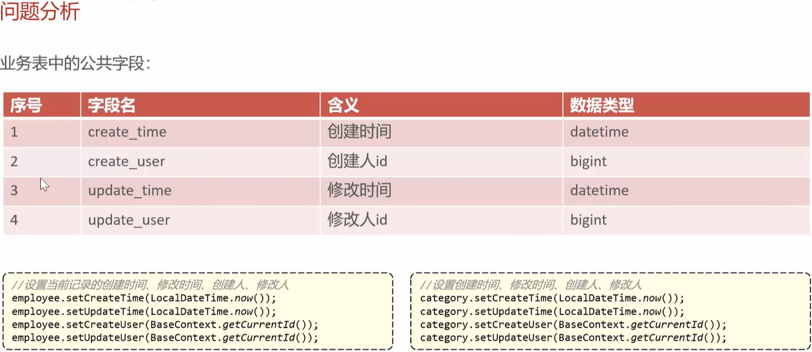


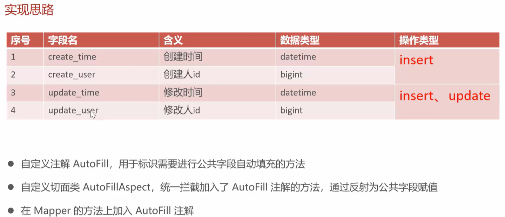


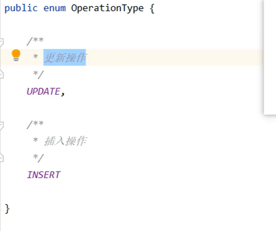

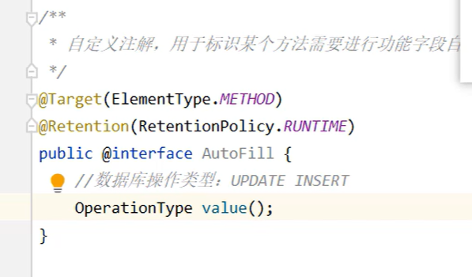


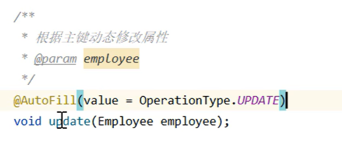

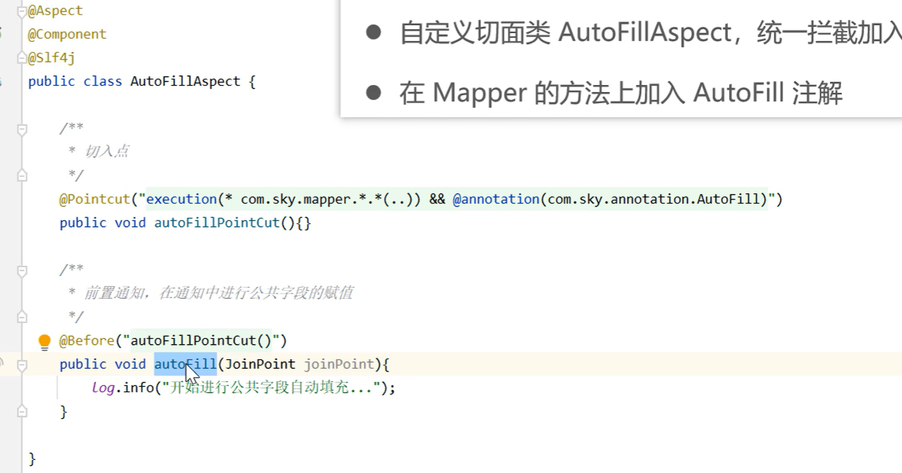

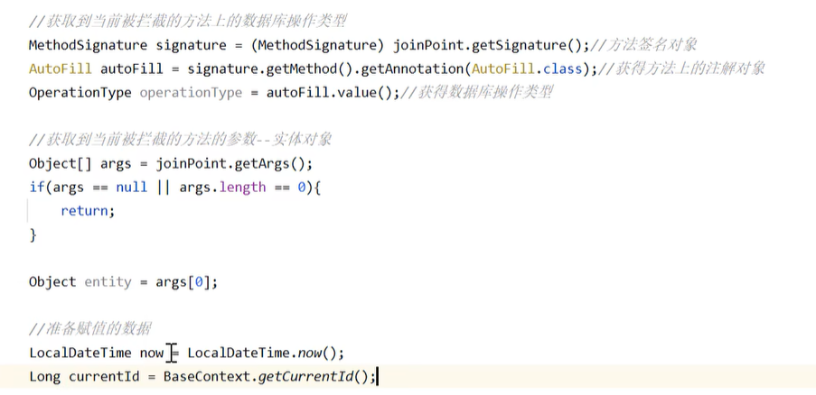


反射与参数处理

在自定义切面（Aspect）中，我们需要同时操作“规则”（注解）和“数据”（实体对象）。这涉及到 `JoinPoint` 的两个核心用法。

1. 核心概念对比

| **核心组件** | **MethodSignature (方法签名)**                   | **joinPoint.getArgs() (参数数组)**         |
| ------------ | ------------------------------------------------ | ------------------------------------------ |
| **性质**     | **静态元数据 (Metadata)**                        | **动态运行时数据 (Runtime Data)**          |
| **比喻**     | **菜谱 / 模具**                                  | **刚买回来的菜 / 实物**                    |
| **作用**     | 告诉你代码是怎么**写**的。                       | 给你看程序正在**跑**的数据。               |
| **核心用途** | 获取方法名、**读取方法上的注解**、查看参数类型。 | 获取**前端传来的实体对象**、进行反射赋值。 |
| **获取方式** | `(MethodSignature) joinPoint.getSignature()`     | `joinPoint.getArgs()`                      |


2. 详细解析

A. 为什么要强转 `MethodSignature`？

- **问题**：`joinPoint.getSignature()` 返回的是最顶层的 `Signature` 接口。它只知道“这是一个连接点”，但不知道这是个“方法”。
- **解决**：必须向下转型（强转）为 `MethodSignature`。
- **目的**：只有转了之后，才能调用 `.getMethod()` 拿到 `java.lang.reflect.Method` 对象，进而通过 `.getAnnotation(AutoFill.class)` 读取我们在方法上写的注解（判断是 `INSERT` 还是 `UPDATE`）。

B. 为什么要用 `getArgs()`？

- **问题**：`Method` 对象里只有“参数类型”（比如 `Employee.class`），没有“参数值”。
- **解决**：通过 `joinPoint.getArgs()` 获取一个 `Object[]` 数组。
- **目的**：数组中的 `args[0]` 就是前端传进来的、活生生的实体对象（内存地址）。我们需要拿到它，才能通过反射（Reflection）把 `createTime` 等值塞进去。


3. 标准代码模板

```Java
@Before("@annotation(com.sky.annotation.AutoFill)") // 拦截带有 @AutoFill 注解的方法
public void autoFill(JoinPoint joinPoint) {

    // ================= Phase 1: 获取“规则” (MethodSignature) =================
    // 1. 获取签名并强转 (这是通往 Method 对象的唯一桥梁)
    MethodSignature signature = (MethodSignature) joinPoint.getSignature();
    
    // 2. 获取 Method 对象 (反射的核心)
    Method method = signature.getMethod();
    
    // 3. 获取方法上的注解 (读取你是 INSERT 还是 UPDATE)
    AutoFill autoFill = method.getAnnotation(AutoFill.class);
    OperationType operationType = autoFill.value();


    // ================= Phase 2: 获取“数据” (Args) =================
    // 1. 获取参数数组
    Object[] args = joinPoint.getArgs();
    
    // 2. 防御性编程 (防止无参数方法报错)
    if (args == null || args.length == 0) {
        return;
    }
    
    // 3. 锁定目标对象 (通常约定第一个参数是实体对象)
    Object entity = args[0];


    // ================= Phase 3: 执行“操作” (Reflection) =================
    // 准备数据
    LocalDateTime now = LocalDateTime.now();
    Long currentId = BaseContext.getCurrentId();

    // 通过反射赋值 (根据 operationType 决定填充哪些字段)
    if (operationType == OperationType.INSERT) {
        // 伪代码：通过反射调用 entity.setCreateTime(now);
        // ...
    }
}
```


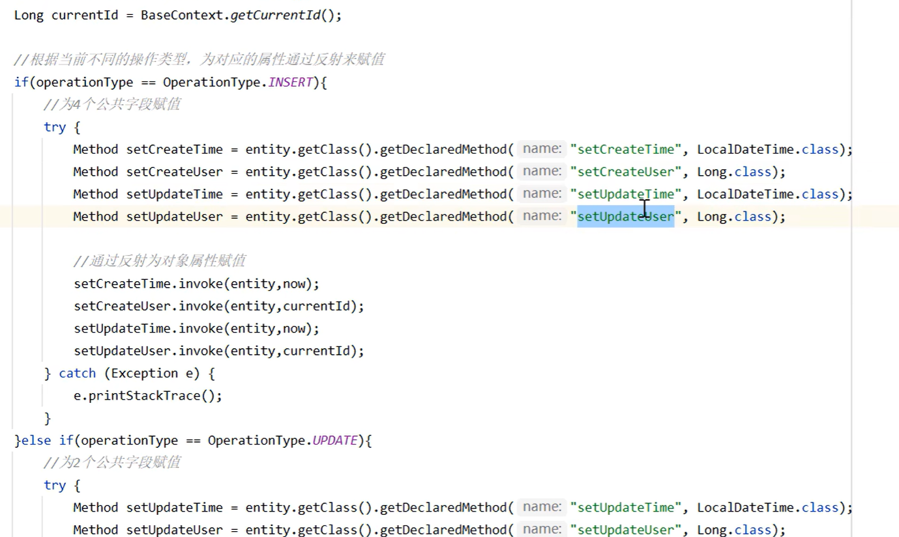

<font color='red'>注意：这里通过AOP已经将实体中对应的变量赋值</font>


## Mybatis-Plus直接使用

### 使用步骤

#### 1. 定义实体类

在实体类中，你需要使用 `@TableField` 注解来标记哪些字段需要自动填充，并指定填充的策略。

```java
public class User {
    @TableField(fill = FieldFill.INSERT)
    private String createTime;

    @TableField(fill = FieldFill.UPDATE)
    private String updateTime;

    // 其他字段...
}
```

#### 2. 实现 MetaObjectHandler

创建一个类来实现 `MetaObjectHandler` 接口，并重写 `insertFill` 和 `updateFill` 方法。

```java
@Slf4j
@Component
public class MyMetaObjectHandler implements MetaObjectHandler {

    @Override
    public void insertFill(MetaObject metaObject) {
        log.info("开始插入填充...");
        this.strictInsertFill(metaObject, "createUserId", Long.class, 123456L)
        this.strictInsertFill(metaObject, "createTime", LocalDateTime.class, LocalDateTime.now());
    }

    @Override
    public void updateFill(MetaObject metaObject) {
        log.info("开始更新填充...");
        this.strictInsertFill(metaObject, "updateUserId", Long.class, 123456L)
        this.strictUpdateFill(metaObject, "updateTime", LocalDateTime.class, LocalDateTime.now());
    }
}
```

#### 3. 配置自动填充处理器

确保你的 `MyMetaObjectHandler` 类被 Spring 管理，可以通过 `@Component` 或 `@Bean` 注解来实现。

### 注意事项

- 自动填充是直接给实体类的属性设置值。
- 如果属性没有值，入库时会是 `null`。
- `MetaObjectHandler` 提供的默认方法策略是：如果属性有值则不覆盖，如果填充值为 `null` 则不填充。
- 字段必须声明 `@TableField` 注解，并设置 `fill` 属性来选择填充策略。
- 填充处理器需要在 Spring Boot 中声明为 `@Component` 或 `@Bean`。
- 使用 `strictInsertFill` 或 `strictUpdateFill` 方法可以根据注解 `FieldFill.xxx`、字段名和字段类型来区分填充逻辑。
- 如果不需区分，可以使用 `fillStrategy` 方法。
- 在 `update(T entity, Wrapper<T> updateWrapper)` 时，`entity` 不能为空，否则自动填充失效。
- <font color='red'>在 `update(Wrapper<T> updateWrapper)` 时不会自动填充，需要手动赋值字段条件。</font>


`update(entity, wrapper)` 是 MyBatis-Plus 中一个非常灵活的方法，它的核心逻辑是：**“对象负责数据，Wrapper 负责条件”**。

它完美解决了你遇到的“想用复杂条件更新，又想让自动填充生效”的问题。

- **参数 1 (`entity`)**：决定 `UPDATE` 语句中的 **SET** 部分（以及触发自动填充）。
- **参数 2 (`wrapper`)**：决定 `UPDATE` 语句中的 **WHERE** 部分。


手动实现中，反射需要依靠方法名

```java
package com.hongs.skycommon.constant;

/**
 * 公共字段自动填充相关常量
 */
public class AutoFillConstant {
    public static final String SET_CREATE_TIME = "setCreateTime";
    public static final String SET_UPDATE_TIME = "setUpdateTime";
    public static final String SET_CREATE_USER = "setCreateUser";
    public static final String SET_UPDATE_USER = "setUpdateUser";
}
```


Mybatis-Plus，的使用中只需要属性即可

```java
package com.hongs.skycommon.constant;

/**
 * 公共字段自动填充相关常量
 */
public class AutoFillConstant {
    public static final String CREATE_TIME = "createTime";
    public static final String UPDATE_TIME = "updateTime";
    public static final String CREATE_USER = "createUser";
    public static final String UPDATE_USER = "updateUser";
}
```


### MP仅用属性名的原因

MP底层是反射调用了 `set` 方法（或者直接操作字段），**但是**，MyBatis-Plus（以及 MyBatis 核心）的设计逻辑遵循了 **JavaBean 规范** 和 **元数据管理** 的原则。

这里之所以**必须是属性名**（`createTime`）而不是方法名（`setCreateTime`），主要有以下三个核心原因：


#### 1. MyBatis 的 `MetaObject` 机制（中间人模式）

MyBatis-Plus 的自动填充底层依赖于 MyBatis 原生的工具类 `MetaObject`。

`MetaObject` 是一个强大的对象包装器，它的设计理念是：**“给我属性名，我来负责找存取方法”**。它屏蔽了具体的实现细节。

当你调用 `metaObject.setValue("name", "张三")` 时，内部流程是这样的：

1. **查找属性**：MyBatis 会去 `Reflector`（反射器）中查找名为 `name` 的属性信息。
2. **解析 Setter**：
	- 标准 JavaBean：它会自动拼凑出 `setName`。
	- Lombok `@Accessors(fluent=true)`：Setter 可能叫 `name()`。
	- Boolean 类型：Setter 可能叫 `isName()` 或 `setName()`。
3. **调用**：反射调用找到的方法。

**结论**：如果你传给它 `"setName"`，`MetaObject` 会以为你有一个属性叫 `setName`（对应的 Setter 应该是 `setSetName`），这显然是找不到的。


#### 2. MP 的 `strictFill` 需要获取字段元数据

注意你调用的方法名是 `strictInsertFill`（严格填充）。这个“严格”体现在：它不仅仅是赋值，它还要**检查字段是否存在**以及**类型是否匹配**。

MP 的源码逻辑大致如下（伪代码）：

```Java
public void strictFill(MetaObject metaObject, String fieldName, Class<?> fieldType, Object fieldVal) {
    // 1. MP 拿着你传入的 "createTime" 去类定义里找 Field 对象
    // 如果你传 "setCreateTime"，这里直接报错：没有这个字段！
    if (metaObject.hasSetter(fieldName) && metaObject.hasGetter(fieldName)) {
        
        // 2. 检查类型是否匹配 (比如你要填 LocalDateTime，但字段是 String)
        Class<?> setterType = metaObject.getSetterType(fieldName);
        if (setterType.isAssignableFrom(fieldType)) {
            
            // 3. 执行填充
            metaObject.setValue(fieldName, fieldVal);
        }
    }
}
```

如果 MP 要求你传入方法名 `"setCreateTime"`，那么它就无法反向推导出字段名是 `createTime`（因为可能存在非标准的命名），也就无法获取字段上的注解（如 `@TableField`）或者类型信息。


#### 3. 解耦与稳定性

在 Java 开发中，**属性名（Field）** 是数据的核心标识，而 **Setter 方法名** 是一种行为实现。

- **场景 A**：你使用了 Lombok 的 `@Accessors(chain = true)` 或 `@Builder`，或者你是 Kotlin 用户，Setter 方法的签名或名称可能会变。
- **场景 B**：你可能根本没有 Setter 方法，而是配置了 MyBatis 直接通过反射操作 Field（不走 set 方法）。

如果 MP 强制绑定“方法名”，一旦上述场景发生，自动填充就废了。绑定“属性名”则是最稳定、最符合面向对象设计的做法。


#### 图解流程

**手动实现：**

> 常量 "setCreateTime"  -->  反射调用 setCreateTime()

**实际的 MP/MyBatis 逻辑：**

> 常量 "createTime" (属性名)
>
> ⬇️
>
> 1. `Reflector` 查找名为 `createTime` 的属性定义
>
> 2. 获取该属性对应的 Setter 方法（例如 `setCreateTime`）
>
> 3. 获取该属性的类型（用于类型检查）
>
> 	⬇️
>
> 	反射调用 setCreateTime()


### 公共属性不全面跳过自动填充

#### 问题描述

```java
@Slf4j
@Component
public class MyMetaObjectHandler implements MetaObjectHandler {

    @Override
    public void insertFill(MetaObject metaObject) {
        log.info("开始插入填充...");
        this.strictInsertFill(metaObject, AutoFillConstant.CREATE_TIME, LocalDateTime.class, LocalDateTime.now());
        this.strictInsertFill(metaObject, AutoFillConstant.CREATE_USER, Long.class, BaseContext.getCurrentId());
        this.strictInsertFill(metaObject, AutoFillConstant.UPDATE_TIME, LocalDateTime.class, LocalDateTime.now());
        this.strictInsertFill(metaObject, AutoFillConstant.UPDATE_USER, Long.class, BaseContext.getCurrentId());
    }

    @Override
    public void updateFill(MetaObject metaObject) {
        log.info("开始更新填充...");
        this.strictUpdateFill(metaObject, AutoFillConstant.UPDATE_TIME, LocalDateTime.class, LocalDateTime.now());
        this.strictUpdateFill(metaObject, AutoFillConstant.UPDATE_USER, Long.class, BaseContext.getCurrentId());
    }
}
```

有 `CreateTime` `UpdateTime` `CreateUser` `UpdateUser` 这四种属性的 `set` 方法时，才会触发自动填充的 `insertFill`；同理，有 `UpdateTime` ` UpdateUser` 这两种属性的 `set` 方法才会触发自动填充的 `updateFill`。


#### 改进方法

```java
@Slf4j
@Component
public class MyMetaObjectHandler implements MetaObjectHandler {

    @Override
    public void insertFill(MetaObject metaObject) {
        log.info("开始插入填充...");

        // 1. 填充 createTime (User实体有这个字段，会执行)
        if (metaObject.hasSetter(AutoFillConstant.CREATE_TIME)) {
            this.strictInsertFill(metaObject, AutoFillConstant.CREATE_TIME, LocalDateTime.class, LocalDateTime.now());
        }

        // 2. 填充 createUser (User实体没有这个字段，hasSetter返回false，跳过，不会报错)
        if (metaObject.hasSetter(AutoFillConstant.CREATE_USER)) {
            this.strictInsertFill(metaObject, AutoFillConstant.CREATE_USER, Long.class, BaseContext.getCurrentId());
        }

        // 3. 填充 updateTime
        if (metaObject.hasSetter(AutoFillConstant.UPDATE_TIME)) {
            this.strictInsertFill(metaObject, AutoFillConstant.UPDATE_TIME, LocalDateTime.class, LocalDateTime.now());
        }

        // 4. 填充 updateUser
        if (metaObject.hasSetter(AutoFillConstant.UPDATE_USER)) {
            this.strictInsertFill(metaObject, AutoFillConstant.UPDATE_USER, Long.class, BaseContext.getCurrentId());
        }
    }

    @Override
    public void updateFill(MetaObject metaObject) {
        log.info("开始更新填充...");

        if (metaObject.hasSetter(AutoFillConstant.UPDATE_TIME)) {
            this.strictUpdateFill(metaObject, AutoFillConstant.UPDATE_TIME, LocalDateTime.class, LocalDateTime.now());
        }

        if (metaObject.hasSetter(AutoFillConstant.UPDATE_USER)) {
            this.strictUpdateFill(metaObject, AutoFillConstant.UPDATE_USER, Long.class, BaseContext.getCurrentId());
        }
    }
}
```

这样的同一个 Handler 就可以同时兼容“全字段实体（如员工表）”和“少字段实体（如用户表）”。


# 工具类保持启动时单例

```java
/**
 * AliOSSUtil配置类
 */
@Configuration
@Slf4j
public class AliOSSConfig {
    @Bean
    @ConditionalOnMissingBean
    public AliOSSUtil aliOSSUtil(AliOSSProperties aliOSSProperties) {
        log.info("开始创建AliOSSUtil对象...");
        return new AliOSSUtil(aliOSSProperties.getEndpoint(),
                aliOSSProperties.getAccessKeyId(),
                aliOSSProperties.getAccessKeySecret(),
                aliOSSProperties.getBucketName(),
                aliOSSProperties.getRegion());
    }
}
```

| **对比维度**     | **仅使用 @Bean**                                             | **使用 @Bean + @ConditionalOnMissingBean**                   |
| ---------------- | ------------------------------------------------------------ | ------------------------------------------------------------ |
| **创建逻辑**     | **强制创建**。无论容器中是否已存在该类型的 Bean，都会尝试注册当前的 Bean 定义。 | **按需创建**。先检查容器中是否已存在该类型的 Bean。若不存在才创建；若已存在则忽略，不执行创建逻辑。 |
| **冲突处理**     | **报错或覆盖**。如果容器中已有同名 Bean，默认情况下 Spring Boot (2.1+) 会抛出 `BeanDefinitionOverrideException` 异常导致启动失败。 | **礼貌避让**。如果容器中已有同名或同类型的 Bean，当前配置自动失效，系统继续运行，使用已存在的那个 Bean。 |
| **优先级定位**   | **一等公民**。认为是系统中不可或缺、不可替代的定义。         | **兜底策略 (Fallback)**。认为是“备胎”或“默认值”，允许被更高优先级的自定义配置取代。 |
| **典型应用场景** | **业务代码 (Application Code)**。如 Controller、Service、或项目特有的配置。你不希望这些代码被意外替换。 | **自动配置 (Auto-Configuration)**。如编写 SDK、Starter 或通用工具库。你希望给用户提供默认功能，但允许用户自定义去覆盖它。 |
| **灵活性**       | **低**。外部很难替换该 Bean，除非修改源码或开启允许 Bean 覆盖的全局配置。 | **高**。外部只需定义一个同类型的 Bean，即可轻松替换掉这个默认实现，无需修改你的源码。 |


# 文件上传的文件名设置

## 上传配置

```java
@Operation(summary = "文件上传")
@PostMapping("/update")
public Result<String> update(MultipartFile file) {
    log.info("文件上传");
    try {
        // 生成文件名: UUID + 文件后缀
        String fileName = UUID.randomUUID().toString() + file.getName().substring(file.getName().lastIndexOf("."));

        // 按年月文件上传路径
        String objectName = LocalDateTime.now().format(DateTimeFormatter.ofPattern("yyyy/MM")) + "/" + fileName;

        String url = aliOSSUtil.upload(objectName, file.getBytes());
        return Result.success(url);
    } catch (IOException e) {
        throw new BaseException(MessageConstant.UPLOAD_FAILED);
    }
}
```

```yml
spring:
  servlet:
    multipart:
      max-file-size: 10MB
      max-request-size: 10MB
```


## 分目录的原因

**技术上不强制（OSS 是扁平的），但在工程实践中，强烈建议分目录。**

### 1. 核心原理：对象存储其实是“假的”文件系统

Windows 或 Linux 的文件系统，文件夹是真的存在的。 但在对象存储（OSS、S3）中，**本质上它是 Key-Value 的结构**，它是扁平的。

- **你以为的结构：** `folder` (文件夹) -> `subfolder` (子文件夹) -> `file.jpg`
- **OSS 实际存储的结构：** 它只存了一个 Key（文件名），这个 Key 的字符串就是：`folder/subfolder/file.jpg`。 **“/” 对 OSS 来说，只是文件名字符串的一部分而已。**

### 2. 既然是扁平的，为什么还要我手动加 "/" 分层？

虽然底层是扁平的，但 **分层（分目录）** 有以下 3 个巨大的实际价值：

#### ① 避免“控制台爆炸” (最直接的原因)

阿里云、AWS 的网页版管理控制台（Console），都会把 `/` 识别为模拟文件夹。

- **如果不分目录：** 假设你存了 10 万张图在根目录。当你登录阿里云 OSS 后台想找某张图时，浏览器会尝试加载这 10 万条记录。**结果通常是：网页卡死、崩溃，或者加载极慢。**
- **如果分目录：** 打开根目录，你只看到几个年份文件夹（如 `2023/`, `2024/`），系统非常流畅。

#### ② 数据管理与生命周期 (最值钱的原因)

OSS 都有**生命周期管理 (Lifecycle)** 功能。

- **场景：** 老板说，“原本去年的临时图片（temp）太占钱了，我们要自动删除，但保留今年的”。
- **没目录：** 你完了。所有图片都在一起，怎么区分哪张是去年的？只能写脚本一个个遍历（耗时耗钱）。
- **有目录：** 你可以直接在阿里云后台配一条规则：**“对前缀为 `2023/temp/` 的对象，设置 30 天后自动删除。”** —— **一键搞定。**

#### ③ 性能优化 (Listing 性能)

如果你需要通过 API 列出某个文件，虽然 OSS 很快，但如果你在根目录下 List Object，而根目录下有 100 万个文件，API 只能分页返回（比如一次 1000 个）。你要找到第 90 万个文件，需要请求 900 次 API。 如果有目录结构，你可以直接 List `2024/10/12/` 下的文件，效率高得多。


# 动态SQL

[MyBatis 3 | 动态 SQL – mybatis](https://mybatis.org/mybatis-3/zh_CN/dynamic-sql.html)

`<if>`

```xml
<select id="findActiveBlogWithTitleLike"
     resultType="Blog">
  SELECT * FROM BLOG
  WHERE state = ‘ACTIVE’
  <if test="title != null">
    AND title like #{title}
  </if>
</select>
```

`<where>`

```xml
<select id="findActiveBlogLike"
     resultType="Blog">
  SELECT * FROM BLOG
  <where>
    <if test="state != null">
         state = #{state}
    </if>
    <if test="title != null">
        AND title like #{title}
    </if>
    <if test="author != null and author.name != null">
        AND author_name like #{author.name}
    </if>
  </where>
</select>

```

`<set>`

```xml
<update id="updateAuthorIfNecessary">
  update Author
    <set>
      <if test="username != null">username=#{username},</if>
      <if test="password != null">password=#{password},</if>
      <if test="email != null">email=#{email},</if>
      <if test="bio != null">bio=#{bio}</if>
    </set>
  where id=#{id}
</update>

```
`<foreach`

```xml
<select id="selectPostIn" resultType="domain.blog.Post">
  SELECT *
  FROM POST P
  <where>
    <foreach item="item" index="index" collection="list"
        open="ID in (" separator="," close=")" nullable="true">
          #{item}
    </foreach>
  </where>
</select>
```

*foreach* 元素的功能非常强大，它允许你指定一个集合，声明可以在元素体内使用的集合项（item）和索引（index）变量。它也允许你指定开头与结尾的字符串以及集合项迭代之间的分隔符。这个元素也不会错误地添加多余的分隔符，看它多智能！

**提示** 你可以将任何可迭代对象（如 List、Set 等）、Map 对象或者数组对象作为集合参数传递给 *foreach*。当使用可迭代对象或者数组时，index 是当前迭代的序号，item 的值是本次迭代获取到的元素。当使用 Map 对象（或者 Map.Entry 对象的集合）时，index 是键，item 是值。


>  注意：返回结果是集合的时候，


# 多表查询

## 多张表操作开启事务

```java
@SpringBootApplication
@ComponentScan("com.hongs")
@EnableTransactionManagement // 开启注解方式的事务管理
public class SkyServerApplication {

    public static void main(String[] args) {
        SpringApplication.run(SkyServerApplication.class, args);
    }
}
```

```java
/**
 * 保存菜品
 * @param dishSaveDTO
 */
@Override
@Transactional
public void saveWithFlavor(DishSaveDTO dishSaveDTO) {
    // 向菜品表插入一条数据
    Dish dish = new Dish();
    BeanUtils.copyProperties(dishSaveDTO, dish);
    this.save(dish);

    // 向口味表插入多条数据
    List<DishFlavor> dishFlavors = dishSaveDTO.getFlavors();
    if (dishFlavors != null && dishFlavors.isEmpty()) {
        dishFlavors.forEach(dishFlavor -> dishFlavor.setDishId(dish.getId()));
        dishFlavorService.saveBatch(dishFlavors);
    }
}
```


## 分页多表实现样例


service代码
```java
/**
 * 菜品分页查询
 * @param dishPageQueryDTO
 * @return
 */
@Override
public PageResult<DishPageQueryVO> page(DishPageQueryDTO dishPageQueryDTO) {
    Page<DishPageQueryVO> page = new Page<>(dishPageQueryDTO.getPage(), dishPageQueryDTO.getPageSize());
    this.baseMapper.pageQuery(page, dishPageQueryDTO);
    return new PageResult<>(page.getTotal(), page.getRecords());
}
```
mapper代码
```java
public interface DishMapper extends BaseMapper<Dish> {

    /**
     * 菜品分页查询
     * @param page
     * @param dishPageQueryDTO
     * @return
     */
    Page<DishPageQueryVO> pageQuery(Page<DishPageQueryVO> page, DishPageQueryDTO dishPageQueryDTO);

}
```
xml代码
```xml
    <select id="pageQuery" resultType="com.hongs.skycommon.pojo.vo.DishPageQueryVO">
        select d.id, d.name, d.category_id, d.price, d.image, d.description,
        d.status, d.update_time, c.name as category_name
        from dish d
        left join category c on d.category_id = c.id
        <where>
            <if test="dishPageQueryDTO.name != null and dishPageQueryDTO.name != ''">
                and d.name like concat('%', #{dishPageQueryDTO.name}, '%')
            </if>
            <if test="dishPageQueryDTO.categoryId != null">
                and d.category_id = #{dishPageQueryDTO.categoryId}
            </if>
            <if test="dishPageQueryDTO.status != null">
                and d.status = #{dishPageQueryDTO.status}
            </if>
        </where>
    </select>
```


# Query形式的多参数接收

在 Spring Boot 中，前端传来的 `ids=1,2,3`（Query形式），后端可以直接用 `List<Long>` 或者 `Long[]` 接收。

```java
/**
 * 批量删除
 * @param ids
 * @return
 */
@Operation(summary = "批量删除")
@DeleteMapping
public Result delete(@RequestParam List<Long> ids) {
    log.info("批量删除: {}", ids);
    dishService.deleteBatchByIds(ids);
    return Result.success();
}
```

**注意：** 使用 `List` 接收时，**必须**加上 `@RequestParam` 注解，否则 Spring 会懵圈，试图去实例化一个 List 接口对象而报错。

也可以直接 `Long[] ids` 无需注解来接收参数


# 从字段注入到构造器注入

## 为什么不字段注入

虽然**字段注入**（Field Injection，即直接在字段上加 `@Autowired`）写起来最爽，但它被官方“嫌弃”主要有 **3 个核心原因**（通常被称为“三大原罪”）：


### 1. 容易导致空指针异常 (NPE) —— “半成品”对象

这是最致命的问题。

- 字段注入的逻辑：

  Java 先把对象 new 出来（此时字段全是 null），然后 Spring 再通过反射把值塞进去。

- 风险：

  如果你的类被很多地方调用，或者在 Spring 容器启动完成前（比如在构造函数里、或者静态代码块里）就去调用了这个类的某个方法，此时 @Autowired 的字段可能还没来得及被注入。

  结果就是： 直接报 NullPointerException。

> 比喻：
>
> 这就像你买了一辆车（实例化对象），但轮胎是“字段注入”的。厂家先把没轮胎的车卖给你，过了一会儿才派人把轮胎装上。
>
> 如果你在装轮胎之前就想开车（调用方法），车就会散架（NPE）。


### 2. 无法进行纯粹的单元测试 (Unit Testing)

- **场景：** 你想测试 `SetmealServiceImpl` 的逻辑，但不想启动沉重的 Spring 容器（太慢了）。

- **字段注入的尴尬：**

  ```Java
  // 假设你用字段注入
  SetmealServiceImpl service = new SetmealServiceImpl();
  // 此时 service.setmealDishService 是 null！
  // 你没办法直接塞一个 Mock 对象进去，因为字段是 private 的。
  // 你被迫只能用反射（Reflection）强行塞值，或者被迫启动 Spring 容器。
  ```

- **构造器注入的优势：**

  ```Java
  // 如果是构造器注入
  SetmealServiceImpl service = new SetmealServiceImpl(new MockSetmealDishService());
  // 非常简单，直接 new 出来就能测，完全不依赖 Spring 框架。
  ```


### 3. 破坏了不可变性 (Immutability)

- **原则：** 在软件设计中，我们希望依赖一旦确立，就不要再变了。

- **字段注入：** 字段不能加 `final` 关键字。这意味着在这个对象的生命周期内，理论上这个 `setmealDishService` 随时可能被改成别的值（虽然概率小，但代码层面不安全）。

- **构造器注入：** 可以加上 `final` 关键字。

  ```Java
  private final SetmealDishService setmealDishService;
  ```

  这告诉所有人：**“这个 Service 一旦创建，它的依赖就是固定的，谁也别想动它。”** 这种代码极其健壮。


### 还有一个“隐藏的坏处”：掩盖设计缺陷

**循环依赖 (Circular Dependency)**

- **场景：** A Service 依赖 B，B Service 又依赖 A。

- **字段注入：** Spring 能够通过“三级缓存”勉强解决这个问题，让程序跑起来。但这其实是一种**很烂的设计**。

- 构造器注入： 如果你用构造器注入，Spring 启动时会直接报错：BeanCurrentlyInCreationException。

  这其实是好事！ 因为它直接把问题暴露出来，逼着你去重构代码（比如抽取第三个 Service），而不是把烂代码藏着掖着。


### 一张图总结

| **特性**       | **字段注入 (@Autowired 字段)** | **构造器注入 (推荐)**         |
| -------------- | ------------------------------ | ----------------------------- |
| **代码量**     | 少，简单                       | 稍多（配合 Lombok 可解决）    |
| **依赖可见性** | 隐藏（外面看不出这货依赖谁）   | 显式（构造函数参数一目了然）  |
| **是否可变**   | 可变 (Mutable)                 | **不可变 (Immutable, final)** |
| **NPE 风险**   | 高 (存在中间状态)              | **无 (对象创建即完整)**       |
| **测试难度**   | 难 (需要反射或容器)            | **易 (直接 new)**             |


## 字段注入

```java
@Service
public class SetmealServiceImpl extends ServiceImpl<SetmealMapper, Setmeal>
    implements SetmealService {

    @Autowired
    private SetmealDishService setmealDishService;
}
```


## Lombok下的构造器注入

```java
@Service
@RequiredArgsConstructor // 1. Lombok 注解
public class SetmealServiceImpl extends ServiceImpl<SetmealMapper, Setmeal>
    implements SetmealService {

    // 2. 去掉 @Autowired，加上 final
    private final SetmealDishService setmealDishService; 
    
    // Lombok 会自动生成如下构造函数（你不用手写）：
    // public SetmealServiceImpl(SetmealDishService setmealDishService) {
    //     this.setmealDishService = setmealDishService;
    // }
}
```


## 构造器注入

```java
@Service
public class SetmealServiceImpl extends ServiceImpl<SetmealMapper, Setmeal>
    implements SetmealService {

    private final SetmealDishService setmealDishService;

    public SetmealServiceImpl(SetmealDishService setmealDishService) {
        this.setmealDishService = setmealDishService;
    }
}
```


如果 Service 依赖了多个 Bean（比如同时依赖 `UserService`, `OrderService`, `PaymentService` 等），构造器注入的写法非常直观，就是**在构造函数的参数列表里一直往后加**。


```java
@Service
public class OrderServiceImpl implements OrderService {

    private final UserService userService;
    private final PaymentService paymentService;
    private final StockService stockService;

    public OrderServiceImpl(UserService userService, 
                            PaymentService paymentService, 
                            StockService stockService) {
        this.userService = userService;
        this.paymentService = paymentService;
        this.stockService = stockService;
    }
}
```


# 业务逻辑

## 1. 基础状态默认值

- **员工、分类、菜品、套餐**：新增时，默认状态均为 **禁用/停售 (Status = 0)**。
  - *补充理由*：防止新建过程中数据未完善（如图片未上传、价格未定）就直接暴露给用户端。

## 2. 删除逻辑（数据完整性保护）

- **通用规则**：所有**启用/起售**状态的数据，**不允许直接删除**，必须先执行停售/禁用操作。
- **分类删除**：
  - 必须校验该分类下**没有关联任何菜品**（无论菜品是起售还是停售）。
  - 必须校验该分类下**没有关联任何套餐**。
  - *补充*：如果不满足条件，抛出“关联数据存在”的业务异常，而不是静默失败。
- **菜品删除**：
  - 必须处于**停售**状态。
  - 必须校验**未被任何套餐关联**（检查 `setmeal_dish` 表）。
  - **执行动作**：删除菜品基本信息 + 删除关联的口味数据（`dish_flavor`）。

## 3. 新增与修改逻辑

- **菜品添加**：
  - 先保存菜品基本信息（获取生成的 ID）。
  - 再批量保存口味信息（关联生成的 ID）。
  - *关于分类校验的修正建议*：虽然前端限制了只能选启用分类，但**后端接口建议仍做一次校验**（防御式编程），防止恶意调用接口将菜品挂在已禁用的分类下。
- **菜品修改**：
  - 修改基本信息 + **先删后加**（物理删除旧口味，插入新口味）的方式更新口味表。
- **套餐修改**：
  - 修改基本信息 + **先删后加**（物理删除旧关联，插入新关联）的方式更新套餐菜品关系表。

## 4. 状态流转逻辑（级联与依赖）—— **核心难点**

- **【关键】菜品停售 (Disable)**：

  - **动作**：将菜品状态置为 0。
  - **级联影响**：必须查询包含该菜品的所有**在售套餐**，并将这些套餐的状态也自动置为 **停售 (Status = 0)**。

  ```java
      @Override
      public void updateStatus(Integer status, Long id) {
          // 如果是停售操作，需要处理关联的套餐
          if (StatusConstant.DISABLE.equals(status)) {
              // 查询包含当前菜品的关联数据
              List<Long> setmealIds = setmealDishService.getSetmealIdsByDishId(id); // 需要在Service里补充这个方法
  
              if (setmealIds != null && !setmealIds.isEmpty()) {
                  // 将这些关联的套餐状态也改为停售
                  Setmeal setmeal = Setmeal.builder()
                          .status(StatusConstant.DISABLE)
                          .build();
                  LambdaQueryWrapper<Setmeal> wrapper = new LambdaQueryWrapper<>();
                  wrapper.in(Setmeal::getId, setmealIds);
                  setmealService.update(setmeal, wrapper);
              }
          }
  
          Dish dish = Dish.builder()
                  .id(id)
                  .status(status)
                  .build();
          this.updateById(dish);
      }
  ```

  

- **【关键】套餐起售 (Enable)**：

  - **动作**：尝试将套餐状态置为 1。
  - **前置校验**：必须遍历该套餐下的**所有菜品**，只有当**所有菜品均为起售状态**时，套餐才允许起售。否则抛出异常提示用户。

  ```java
      @Override
      public void updateStatus(Integer status, Long id) {
          // 判断当前是否要更改为启售
          if (status.equals(StatusConstant.ENABLE)) {
              // 查询当前套餐的菜品数据
              List<Long> dishIdList = setmealDishService.getDishIdsBySetmealId(id);
              if (dishIdList != null && !dishIdList.isEmpty()) {
                  Long count = dishService.count(new LambdaQueryWrapper<Dish>()
                          .in(Dish::getId, dishIdList)
                          .eq(Dish::getStatus, StatusConstant.DISABLE));
                  // 如果存在停售的菜品，则抛出异常
                  if (count > 0) {
                      throw new SetMealEnableFailedException(MessageConstant.SETMEAL_ENABLE_FAILED);
                  }
              }
          }
  
          Setmeal setmeal = Setmeal.builder()
                  .id(id)
                  .status(status)
                  .build();
          this.updateById(setmeal);
      }
  ```

  

- **分类禁用**：

  - *补充*：虽然项目可能没做，但严谨的逻辑是：分类禁用时，理论上该分类下的菜品在 C 端也应该不可见。通常通过查询 SQL 过滤（`where category.status = 1`）来实现，而非修改菜品表状态。


# 从全量更新到增量更新

## 全量更新

1. 清除旧状态

   ```java
   setmealDishService.remove(new LambdaQueryWrapper<SetmealDish>()
           .eq(SetmealDish::getSetmealId, setmeal.getId()));
   ```

   这一步不管你之前套餐里有什么菜，也不管你这次修改有没有动过这些菜，**直接全部删除**。

2. 建立新状态

   ```java
   List<SetmealDish> setmealDishList = setmealSaveDTO.getSetmealDishes();
   // ...
   setmealDishService.saveBatch(setmealDishList);
   ```

   这一步把前端传过来的所有菜品列表，**全部重新插入**。


## 增量更新

从“全量更新”（先删后加）转变为“增量更新”（只改动变化的），核心思路利用集合运算来计算**差集**和**交集**。


**核心逻辑图解：**

假设数据库里的数据是集合 **A**，前端传来的新数据是集合 **B**。

1. **新增的数据** = **B - A** （前端有，数据库没）
2. **删除的数据** = **A - B** （数据库有，前端没）
3. **修改的数据** = **A ∩ B** （都有，但字段值变了，比如份数改了）


```java

    /**
     * 修改套餐
     * @param setmealSaveDTO
     * @return
     */
    @Override
    @Transactional
    public void updateWithDish(SetmealSaveDTO setmealSaveDTO) {
        Setmeal setmeal = new Setmeal();
        BeanUtils.copyProperties(setmealSaveDTO, setmeal);
        this.updateById(setmeal);

        List<SetmealDish> dtoList = setmealSaveDTO.getSetmealDishes();
        if (dtoList != null) {
            dtoList.forEach(setmealDish -> {
                setmealDish.setSetmealId(setmeal.getId());
            });
        } else {
            dtoList = new ArrayList<>();
        }

        List<SetmealDish> dbList = setmealDishService.list(
                new LambdaQueryWrapper<SetmealDish>()
                        .eq(SetmealDish::getSetmealId, setmeal.getId()));

        Map<Long, SetmealDish> dtoMap = dtoList.stream()
                .collect(Collectors.toMap(SetmealDish::getDishId, Function.identity(), (old, newOne) -> old));
        Map<Long, SetmealDish> dbMap = dbList.stream()
                .collect(Collectors.toMap(SetmealDish::getDishId, Function.identity(), (old, newOne) -> old));

        List<Long> idsToRemove = dbList.stream()
                .filter(dbSetmealDish -> !dtoMap.containsKey(dbSetmealDish.getDishId()))
                .map(SetmealDish::getId).toList();
        List<SetmealDish> entitiesToAdd = dtoList.stream()
                .filter(setmealDish -> !dbMap.containsKey(setmealDish.getDishId()))
                .toList();
        List<SetmealDish> entitiesToUpdate = dtoList.stream()
                .filter(setmealDish -> dbMap.containsKey(setmealDish.getDishId()))
                .filter(setmealDish -> !dbMap.get(setmealDish.getDishId()).getCopies().equals(setmealDish.getCopies()))
                .peek(setmealDish -> {
                    setmealDish.setId(dbMap.get(setmealDish.getDishId()).getId());
                }).toList();

        if (!idsToRemove.isEmpty()) {
            setmealDishService.removeByIds(idsToRemove);
        }
        if (!entitiesToUpdate.isEmpty()) {
            setmealDishService.updateBatchById(entitiesToUpdate);
        }
        if (!entitiesToAdd.isEmpty()) {
            setmealDishService.saveBatch(entitiesToAdd);
        }
    }
```


# Stream流小技巧

## Collectors.toMap

```java
Map<String, DishFlavor> dbMap = dbList.stream()
    .collect(Collectors.toMap(DishFlavor::getName, Function.identity(), (old, newOne) -> newOne));
```

**参数 1 (Key)**：`SetmealDish::getDishId` 表示：取出 `SetmealDish` 对象里的 `dishId` 作为 Map 的 **Key**。

**参数 2 (Value)**：`Function.identity()` 表示：把当前的 `SetmealDish` **对象本身**（整个实体）作为 Map 的 **Value**。

` (old, newOne) -> old)` 假如List向Map转化中有相同的Key，用旧Key覆盖新Key。


## Collectors.groupingBy

```java
Map<Long, List<OrderDetail>> orderDetailMap = orderDetailList.stream()
        .collect(Collectors.groupingBy(OrderDetail::getOrderId));
```

`Collectors.groupingBy` 就像是 SQL 语句中的 **`GROUP BY`**。它的作用是将 Stream 流中的元素按照某个特定的标准“**分类**”存放，最终生成一个 `Map`。


如果你想通过某个 ID **查找唯一对应** 的对象，用 `Collectors.toMap`。

如果你想将具有相同特征的对象 **聚拢在一起**，用 `Collectors.groupingBy`。


## Collectors.joining

```java
/**
 * 辅助方法：将订单详情转化为 "菜品(口味)*数量; " 格式
 * @param details
 * @return
 */
private String getDishesStr(List<OrderDetail> details) {
    // 使用 StringJoiner 或 StringBuilder 提升性能
    return details.stream().map(detail -> {
        String flavor = (detail.getDishFlavor() == null || detail.getDishFlavor().isEmpty())
                ? "" : "(" + detail.getDishFlavor() + ")";
        return detail.getName() + flavor + "*" + detail.getNumber();
    }).collect(Collectors.joining("; ")); // 使用分号+空格分隔，且结尾不会有多余的分号
}
```


## peek

`Stream` 中 `peek` 相比 `map` 不需要返回值，更适合set类方法。

```java
List<SetmealDish> entitiesToUpdate = dtoList.stream()
        .filter(setmealDish -> dbMap.containsKey(setmealDish.getDishId()))
        .filter(setmealDish -> !dbMap.get(setmealDish.getDishId()).getCopies().equals(setmealDish.getCopies()))
        .peek(setmealDish -> {
            setmealDish.setId(dbMap.get(setmealDish.getDishId()).getId());
        }).collect(Collectors.toList());
```


## reduce

```java
BigDecimal amount = shoppingCartList.stream()
    // 第一步：转换（Map）
    // 每一个 item (购物车商品) -> 变成该商品的“小计金额” (单价 * 数量)
    .map(item -> item.getAmount().multiply(BigDecimal.valueOf(item.getNumber())))
    
    // 第二步：归约（Reduce）
    // 将流中所有的“小计金额”累加起来
    // BigDecimal.ZERO 是初始值（累加起点）
    // BigDecimal::add 是累加的操作方式
    .reduce(BigDecimal.ZERO, BigDecimal::add);
```


# 相同Controller处理

```
src/main/java/com/hongs/skyserver
├── controller
│   │
│   ├── admin               <-- 【管理端】(B端：商家/管理员后台)
│   │   ├── ShopController.java    // 负责店铺设置、营业状态切换
│   │   ├── ...
│   │   └── ...
│   │
│   └── user                <-- 【用户端】(C端：小程序/App用户)
│       ├── ShopController.java    // 负责展示店铺详情、查询列表
│       ├── ...
│       └── ...
```

由于 Spring 会根据类名注册 bean，所以会出现两个相同名称的 bean 而导致出错。

通过注解进行修改，如下所示。

```java
@Slf4j
@Tag(name = "店铺相关接口")
@RestController("userShopController")
@RequestMapping("/user/shop")
public class ShopController {

    @Autowired
    private RedisTemplate<String, Object> redisTemplate;

    /**
     * 获取营业状态
     *
     * @return
     */
    @Operation(summary = "获取营业状态")
    @GetMapping("/status")
    public Result<Integer> getStatus() {
        Integer status = (Integer) redisTemplate.opsForValue().get(SHOP_STATUS_KEY);
        log.info("获得营业状态: {}", status);
        return Result.success(status);
    }
}
```


# 前端JS简写

**解构赋值 (Destructuring Assignment)**

```javascript
// 源代码
const { avatarUrl } = e.detail

// 等价于传统写法
const avatarUrl = e.detail.avatarUrl
```


```javascript
// 方式 A：传统写法 (你预期的写法)
this.setData({
    avatarUrl: avatarUrl 
});

// 方式 B：ES6 简写 (现在的写法)
this.setData({
    avatarUrl
});
```


# Json与Map互相转换

## Map转Json

### 1. Jackson

这是 Spring Boot 默认集成的库，也是国际上最标准的做法。

- **特点**：功能最强大，注解丰富，Spring 生态原生支持。

- **代码**：

  ```Java
  // 假设你已经有了 objectMapper 实例
  Map<String, Object> map = new HashMap<>();
  map.put("name", "gemini");
  
  try {
      String json = objectMapper.writeValueAsString(map);
      System.out.println(json);
  } catch (JsonProcessingException e) {
      e.printStackTrace();
  }
  ```


Spring 自动化写法（你在 Controller 里）

```java
@PostMapping
public Result save(@RequestBody User user) {
    return Result.ok(user);
}
```

看起来没 JSON，但实际上：

```java
Spring MVC
→ HttpMessageConverter
→ ObjectMapper.writeValueAsString()
```


### 2. Fastjson / Fastjson2 (阿里巴巴)

在国内互联网公司非常流行，因为它的 API 设计非常符合国人直觉（全是静态方法）。

- **特点**：速度极快，API 调用简单（一行代码），但历史上安全漏洞较多（Fastjson2 已改进）。

- **代码**：

  ```Java
  import com.alibaba.fastjson.JSON; // 或者 com.alibaba.fastjson2.JSON
  
  Map<String, Object> map = new HashMap<>();
  map.put("name", "gemini");
  
  // 直接调用静态方法，不用 new 对象，非常爽
  String json = JSON.toJSONString(map); 
  ```


### 3. Gson (Google)

Google 开源的库，在 Android 开发和一些老项目中很常见。

- **特点**：轻量级，零依赖，简单可靠。

- **代码**：

  ```Java
  import com.google.gson.Gson;
  
  Map<String, Object> map = new HashMap<>();
  map.put("name", "gemini");
  
  // 需要 new 一个 Gson 对象
  String json = new Gson().toJson(map);
  ```


### 4. Hutool (国产工具包)

Hutool 是一个 Java 工具包（`cn.hutool`），它内部其实封装了上面的逻辑，如果你的项目里引入了 Hutool，用这个最省事。

- **代码**：

  ```Java
  import cn.hutool.json.JSONUtil;
  
  Map<String, Object> map = new HashMap<>();
  map.put("name", "gemini");
  
  String json = JSONUtil.toJsonStr(map);
  ```


## Json转Map

使用 TypeReference (最规范，推荐)

如果你需要明确指定 Map 的键值类型（例如 `Map<String, Object>`），使用 `TypeReference` 是更安全的做法，特别是当 JSON 结构比较复杂时。

```java
import com.fasterxml.jackson.core.type.TypeReference;
import java.util.Map;

String jsonStr = "{\"name\": \"张三\", \"age\": 18}";

try {
    // 使用 TypeReference 指定泛型
    Map<String, Object> map = objectMapper.readValue(jsonStr, new TypeReference<Map<String, Object>>() {});
    
    System.out.println(map.get("name"));
} catch (Exception e) {
    e.printStackTrace();
}
```


# 缓存数据

## 实现思路


**缓存粒度**

这里将缓存的粒度控制在一个分类，将一个分类下单菜品信息都存在redis中。


## 初步代码实现

### 检测缓存与使用缓存


在 Redis 缓存设计中，使用 `opsForValue()`（对应 Redis 的 String 结构）而不是 `opsForList()`（对应 Redis 的 List 结构）通常是**基于“序列化”和“整体缓存”的考虑**。


1. 存储结构的区别（核心原因）

- **如果使用 `opsForValue()` (String)**: Spring Data Redis 会将整个 Java `List<DishVO>` 对象**序列化成一个字符串**（通常是 JSON 格式，取决于你的 RedisTemplate 配置）。
  - **Redis 中的样子**：
    - Key: `dish_101`
    - Value: `"[{"id":1,"name":"宫保鸡丁"}, {"id":2,"name":"麻婆豆腐"}]"`
  - **操作**：一次 `get` 就能拿到整个 JSON 字符串，反序列化后就是完整的 Java List。
- **如果使用 `opsForList()` (List)**: Redis 会将 Java List 中的**每一个** `DishVO` 元素作为 Redis List 中的一个独立节点存储。
  - **Redis 中的样子**：
    - Key: `dish_101`
    - Value: Index 0 -> `{"id":1,"name":"宫保鸡丁"}`, Index 1 -> `{"id":2,"name":"麻婆豆腐"}`
  - **操作**：你需要遍历 List 并一个个 `push` 进去，取的时候需要使用 `range(0, -1)` 来获取所有元素。

2. 使用场景匹配

在这个代码场景中（通常是外卖点餐业务的菜品查询）：

- **读多写少，整体存取**：用户点进一个分类，是为了看该分类下的**所有**菜品。后端逻辑通常是：“把这个分类下的菜单给我”。我们不需要频繁地只取出第 3 个菜，或者只在列表尾部追加一个菜。
- **原子性**：使用 `opsForValue()`，存取都是一次网络 IO 操作，要么全拿到，要么全拿不到（过期了）。
- **性能**：对于这种几十条数据量级的列表，直接作为一个大的 JSON 字符串传输和解析，通常比维护一个 Redis List 结构（并在 Java 端处理一个个元素的序列化/反序列化）要简单且高效得多。


### 删除缓存


#### 删除单一菜品对应的一个分类的缓存


#### 删除多个菜品对应的多个分类的缓存

###### 方法一：精确删除（最推荐，性能最好）

既然缓存的 Key 规则是 `dish_{categoryId}`（按分类缓存），那么删除菜品时，其实只需要清除**这些菜品所属分类**的缓存即可，没必要把所有分类的缓存都清空。

**逻辑步骤：**

1. 在删除菜品前（或后），先根据前端传来的 `ids` 查询数据库，找出这些菜品属于哪些 `categoryId`。
2. 拼接出对应的 Key 列表，如 `dish_10`, `dish_12`。
3. 调用 `redisTemplate.delete(keysCollection)` 精确删除。

**代码示例：**

```java
public Result delete(@RequestParam List<Long> ids) {
    // 1. 先查询这批菜品属于哪些分类（去重）
    // 假设你有一个方法可以通过菜品ID列表查出对应的分类ID列表
    List<Long> categoryIds = dishMapper.selectCategoryIdsByDishIds(ids); 
    
    // 2. 执行数据库删除逻辑
    dishService.deleteBatch(ids);

    // 3. 精确构造需要清理的缓存Key
    List<String> keys = new ArrayList<>();
    for (Long categoryId : categoryIds) {
        String key = "dish_" + categoryId;
        keys.add(key);
    }

    // 4. 精确删除，不影响其他分类的缓存
    if (keys.size() > 0) {
        redisTemplate.delete(keys);
    }
    
    return Result.success();
}
```

- **优点**：只删除受影响的数据，缓存命中率高，Redis 压力小。
- **缺点**：多了一次查询数据库的操作（查询 `categoryId`），但通常这个开销远小于缓存失效带来的重建开销。


###### 方法二：通配符匹配

**使用 `KEYS` 的问题：** 代码 `redisTemplate.keys("dish_*")` 在 Redis 中对应的是 `KEYS` 命令。这是一个 **O(N)** 的操作。如果 Redis 中有几百万个 Key，执行这个命令会导致 Redis **单线程阻塞**，瞬间卡顿，导致线上故障。

**优化方案（使用 SCAN）：** 如果匹配删除，应该使用 `SCAN` 命令来替代 `KEYS`。Spring Data Redis 提供了 `scan` 的封装。

```java
public void clearCachePattern(String pattern) {
    Set<String> keys = new HashSet<>();
    ScanOptions options = ScanOptions.scanOptions().match(pattern).count(100).build();
    
    // 使用游标分批查找，不会阻塞 Redis
    redisTemplate.execute((RedisCallback<Void>) connection -> {
        try (Cursor<byte[]> cursor = connection.scan(options)) {
            while (cursor.hasNext()) {
                keys.add(new String(cursor.next()));
            }
        }
        return null;
    });

    if (keys.size() > 0) {
        redisTemplate.delete(keys);
    }
}
```

这里是采用的是将缓存全部都删除来以此更新缓存


#### 修改菜品

由于修改菜品可能会出现从一个分类到另一个分类的情况，故而也要对缓存进行更新，与上面同理。

> **<font color='red'>注意不要为了省一点 Redis 的力气，却要让 MySQL 多跑一趟，得不偿失。</font>**


# Spring Cache


继承了springboot父工程，不需要导入版本。

```xml
<dependency>
    <groupId>org.springframework.boot</groupId>
    <artifactId>spring-boot-starter-cache</artifactId>
</dependency>
```


## 定义key的方法

| **分类**               | **写法示例 (SpEL)**                   | **说明**                                                     | **推荐指数** | **适用场景**                                                 |
| ---------------------- | ------------------------------------- | ------------------------------------------------------------ | ------------ | ------------------------------------------------------------ |
| **1. 引用参数 (推荐)** | `#id` `#example.id`                   | 直接使用方法入参名或其属性。语义清晰，重构安全。             | ⭐⭐⭐⭐⭐        | 绝大多数场景，如根据 ID 查询/更新。                          |
| **2. 引用返回值**      | `#result.id`                          | 获取方法执行后的返回值。**仅限 `@CachePut` 或 `@CacheEvict`**。 | ⭐⭐⭐⭐⭐        | 插入数据场景（ID 由数据库生成）。                            |
| **3. 引用参数索引**    | `#p0`, `#p1.id` `#a0`, `#a1.id`       | 代表第1个参数、第2个参数。`p`=param, `a`=arg。               | ⭐⭐           | 参数名不可用时（如未开启 `-parameters` 编译参数）。**易读性差**。 |
| **4. Root 根对象**     | `#root.methodName` `#root.args[0].id` | 获取当前被拦截的方法名、类名、参数数组等元数据。             | ⭐⭐⭐          | 需要区分不同方法但 ID 相同，或编写通用切面时。               |
| **5. 静态方法/工具**   | `T(cn.hutool.SecureUtil).md5(#id)`    | 调用静态方法生成复杂的 Key。                                 | ⭐⭐⭐          | 仅靠参数无法生成唯一 Key，需要哈希或加密时。                 |
| **6. 组合/拼接**       | `'USER:' + #id` `#k1 + '-' + #k2`     | 字符串拼接，构建有层级的 Redis Key。                         | ⭐⭐⭐⭐         | 防止 Key 冲突，Redis 可视化管理更方便。                      |


## 配置Config

```java
@Configuration
@Slf4j
public class RedisConfig {

    private static final String PROJECT_PREFIX = "sky_take_out";
    private final GenericJackson2JsonRedisSerializer jacksonSerializer;

    /**
     * 构造函数：初始化序列化器
     * 在 Config 类实例化时执行一次，配置好所有的序列化规则
     */
    public RedisConfig() {
        log.info("RedisConfig: 初始化序列化器...");

        // 获取基础 ObjectMapper (复用 sky-common 中的时间格式配置)
        ObjectMapper mapper = JacksonBaseConfig.createObjectMapper();

        // 创建 GenericJackson2JsonRedisSerializer
        this.jacksonSerializer = new GenericJackson2JsonRedisSerializer(mapper);
    }

    /**
     * RedisTemplate 配置
     * 用于代码中手动操作 Redis (如: redisTemplate.opsForValue().set(...))
     */
    @Bean
    public RedisTemplate<String, Object> redisTemplate(RedisConnectionFactory factory) {
        log.info("RedisConfig: 开始配置 RedisTemplate...");
        RedisTemplate<String, Object> template = new RedisTemplate<>();
        template.setConnectionFactory(factory);

        StringRedisSerializer stringSerializer = new StringRedisSerializer();

        // Key 序列化：使用 String
        // 原因：Key 通常是字符串，使用 String 序列化后在 Redis 客户端(RDM)中可读性强，方便调试
        template.setKeySerializer(stringSerializer);
        template.setHashKeySerializer(stringSerializer);

        // Value 序列化：使用 JSON (复用成员变量)
        // 原因：Value 通常是对象，需要转为 JSON 存储。复用上面的 jacksonSerializer 确保能处理日期和多态类型。
        template.setValueSerializer(this.jacksonSerializer);
        template.setHashValueSerializer(this.jacksonSerializer);

        template.afterPropertiesSet();
        return template;
    }

    /**
     * RedisCacheConfiguration 配置
     */
    @Bean
    public RedisCacheConfiguration redisCacheConfiguration() {
        log.info("RedisConfig: 开始配置 RedisCacheConfiguration...");

        return RedisCacheConfiguration.defaultCacheConfig()
                // Key 使用 String 序列化
                .serializeKeysWith(RedisSerializationContext.SerializationPair.fromSerializer(new StringRedisSerializer()))
                // Value 使用 JSON 序列化
                .serializeValuesWith(RedisSerializationContext.SerializationPair.fromSerializer(this.jacksonSerializer))
                // 不缓存 null 值，防止缓存穿透/击穿时的误判
                .disableCachingNullValues()
                // 设置默认过期时间 (例如 1 小时)，防止缓存无限堆积
                .entryTtl(Duration.ofHours(1))
                // 统一前缀格式: sky_take_out:模块名:维度:
                .computePrefixWith(name -> PROJECT_PREFIX + ":" + name + ":");
    }
}
```


## 快速入门

模拟了一个标准的 `UserService` 业务流程，展示了如何配合使用这 4 个注解来实现“增删改查”的缓存自动管理。


### 1. 开启缓存功能 (`@EnableCaching`)

位置： 通常放在启动类或配置类上。

作用： 相当于总开关，没有它，下面的注解都不会生效。

```Java
import org.springframework.boot.SpringApplication;
import org.springframework.boot.autoconfigure.SpringBootApplication;
import org.springframework.cache.annotation.EnableCaching;

@SpringBootApplication
@EnableCaching  // <--- 核心：开启缓存注解支持
public class Application {
    public static void main(String[] args) {
        SpringApplication.run(Application.class, args);
    }
}
```


### 2. 业务层缓存实战 (Service)

这里模拟对“用户”数据的缓存操作。请注意观察 `key` 是如何保持一致的。

```Java
import org.springframework.cache.annotation.CacheConfig;
import org.springframework.cache.annotation.CacheEvict;
import org.springframework.cache.annotation.CachePut;
import org.springframework.cache.annotation.Cacheable;
import org.springframework.stereotype.Service;

@Service
// @CacheConfig(cacheNames = "userCache") // 可选：如果整个类都用同一个 cacheName，可以在这里统一定义
public class UserService {

    // 模拟数据库
    private Map<Long, User> db = new ConcurrentHashMap<>();

    /**
     * 1. 查询 (@Cacheable)
     * 场景：如果缓存有，直接返回；如果没有，查库并写入缓存。
     * key: 使用参数 id，例如 "userCache::1"
     */
    @Cacheable(cacheNames = "userCache", key = "#id")
    public User getUserById(Long id) {
        System.out.println("查询数据库... id=" + id);
        return db.get(id);
    }

    /**
     * 2. 更新 (@CachePut)
     * 场景：必须执行方法（更新数据库），然后将方法的返回值更新到缓存中。
     * key: 必须和查询的 key 保持一致！这里使用对象导航 "#user.id"
     * 参考你的图1：也可以写成 #p0.id (不推荐) 或 #a0.id
     */
    @CachePut(cacheNames = "userCache", key = "#user.id")
    public User updateUser(User user) {
        System.out.println("更新数据库... id=" + user.getId());
        db.put(user.getId(), user);
        return user; // 返回值会被自动写入缓存，覆盖旧数据
    }

    /**
     * 3. 新增 (@CachePut 特殊用法)
     * 场景：插入新数据，ID 是自动生成的。
     * key: 只能用 "#result.id"，因为方法执行前 id 是空的。
     * 参考你的图1：这是 "#result.id" 最典型的应用场景。
     */
    @CachePut(cacheNames = "userCache", key = "#result.id")
    public User saveUser(User user) {
        // 模拟数据库自增 ID
        Long newId = System.currentTimeMillis();
        user.setId(newId);
        db.put(newId, user);
        System.out.println("新增用户... 生成ID=" + newId);
        return user; // 将带有新 ID 的用户对象存入缓存
    }

    /**
     * 4. 删除 (@CacheEvict)
     * 场景：删除数据库数据，同时删除缓存。
     * key: 使用参数 id
     */
    @CacheEvict(cacheNames = "userCache", key = "#id")
    public void deleteUser(Long id) {
        System.out.println("删除数据库... id=" + id);
        db.remove(id);
    }
    
    /**
     * 5. 清空所有 (@CacheEvict)
     * 场景：删除整个缓存分区（例如批量导入数据后）。
     * allEntries = true: 清空 userCache 下所有数据
     */
    @CacheEvict(cacheNames = "userCache", allEntries = true)
    public void deleteAllCache() {
        System.out.println("清空所有用户缓存...");
    }
}
```


核心逻辑总结

1. **一致性是关键：** `getUserById` 用什么 key（比如 id），`updateUser` 和 `deleteUser` 就必须针对同一个 key 进行操作。
2. **`@Cacheable` vs `@CachePut`：**
   - 想“少查库”（有缓存就不查），用 `@Cacheable`。
   - 想“同步更新”（只要改了库就必须改缓存），用 `@CachePut`。
3. **SpEL 写法对应你的图片：**
   - `#user.id`：用于更新操作，直接从入参取 ID。
   - `#result.id`：用于新增操作，从返回结果取生成的 ID。


### 多缓存操作

**`@Caching`** 是 Spring Cache 提供的一个**“组合注解”**。

**允许你在同一个方法上，同时执行多个缓存操作。**


#### 1. 为什么需要它？

在 Java 中，同一个注解（比如 `@CacheEvict`）通常不能在同一个方法上重复写多次（虽然 Java 8 之后支持重复注解，但 Spring Cache 的某些版本或配置可能处理起来不如 `@Caching` 直观和兼容）。

场景：

1. `dish:list` (普通列表)
2. `dish:list_flavor` (带口味的列表)

当你修改菜品时，这两份列表**都脏了**，都得删。如果你直接写两个 `@CacheEvict`，代码可能会编译报错或者看起来很乱。

这时候，`@Caching` 就派上用场了。


#### 2. 语法结构

`@Caching` 里面包含了三个属性，分别对应三种操作的数组：

```Java
@Caching(
    cacheable = { ... }, // 组合多个 @Cacheable (极少用)
    put = { ... },       // 组合多个 @CachePut (偶尔用)
    evict = { ... }      // 组合多个 @CacheEvict (最常用！！！)
)
```


#### 3. 实战用法：一次删多份 (你的场景)

```Java
@Override
@Caching(evict = {
    // 动作 1：清理“普通列表”缓存
    @CacheEvict(cacheNames = "dish:list", allEntries = true),
    
    // 动作 2：清理“带口味列表”缓存
    @CacheEvict(cacheNames = "dish:list_flavor", allEntries = true),
    
    // 甚至还可以清理“套餐列表” (假如菜品变了套餐也受影响)
    @CacheEvict(cacheNames = "setmeal:list", allEntries = true)
})
public void updateWithFlavor(DishSaveDTO dishSaveDTO) {
    // ... 数据库更新逻辑 ...
}
```


#### 4. 进阶用法：又更又删 (混合双打)

`@Caching` 还可以让你**一边更新一份缓存，一边删除另一份缓存**。

**场景**：

- 有一个缓存存的是**单个菜品详情** (`dish:info::101`)。
- 有一个缓存存的是**菜品列表** (`dish:list::1`)。

当你修改 ID 为 101 的菜品时：

1. **对于详情 (`dish:info`)**：你已经有了最新的数据，不用删，直接**更新**它 (用 `@CachePut`)，这样下次查详情更快。
2. **对于列表 (`dish:list`)**：列表数据太复杂，不好局部更新，直接**删除**它 (用 `@CacheEvict`)，让下次查询重新加载。

**代码示例**：

```java
@Override
@Caching(
    // 1. 精确更新：把方法的返回值(最新的Dish)更新到 dish:info::101 中
    put = {
        @CachePut(cacheNames = "dish:info", key = "#dishDTO.id")
    },
    // 2. 暴力删除：把所属分类的列表缓存全删了
    evict = {
        @CacheEvict(cacheNames = "dish:list", key = "#dishDTO.categoryId")
    }
)
public Dish update(DishDTO dishDTO) {
    // update db...
    return dishDTO; // 这里返回的对象会被 @CachePut 塞进去
}
```


# 避免循环读取数据库（N+1 查询问题）

数据库要执行 `1 (查菜品) + N (查口味)` 次 SQL


## 修改前

```java
/**
 * 根据分类ID查询菜品及口味
 * @param categoryId
 * @return
 */
@Override
@Cacheable(cacheNames = "dish:list_flavor", key = "#categoryId")
public List<DishGetOneByIdVO> listWithFlavorByCategoryId(Long categoryId) {
    return this.listByCategoryId(categoryId).stream()
            .map(dish -> {
                DishGetOneByIdVO dishGetOneByIdVO = new DishGetOneByIdVO();
                BeanUtils.copyProperties(dish, dishGetOneByIdVO);
                dishGetOneByIdVO.setFlavors(dishFlavorService.list(new LambdaQueryWrapper<DishFlavor>()
                        .eq(DishFlavor::getDishId, dish.getId())));
                return dishGetOneByIdVO;
            }).toList();
}
```


## 修改后

```java
/**
 * 根据分类ID查询菜品及口味
 * @param categoryId
 * @return
 */
@Override
@Cacheable(cacheNames = "dish:list_flavor", key = "#categoryId")
public List<DishGetOneByIdVO> listWithFlavorByCategoryId(Long categoryId) {
    List<Dish> dishList = this.listByCategoryId(categoryId);
    if (dishList.isEmpty()) {
        return new ArrayList<>();
    }

    List<Long> dishIds = dishList.stream().map(Dish::getId).toList();

    Map<Long, List<DishFlavor>> flavorMap = dishFlavorService
            .list(new LambdaQueryWrapper<DishFlavor>()
                    .in(DishFlavor::getDishId, dishIds))
            .stream()
            .collect(Collectors.groupingBy(DishFlavor::getDishId));

    return dishList.stream()
            .map(dish -> {
                DishGetOneByIdVO dishGetOneByIdVO = new DishGetOneByIdVO();
                BeanUtils.copyProperties(dish, dishGetOneByIdVO);
                dishGetOneByIdVO.setFlavors(flavorMap.getOrDefault(dish.getId(), new ArrayList<>()));
                return dishGetOneByIdVO;
            }).toList();
}
```


# 静态工厂方法

一个类提供一个**公共的静态方法**（`public static`），该方法返回类的一个实例。

通过**静态工厂方法**实现了 Spring Bean 和静态工具类（Utils）之间的配置复用，保证了全局序列化标准的一致性。解决 **“Spring 容器的世界”** 和 **“静态（static）的世界”** 这两者通常不互通的问题。


**Spring 用**：`@Bean` 调用这个方法。

**工具类用**：`private static final var = ...` 调用这个方法。


```java
@Configuration
public class JacksonBaseConfig {
    /**
     * 1. 提供一个公共的静态工厂方法，供外部（如 Util 类）直接获取配置好的 ObjectMapper
     * 避免了 Util 类无法注入 Bean 的问题，同时保证配置一致性。
     */
    public static ObjectMapper createObjectMapper() {

        ObjectMapper mapper = JsonMapper.builder()
                // Java 8 时间支持（Instant / LocalDateTime 等）
                .addModule(new JavaTimeModule())
                // 时间不使用时间戳
                .disable(SerializationFeature.WRITE_DATES_AS_TIMESTAMPS)
                // 忽略未知字段
                .disable(DeserializationFeature.FAIL_ON_UNKNOWN_PROPERTIES)
                .build();

        // 创建一个模块，用于注册自定义的序列化器和反序列化器
        // ------------------ 反序列化配置 (Input: JSON字符串 -> Java对象) ------------------
        // 当前端传来 "2025-12-01 12:00:00" 时，自动解析为 LocalDateTime 对象
        // ------------------ 序列化配置 (Output: Java对象 -> JSON字符串) ------------------
        // 当后端返回 LocalDateTime 对象时，自动转为 "yyyy-MM-dd HH:mm:ss" 格式的字符串
        SimpleModule timeModule = new SimpleModule()
                .addSerializer(LocalDateTime.class, new LocalDateTimeSerializer(
                        DateTimeFormatter.ofPattern(JacksonConstants.DEFAULT_DATE_TIME_FORMAT)))
                .addDeserializer(LocalDateTime.class, new LocalDateTimeDeserializer(
                        DateTimeFormatter.ofPattern(JacksonConstants.DEFAULT_DATE_TIME_FORMAT)))
                .addSerializer(LocalDate.class, new LocalDateSerializer(
                        DateTimeFormatter.ofPattern(JacksonConstants.DEFAULT_DATE_FORMAT)))
                .addDeserializer(LocalDate.class, new LocalDateDeserializer(
                        DateTimeFormatter.ofPattern(JacksonConstants.DEFAULT_DATE_FORMAT)))
                .addSerializer(LocalTime.class, new LocalTimeSerializer(
                        DateTimeFormatter.ofPattern(JacksonConstants.DEFAULT_TIME_FORMAT)))
                .addDeserializer(LocalTime.class, new LocalTimeDeserializer(
                        DateTimeFormatter.ofPattern(JacksonConstants.DEFAULT_TIME_FORMAT)));
        mapper.registerModule(timeModule);
        return mapper;
    }

    /**
     * 2. Spring 容器内的 Bean，直接调用上面的静态方法
     * 用途：MVC 全局转换、Feign 调用等
     */
    @Bean
    public ObjectMapper objectMapper() {
        return createObjectMapper();
    }
}
```


# 内网穿透

## 内网穿透与网络访问机制

### 1. 问题现象描述

在典型的家庭宽带、校园网或公司内网环境中：

- **出站正常**：内网主机可以主动访问外部网络服务（如浏览网页、调用公网 API）。
- **入站失败**：外部网络无法直接访问主机上运行的服务（如 Spring Boot 的 8080 端口），请求会超时或被拒绝。
- **IP 不一致**：在主机或路由器 WAN 口看到的 IP 地址，往往与百度搜索“IP”显示的公网出口 IP 不一致（说明经过了多层 NAT）。


### 2. 核心原因概览

该现象由以下三个层面的机制共同导致：

1. **IPv4 枯竭与 NAT 隔离**：由于公网 IPv4 地址不足，广泛使用 NAT（网络地址转换），使得内网主机隐藏在私有网段内，公网路由表中没有通往私有地址的路由。
2. **非对称的连接处理**：NAT 设备通常只自动放行“内网发起”的流量，而丢弃“外网发起”的陌生流量。
3. **安全机制 (SPI 防火墙)**：现代路由器默认开启**状态包检测 (SPI)**，会拦截所有非主动请求的外部 TCP 连接（SYN 包）。


### 3. 网络拓扑与地址结构

现实中的网络往往存在“多级 NAT”结构（CGNAT）：

```
  [内网主机 Host]
  IP: 192.168.1.100 (私有地址 RFC1918)
       │
       ▼
  [家庭路由器 Router/NAT] <--- 第一层 NAT
  WAN 口 IP: 100.64.x.x (运营商级内网 IP，非公网)
       │
       ▼
  [运营商网关 ISP Gateway] <--- 第二层 NAT (CGNAT)
  公网出口 IP: 114.x.x.x (真正的公网 IP)
       │
       ▼
  [Internet]
```

- **私有地址**：`192.168.x.x`, `10.x.x.x`, `172.16.x.x`。
- **运营商保留地址**：`100.64.x.x` (RFC 6598)，常见于光猫/路由器 WAN 口，标志着用户处于运营商的大内网中，**这也是端口映射失效的常见原因**。


### 4. 关键机制详解：NAT 与 防火墙

#### 4.1 出站连接（内网 → 外网）

机制：SNAT (Source NAT) + 状态记录

当内网主机访问外部（如 192.168.1.100:52341 → 1.1.1.1:80）：

1. **NAT 转换**：路由器将源 IP 修改为 WAN 口 IP，并分配一个随机端口。
2. **建立会话表**：路由器在内存中记录一条状态：
   - `[内网 192.168.1.100:52341] <---> [WAN 口 IP:随机端口]`
3. **防火墙放行**：SPI 防火墙识别这是内网主动发起的 `SYN` 包，标记状态为 `NEW` 并放行。
4. **回包转发**：当外部服务器返回数据时，路由器查表匹配到已有会话，将目标 IP 还原回内网 IP。


#### 4.2 入站连接（外网 → 内网）

机制：缺乏 DNAT + 防火墙拦截

当外部主机试图直接访问 WAN 口 IP:8080：

1. **路由层面**：数据包到达路由器的 WAN 口。
2. **NAT 查表失败**：NAT 表中没有静态规则（端口映射），也没有匹配的动态会话记录。路由器不知道这个包该转给哪台内网机器。
3. **防火墙拦截 (SPI)**：防火墙检测到这是一个来自外部的 `SYN` 建连请求，且不属于任何已存在的连接（状态非 `ESTABLISHED`），直接判定为非法流量并**丢弃 (Drop)**。


### 5. 本质区别：连接发起方向

TCP 连接的三次握手决定了 NAT/防火墙的行为差异：

| **比较项**            | **主机作为客户端 (访问外网)** | **主机作为服务端 (被访问)**      |
| --------------------- | ----------------------------- | -------------------------------- |
| **连接发起者**        | 内网主机发送 `SYN`            | 外部主机发送 `SYN`               |
| **NAT 行为**          | 自动建立映射条目 (SNAT)       | 无映射，无法确定目标 (DNAT 缺失) |
| **防火墙 (SPI) 行为** | 信任内部，放行并记录状态      | 不信任外部，直接丢弃             |
| **结果**              | **通**                        | **不通**                         |

**结论**：NAT 和防火墙的设计初衷就是“允许出去，拒绝进来”。


### 6. 解决方案原理

#### 6.1 方案一：端口映射 (Port Forwarding)

**原理**：在路由器上手动添加一条**静态 NAT 规则**。

- **规则含义**：“凡是访问 WAN 口 IP 8080 端口的流量，无条件转发给 192.168.1.100:8080”。
- **适用条件 (苛刻)**：
  1. 你必须拥有路由器的管理权限。
  2. **关键点**：路由器 WAN 口必须持有**公网 IP**。如果上级还有运营商 NAT (CGNAT)，你在自家路由器做的映射是无效的（因为运营商的路由器没给你做映射）。


#### 6.2 方案二：内网穿透 (Tunneling / Reverse Proxy)

原理：利用“出站流量”绕过“入站限制”（反向连接）。

典型工具：FRP, Ngrok, Cloudflare Tunnel。

**流程**：

1. **主动打洞**：内网主机（Client）**主动**向拥有的公网 IP 的服务器（Server）发起 TCP 连接。
   - *因为是内网主动发起，NAT 和防火墙会一路放行。*
2. **维持通道**：双方通过心跳包保持这条 TCP 连接不中断（Keep-Alive）。
3. **反向转发**：当外部用户访问公网 Server 时，Server 将数据包通过这条**现成的长连接**“塞”回给内网主机。

```
[内网主机]  ──(主动发起连接)──>  [防火墙/NAT]  ──>  [公网中转服务器]
     ▲                                                 │
     └──────(通过已有通道回传数据)──────┘               │ <── [外部用户]
```


### 7. 常见误区与补充

1. **公网 IP 不是万能的**：即使拥有公网 IP，运营商通常也会封锁 **80、443、8080** 等常见 Web 端口（为了防止个人搭建违规网站）。因此，家庭宽带对外服务通常需要使用高位非常用端口（如 15000+）。
2. **IPv6 的新局面**：IPv6 地址资源丰富，很多地区已经能获取到公网 IPv6 地址。此时不存在 NAT 问题，但**路由器防火墙**依然会默认拦截外部入站访问，需要在路由器防火墙规则中手动放行特定端口。


## 采用Sakura Frp进行内网穿透

创建隧道

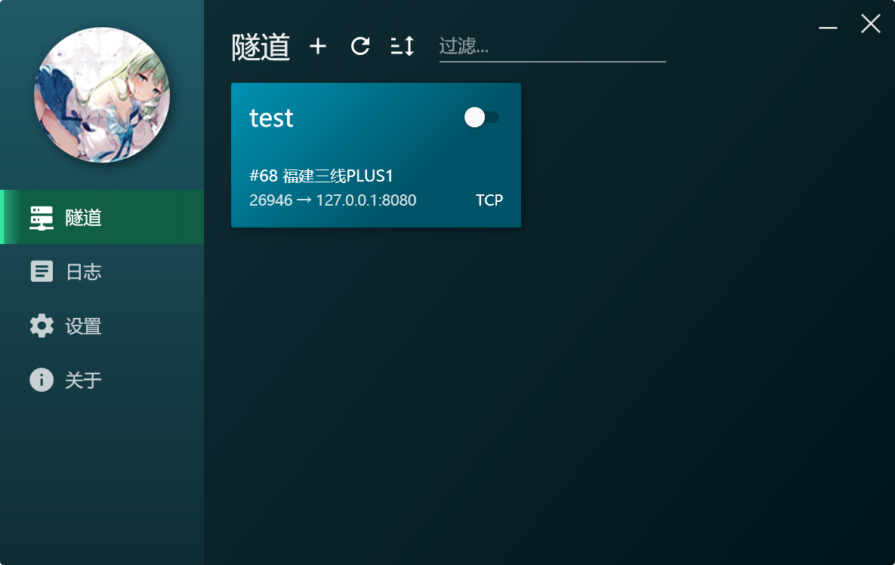

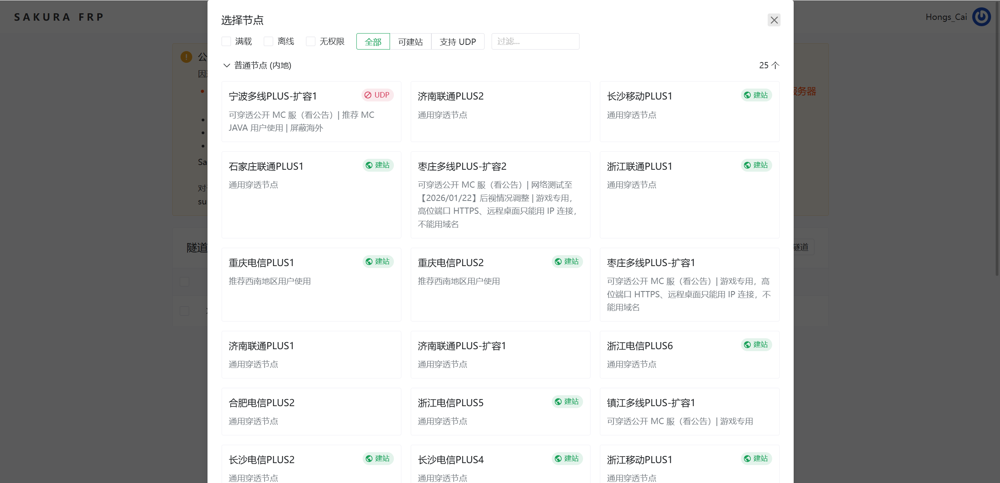


> 注意需要开启自动HTTPS（尽管提供的服务是HTTP）

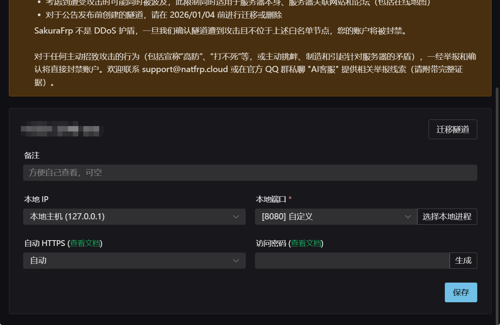

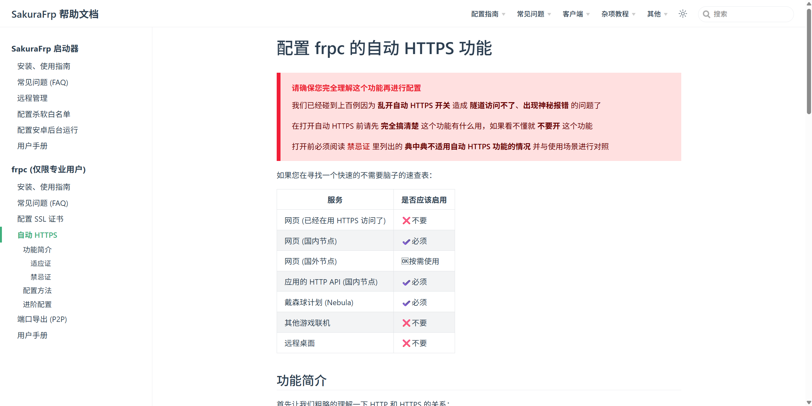


## 注意


**<font color='red'>由于开启了自动HTTPS，所以访问后续的公网IP要使用HTTPS协议访问。</font>**


**<font color='red'>需要配置子域完善SSL证书，不然可能会出现证书链问题，类似微信小程序在真机调试情况下，出现请求 (failed) 的情况。</font>**

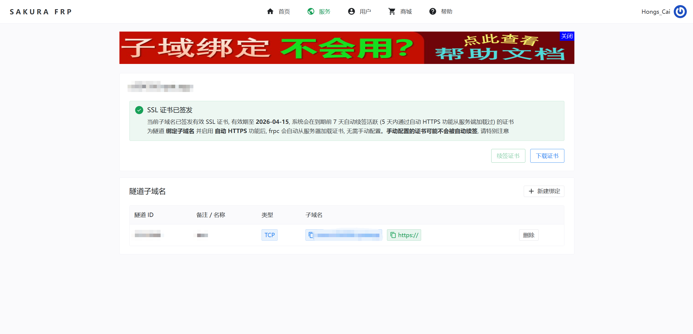
